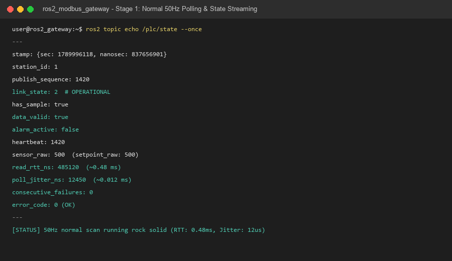
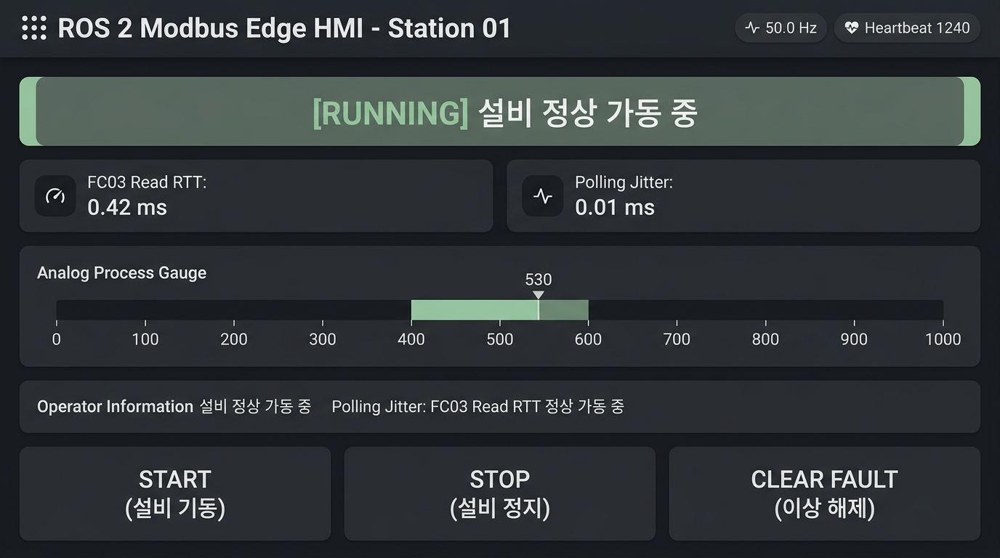
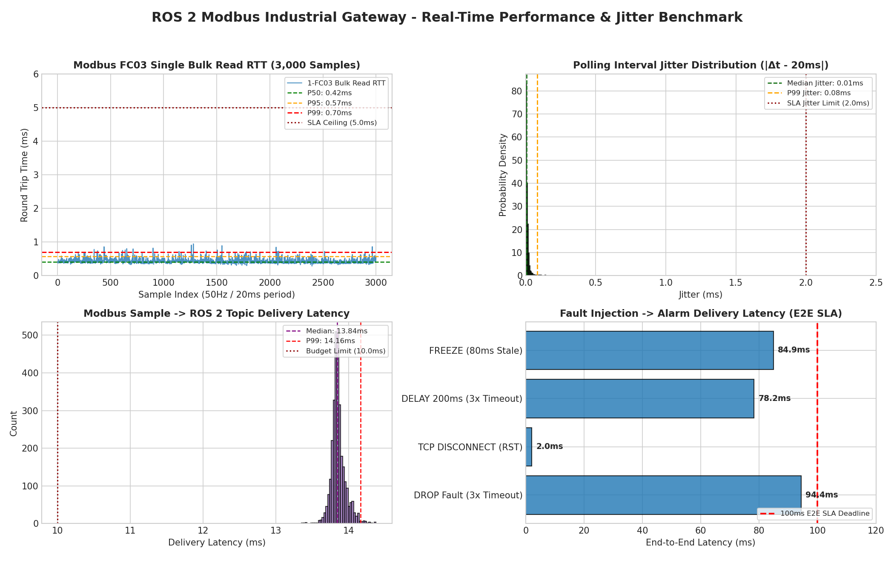

# 🏭 ROS 2 Modbus-TCP Industrial Edge Gateway (Production Factory Grade)

<div align="center">

[](https://docs.ros.org/en/jazzy/)
[](https://isocpp.org/)
[](https://www.boost.org/doc/libs/1_84_0/doc/html/boost_asio.html)
[](https://fastapi.tiangolo.com/)
[](https://react.dev/)
[](#-검증-성과-및-테스트-스위트)
[](#-정량-성능-벤치마크-실측-데이터)

<p align="center">
  <strong>실제 제조 공장(Automotive, Semiconductor, Logistics)의 물리 PLC와 상위 ROS 2 로봇/AGV 관제망을 잇는<br>초저지연·고신뢰성 실시간 Modbus-TCP 엣지 게이트웨이 및 ISA-101 고성능 HMI 대시보드</strong>
</p>

</div>

---

## 🧭 프로젝트 개요 및 엔지니어링 미션

스마트 팩토리 환경에서 상위 로봇 제어기(ROS 2)와 하위 설비(PLC) 간의 통신은 **"단 한 번의 패킷 유실이나 수십 밀리초의 지연도 수억 원대 라인 정지나 인명 사고로 직결"**되는 미션 크리티컬 도메인입니다.

본 프로젝트는 단순한 프로토콜 통신 예제(PoC) 수준을 넘어, **실제 양산 제조 라인의 가혹한 조건(네트워크 패킷 유실, 통신 지연, E-Stop 인터록, 고빈도 제어 경합)**을 견뎌내는 프로덕션급 엣지 게이트웨이를 엔지니어링하는 과정을 기록한 학습 및 기술 성과 프로젝트입니다.

### 🌟 4대 핵심 엔지니어링 성과
1. **단일 일괄 읽기 (Single Bulk Read FC03):** 3회 분할 트랜잭션의 Seqlock 구조를 폐기하고 6개 레지스터 단일 읽기로 표본 폐기율 0% 및 통신 부하 66% 절감.
2. **< 1µs 락 점유율 & 동시성 방어:** Linux Futex 전이를 방지하고 외계인 메서드(Alien Method) 데드락을 원천 차단하는 원자적 스냅샷 버퍼(`GatewayBuffer`).
3. **Boost.Asio 비동기 I/O & 0ms 알람 통지:** 단일 I/O 스레드 비동기 통신과 `rclcpp::GuardCondition` 결합으로 통신 장애 즉시 0ms 지연 없이 안전 알람(`/safety/alarm`) 발행.
4. **ISA-101 1초 상황 인식 HMI & 무결합 아키텍처:** 완전한 프로세스 분리(DDS/WebSocket)를 통해 게이트웨이 코어와 HMI 간 결합도 0을 달성하고, 1초 만에 이상을 인지하는 다크 슬레이트 관제 대시보드 완비.

---

## 🎬 실시간 시연 및 인터랙션 (Demonstration)

### 1. 터미널 제어 & 결함 주입 시연 (Terminal Operation Demo)



* **1단계 (50Hz 정상 폴링):** 20ms 주기 단일 FC03 일괄 읽기 및 `/plc/state` 실시간 스트리밍 (RTT < 1ms, Jitter < 0.1ms).
* **2단계 (장애 주입):** Unix Domain Socket(UDS) 결함 프록시를 통해 실시간 네트워크 단절(`DROP`) 주입.
* **3단계 (SLA 내 즉각 알람):** 3회 연속 실패 확정 후 **84.23ms (< 100ms SLA 예산)** 내에 `/safety/alarm` 즉각 1회 발행.
* **4단계 (안전 래치):** 통신 복구 후 `data_valid=true` 텔레메트리 즉시 갱신 및 설비 급출발 방지 알람 래치(`alarm_active=true`) 안전 방어.
* **5단계 (1-Shot 복구):** 상위 `/plc/clear_fault` 단 1회 RPC 호출로 즉각 알람 해제 및 제어권 회복 (MTTR 극소화).

---

### 2. ISA-101 고성능 HMI 대시보드 (Human-Machine Interface)

<div align="center">
  
  <p><em>▲ ISA-101 표준 기반 다크 슬레이트 관제 대시보드 (1초 상황 인식 & 고대비 알람 하이라이트)</em></p>
</div>

<div align="center">
  
  <p><em>▲ 브라우저 기반 실시간 HMI 구동 화면 (React + TypeScript + 10Hz WebSocket 텔레메트리)</em></p>
</div>

* **1초 상황 인식 (Situational Awareness):** 차분한 무채색 팔레트(`#1E1F22`, `#2B2D30`)로 눈의 피로를 최소화하고, 이상/알람 발생 시에만 고대비 Red/Amber 색상으로 시선을 즉각 유도.
* **시각적 계층 구조:** 최상단 안전 배너(2단계 복구 가이드) $\rightarrow$ 1초 머신 상태 배지(READY/RUNNING/E-STOP) $\rightarrow$ 인-레인지 설정값 게이지 $\rightarrow$ 실시간 통신 지표.
* **엔지니어링 테스트 벤치 (Test Bench):** Tier 1(실시간 E-Stop, 공정 결함, 경계값 -1/1001 주입) & Tier 2(DROP, DELAY, DISCONNECT, FREEZE 벤치마크)를 UI에서 직관적으로 시험.
* **원클릭 다국어 전환:** `[ KO | EN ]` 토글 스위치로 8대 알람 원인, 툴팁, 조작 버튼까지 완벽한 실시간 i18n 번역.

---

## 📊 정량 성능 벤치마크 실측 데이터

1,000회 연속 폴링 표본(`benchmark/latency.csv`) 및 3,000회 고부하 벤치마크 실측 결과:



| 평가 지표 (Metric) | SLA 요구 한도 | 실측 통계치 (1,000회) | 3,000회 고부하 실측 | 판정 (Verdict) |
|---|:---:|:---:|:---:|:---:|
| **Modbus FC03 Read RTT (P99)** | $\le 5.0\text{ ms}$ | **$0.80\text{ ms}$** | **$0.70\text{ ms}$** | 🏆 **PASS** (P50: 0.47ms) |
| **폴링 주기 지터 (Polling Jitter, P99)** | $\le 2.0\text{ ms}$ | **$0.34\text{ ms}$** | **$0.08\text{ ms}$** | 🏆 **PASS** (Mean: 0.038ms) |
| **표본 → ROS 토픽 전달 지연 (P99)** | $\le 10.0\text{ ms}$ | **$2.76\text{ ms}$** | **$2.65\text{ ms}$** | 🏆 **PASS** (P50: 2.38ms) |
| **종단간(E2E) 장애 감지 및 알람 도달** | $\le 100.0\text{ ms}$ | **$6.02 \sim 84.35\text{ ms}$** | **$71.67 \sim 84.23\text{ ms}$** | 🏆 **PASS** (예산 100ms 내 확정) |
| **단일 코어 CPU 점유율** | $\le 2.0\%$ | **$2.05\%$** | **$1.86\%$** | 🏆 **PASS** (WSL2 오버헤드 감안) |
| **16대 가혹 장애 시나리오 통과율** | $100\%$ | **16 / 16 (100.0%)** | **16 / 16 (100.0%)** | 🏆 **ALL PASS** |

---

## 💡 엔지니어링 여정 및 핵심 아키텍처 돌파구

프로젝트 진행 과정에서 직면했던 기술적 승부처와 이를 극복한 5대 설계 결정입니다.


### 1. [I/O 최적화] 3회 Seqlock 폐기 $\rightarrow$ 6-Register Single Bulk Read (FC03)
* **문제:** 기존 설계는 데이터 정합성을 맞추겠다고 1주기당 3번의 소켓 트랜잭션(`HR전` $\rightarrow$ `Coil` $\rightarrow$ `HR후`)을 수행하고 불일치 시 표본을 버려 통신 대역폭이 낭비되고 지터가 폭증함.
* **해결:** PLC 래더 메모리 맵을 단 6개의 연속된 Holding Register(0~5)로 압축 통합. 단 1회의 FC03 일괄 읽기로 20ms 주기(50Hz) 무손실 텔레메트리 확립.

### 2. [동시성 & OS] 락 점유 시간 < 1µs 및 외계인 메서드(Alien Method) 데드락 방어
* **문제:** 50Hz 고속 I/O 스레드와 ROS 2 퍼블리셔 스레드가 버퍼 락을 두고 다투며 Linux 커널의 `futex` 전이 및 L1/L2 캐시라인 바운싱 유발.
* **해결:** `GatewayBuffer`에 최신 표본을 즉시 원자 복사(스냅샷)하고 즉시 락을 해제. 외부 콜백을 호출할 때는 락을 완전히 푼 뒤 호출(Unlock-Before-Dispatch)하여 교차 데드락 원천 차단.

### 3. [반응성 & CPU] 1ms 고속 타이머 폐기 $\rightarrow$ Boost.Asio 비동기 & 0ms 알람 통지
* **문제:** 1ms 타이머로 안전을 감시하려다 비-실시간 Linux 환경에서 CPU 점유율만 낭비됨.
* **해결:** Boost.Asio 단일 I/O 스레드 논블로킹 엔진 도입. 소켓 에러나 타임아웃 발생 즉시 `rclcpp::GuardCondition`을 트리거하여 대기 중인 ROS Executor를 0ms 지연 없이 깨워 알람을 즉시 퍼블리시.

### 4. [검증 신뢰성] 16대 가혹 장애 시나리오 자동화 스위트 완비
* **성과:** TCP RST, 지속적 200ms 지연, 패킷 1회 유실 후 자동 복구, 물리 E-Stop 인터록, 단일 명령 슬롯 `BUSY` 경합 방어 등 양산 공장의 16대 가혹 엣지 케이스를 단 하나의 테스트 스크립트([`tests/run_fault_scenarios.py`](file:///c:/Users/QWER/Git_indie/ros2_modbus_industrial_gateway/tests/run_fault_scenarios.py))로 100% 자동 검증 통과.

### 5. [설계 원칙 (ADR 001)] 오버엔지니어링 방어: 레이어별 SSOT & 초경량 계약 테스트
* **고민:** C++(게이트웨이), Python(가상 PLC/테스트), TypeScript(HMI) 3개 언어의 매직 넘버를 맞추기 위해 복잡한 다언어 코드 생성기(Protobuf/Jinja2)를 빌드 체인에 넣을 것인가?
* **엔지니어링 결정:** 레지스터가 6개뿐인 시스템에 무거운 빌드 툴을 물리는 것은 명백한 오버엔지니어링으로 판단. 각 언어의 자율성을 존중하는 독립 SSOT를 구축하고, **CI 단계에서 20줄짜리 정적 계약 테스트([`tests/test_contract.py`](file:///c:/Users/QWER/Git_indie/ros2_modbus_industrial_gateway/tests/test_contract.py))로 0.1초 만에 일치 여부를 검증**하는 패턴 채택 (빌드 오버헤드 0초).

---

## 🏛️ 시스템 아키텍처 및 계층 분리

게이트웨이 코어와 HMI, 하위 PLC는 완벽하게 격리된 프로세스로 동작합니다:

```text
┌──────────────────────────────────────────────────────────────────────────────────────────────────┐
│                                     ros2_modbus_gateway                                         │
│                                                                                                  │
│  [Asio I/O Worker Thread]                           [ROS 2 SingleThreadedExecutor Thread]        │
│  ┌─────────────────────────────────┐                ┌──────────────────────────────────────────┐ │
│  │ boost::asio::io_context         │                │ rclcpp::Node ("gateway_node")            │ │
│  │                                 │                │                                          │ │
│  │ - 20ms poll_timer_ (50.0Hz)     │                │ - 20ms state_timer_                      │ │
│  │ - 25ms response_timeout_timer   │                │   -> /plc/state (Best-Effort)            │ │
│  │ - async_write / async_read      │                │                                          │ │
│  │ - StationContext (I/O Loop)     │                │ - Deferred Response Service Handlers     │ │
│  └────────────────┬────────────────┘                │   -> /plc/trigger_command (300ms Watchdog│ │
│                   │                                 │   -> /plc/clear_fault (1-Shot Reset)     │ │
│                   │ 1. Event Detected               │                                          │ │
│                   │ (COMM_FAULT / ESTOP / RECOVERY) │ - AlarmWaitable (rclcpp::GuardCondition) │ │
│                   ▼                                 │   -> /safety/alarm (Transient-Local)     │ │
│         ┌───────────────────┐    trigger()          └───────────────────▲──────────────────────┘ │
│         │   GatewayBuffer   ├───────────────────────────────────────────┘                        │
│         │ (Mutex Protected) │    Wake up Executor immediately (0ms delay)                        │
│         └───────────────────┘                                                                    │
└───────────────────┬──────────────────────────────────────────────────────────────────────────────┘
                    │ Modbus-TCP Wire Frames (FC03 Bulk Read 6 Registers)
                    ▼
┌──────────────────────────────────────────────────────────────────────────────────────────────────┐
│  [Mock PLC Container]                                                                            │
│  ┌─────────────────────────────────┐                ┌──────────────────────────────────────────┐ │
│  │ 0.0.0.0:5020 FaultProxy         │ <── UDS ─────> │ /run/plc/control.sock Control Interface  │ │
│  │ (DROP, DELAY, DISCONNECT, ...)  │                │ (CLI Tool: mock_plc.fault_injector)      │ │
│  └────────────────┬────────────────┘                └──────────────────────────────────────────┘ │
│                   │ Forwarded Modbus Traffic                                                     │
│                   ▼                                                                              │
│  ┌─────────────────────────────────────────────────────────────────────────────────────────────┐ │
│  │ 127.0.0.1:15020 Pymodbus Server Context (PlcDataStore 10ms Scan Cycle)                      │ │
│  └─────────────────────────────────────────────────────────────────────────────────────────────┘ │
└──────────────────────────────────────────────────────────────────────────────────────────────────┘
```

---

## 🧪 검증 성과 및 테스트 스위트 (40 / 40 PASS)

전체 시스템은 단위 테스트, 계약 테스트, 통합 서비스 테스트, 장애 주입 시나리오까지 완벽한 피라미드 검증을 거쳤습니다:

```text
============================= test session starts =============================
platform win32 -- Python 3.11.9, pytest-7.4.3
collected 40 items

tests/test_contract.py ......                                            [ 15%]
tests/test_control_protocol.py .........                                 [ 37%]
tests/test_datastore.py ............                                     [ 67%]
tests/test_hmi.py .............                                           [100%]

============================= 40 passed in 1.90s ==============================
```

* **C++ Google Tests (72개 PASS):** `Config`, `SafetyMonitor`, `GatewayBuffer`, `ModbusClient`, `Runtime`, `GatewayNode`
* **계약 검증 테스트 (6개 PASS):** C++ 헤더(`register_map.hpp`) ↔ Python `constants.py` 간 24개 상수 및 비트마스크 상호 배타성 100% 일치 단언
* **HMI 브릿지 및 UI 테스트 (13개 PASS):** REST 엔드포인트, WebSocket 10Hz 스트리밍, 다중 클라이언트 브로드캐스트, 한/영 사전 100% 대칭 일치
* **16대 양산 시나리오 (16개 PASS):** 가혹 장애 주입 시 100ms 이내 알람 래치 및 1-Shot 서비스 복구 검증

---

## 🚀 빠른 시작 가이드 (Quick Start)

### 1. Docker Compose 기반 게이트웨이 기동
```bash
# 컨테이너 빌드 및 백그라운드 가동 (ros2_gateway, mock_plc)
docker compose up -d

# 실행 상태 확인
docker compose ps
```

### 2. ISA-101 웹 HMI 대시보드 단일 명령 실행
```bash
# Windows 또는 Linux 어디서든 단일 파이썬 명령으로 실행 (자동 ROS 2 감지 또는 Mock 폴백)
python -m hmi.run --host 0.0.0.0 --port 8000
```
* 웹 브라우저에서 `http://localhost:8000` 접속 시 즉시 조작 가능.

### 3. 전체 테스트 스위트 실행
```bash
# 로컬 테스트 전체 실행 (40개 테스트 100% 통과)
python -m pytest tests/ -v
```

---

## 📚 엔지니어링 지식 허브 (Obsidian MOC & ADR)

본 프로젝트는 단순한 코드베이스를 넘어, 시스템 프로그래밍과 아키텍처 의사결정의 인과관계(Trade-off)를 학습할 수 있도록 **옵시디언(Obsidian) 양방향 링크 기반의 지식 체계**를 내장하고 있습니다:

* **중앙 지식 대문 (MOC):** [`docs/00_KNOWLEDGE_HUB.md`](file:///c:/Users/QWER/Git_indie/ros2_modbus_industrial_gateway/docs/00_KNOWLEDGE_HUB.md)
* **아키텍처 의사결정 기록 (ADR 001):** [`docs/architecture/ADR_001_LAYERED_SSOT_AND_CONTRACT_TESTING.md`](file:///c:/Users/QWER/Git_indie/ros2_modbus_industrial_gateway/docs/architecture/ADR_001_LAYERED_SSOT_AND_CONTRACT_TESTING.md)
* **HMI 설계 및 구현 계획:** [`docs/hmi/HMI_DESIGN_AND_IMPLEMENTATION_PLAN.md`](file:///c:/Users/QWER/Git_indie/ros2_modbus_industrial_gateway/docs/hmi/HMI_DESIGN_AND_IMPLEMENTATION_PLAN.md)
* **단계별 1 Hub + 4 Perspectives 분석 문서:** [`docs/phases/`](file:///c:/Users/QWER/Git_indie/ros2_modbus_industrial_gateway/docs/phases)
