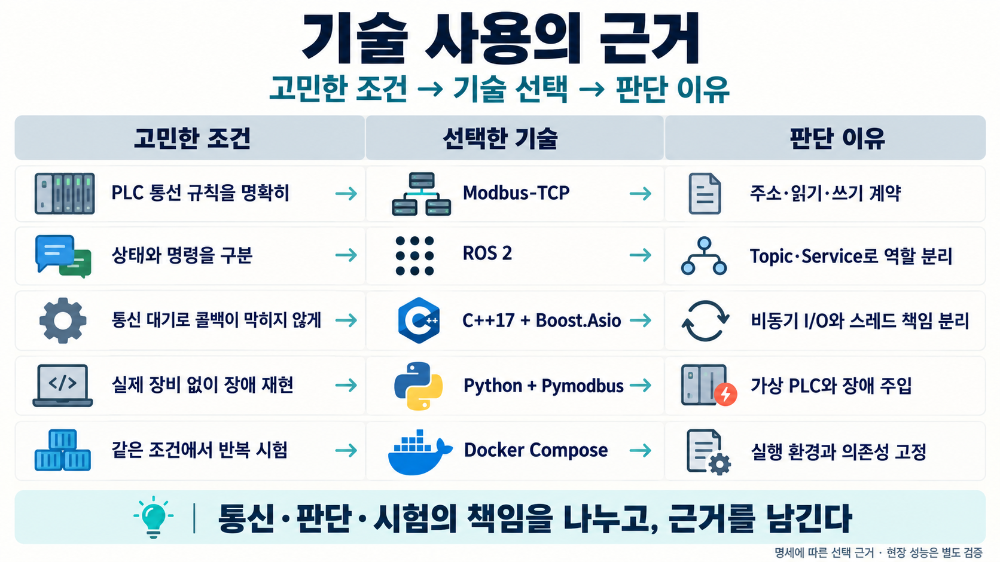
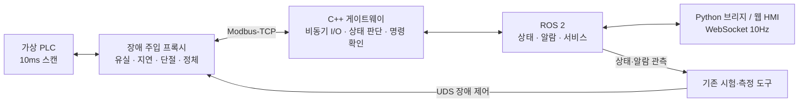
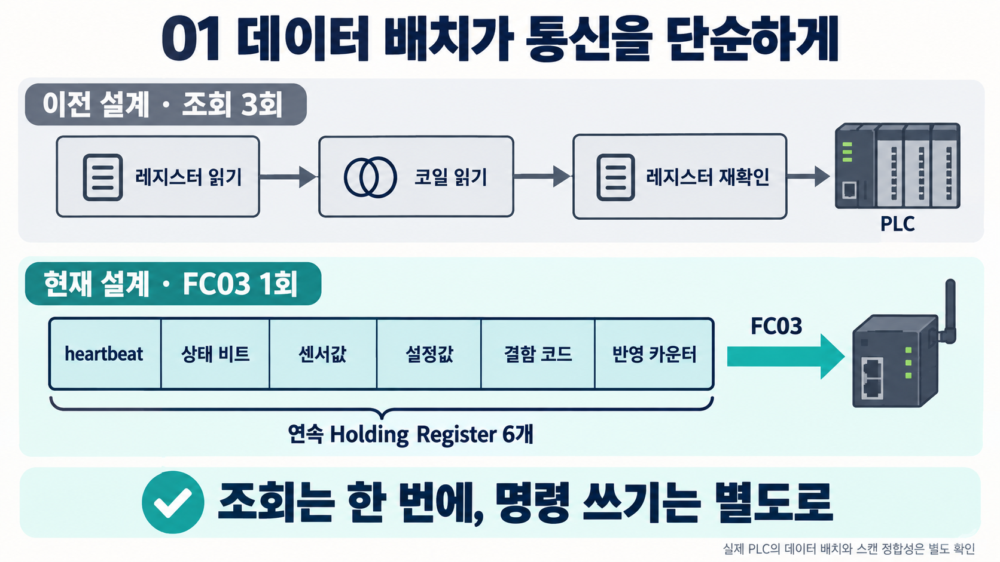
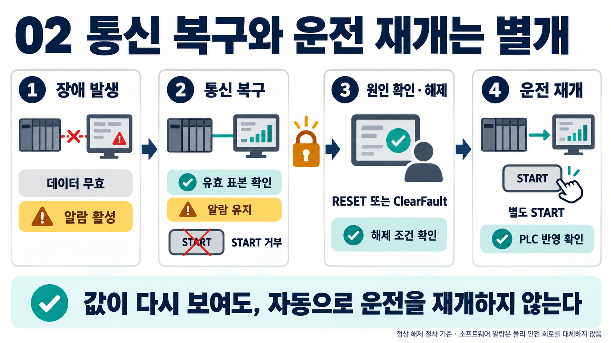
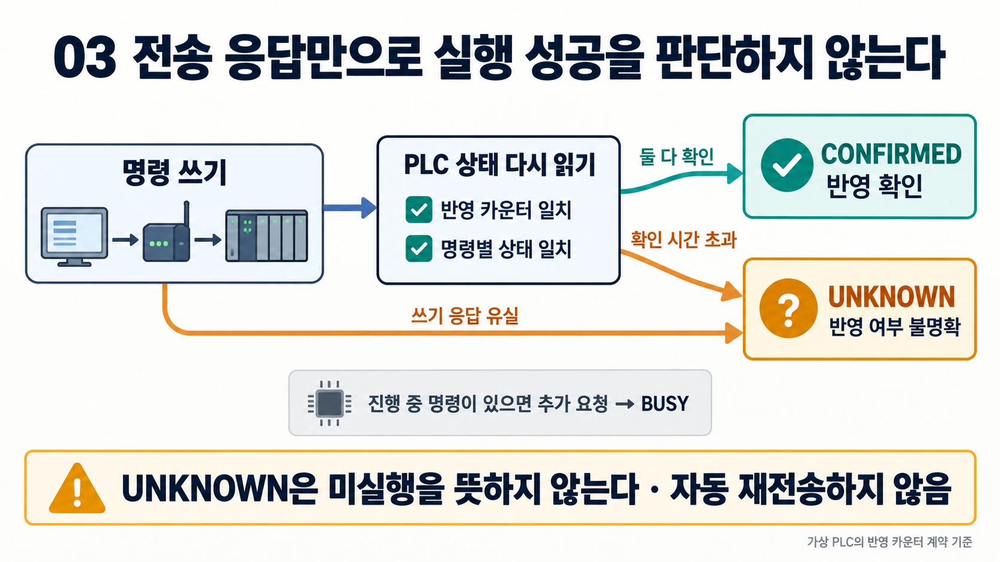
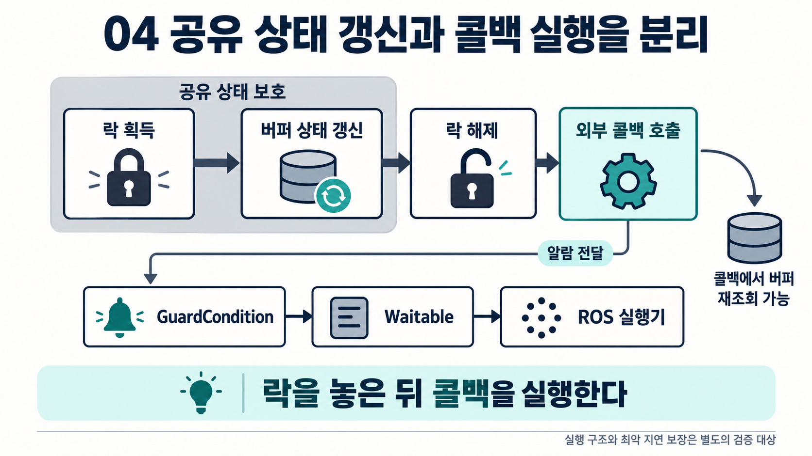
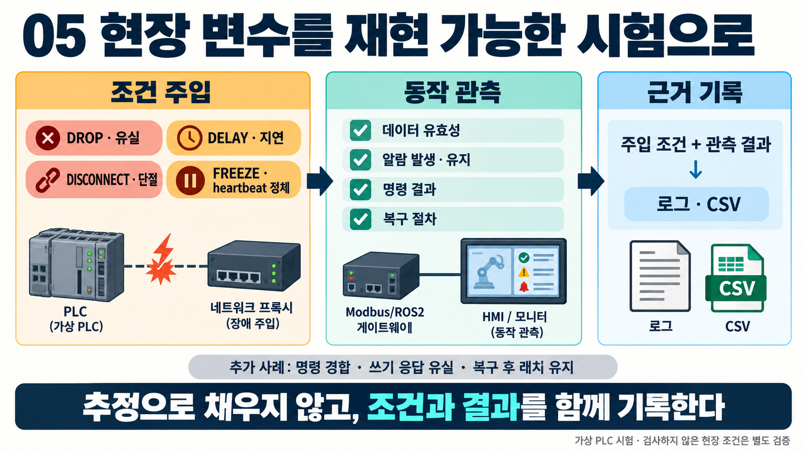

# ROS 2 Modbus-TCP Industrial Gateway

**현장 변수에 대한 실측 정보가 부족할 때, 통신·명령·복구 기준을 어떻게 정하고 확인할지 학습한 프로젝트입니다.**

가상 PLC와 ROS 2 사이에 C++ 게이트웨이를 두고, 장애를 주입하면서 상태 판단과 명령 처리 규칙을 확인했습니다. 웹 HMI는 현재 상태와 운영자가 취할 다음 행동을 보여 주는 용도로 구성했습니다.

ROS 2 Jazzy · C++17 · Boost.Asio · Python / Pymodbus · FastAPI / WebSocket · React / TypeScript · Docker Compose

---

## 학습 동기와 접근

가장 어려웠던 부분은 **작업 현장에서 발생하는 변수를 어떻게 관리할 것인가**였습니다. 실측 정보가 충분하지 않고, 환경에 따라 응답 시간과 복구 요구사항도 달라질 수 있었습니다. 그래서 불확실한 조건을 성능 보장으로 해석하지 않고, 먼저 가상 환경에서 확인할 수 있는 범위를 정하고 상태·명령·복구 기준을 보수적으로 잡았습니다.

구체적으로는 오래된 상태값으로 START를 수락하지 않고, 실행 여부가 불명확한 명령은 `UNKNOWN`으로 구분하며, 통신이 돌아와도 알람 래치를 유지하도록 구성했습니다. 반면 연속 실패 횟수와 타임아웃은 오경보와 감지 지연 사이의 절충이므로, 현재 설정값을 모든 현장의 정답으로 보지는 않습니다.

학습의 초점은 다음 질문을 설계와 테스트로 연결하는 것이었습니다.

| 학습 질문 | 선택한 방식 | 확인할 근거 |
|:---|:---|:---|
| 여러 상태값을 어떻게 함께 읽을까? | 6개 연속 레지스터의 FC03 일괄 조회 | 레지스터 계약·가상 PLC·통신 테스트 |
| 연결은 살아 있지만 PLC 로직이 멈췄다면? | 응답 실패와 heartbeat 정체를 별도로 감시 | `FREEZE`·`DROP` 장애 주입 |
| 명령을 보낸 것을 성공으로 처리해도 될까? | 반영 카운터와 실제 상태로 결과 확인 | START/STOP·경계값·쓰기 ACK 유실 시험 |
| 통신 복구 후 무엇을 허용할까? | 데이터 유효성과 알람 래치를 분리 | 복구 후 래치 유지·START 거부 확인 |
| 문제가 생겼을 때 어떻게 원인을 좁힐까? | 단위 테스트 → 통합 시험 → 장애 주입 → 측정 | 단계별 실행 로그와 원시 데이터 |

AI와 협업해 구현과 문서화를 진행했습니다. 이 문서는 결과 코드와 기존 테스트를 근거로, 설계 선택과 확인한 내용, 적용 범위를 구분해 설명합니다.

> [!NOTE]
> **현재 범위:** 가상 PLC를 사용하는 학습·시험 시스템입니다. 실제 PLC 연결, 제조 라인 운영, 하드 실시간 성능과 기능 안전 인증은 검증하지 않았습니다.

---

## 기술 사용의 근거

기술을 선택할 때 먼저 정한 기준은 **PLC 통신 규칙을 명확히 하고, 통신 대기가 상태 판단과 ROS 콜백을 막지 않게 하며, 장애 조건을 반복해서 확인하는 것**이었습니다. 실측 정보가 부족한 상황에서 필요한 것은 성능을 미리 단정하는 것보다, 문제가 생겼을 때 어느 계층의 동작인지 좁힐 수 있는 구조라고 판단했습니다.



| 고민한 조건 | 선택한 기술 | 판단 이유 |
|:---|:---|:---|
| PLC와 주고받는 값과 명령을 어떻게 명확히 정할까? | Modbus-TCP | 레지스터 주소와 FC03 읽기·FC05/FC06 쓰기로 통신 계약을 구체화했습니다. PLC별 전용 드라이버까지 넓히기보다, 이 계약의 정상·오류 처리를 확인하는 데 집중했습니다. |
| PLC 상태를 상위 제어기에 전달하고 명령 결과를 어떻게 돌려줄까? | ROS 2 Topic·Service | 상태·알람은 Topic으로, 명령·해제 요청은 Service로 구분했습니다. 통신 구현과 상위 인터페이스를 나눠 각 계층의 책임을 명확히 했습니다. |
| 응답이 늦는 PLC를 기다리는 동안 다른 처리가 막히지 않게 할 수 있을까? | C++17 · Boost.Asio | 초기 명세의 블로킹 통신 격리 방식에서 비동기 소켓·타이머 구조로 바꿨습니다. 소켓은 I/O 스레드가 관리하고 ROS 콜백은 완료 이벤트로 결과를 받도록 책임을 분리했습니다. |
| 실제 장비 없이 통신 유실과 PLC 로직 정체를 어떻게 비교할까? | Python · Pymodbus · asyncio | 가상 PLC의 레지스터·heartbeat 동작을 만들고, 장애 프록시와 제어 도구로 유실·지연·단절·정체를 주입했습니다. 주입한 조건을 알고 관측 결과를 비교할 수 있도록 했습니다. |
| 개발 환경 차이가 시험 결과를 해석하는 데 섞이지 않게 할 수 있을까? | Docker Compose | 가상 PLC와 게이트웨이의 의존성·네트워크 구성을 함께 정의했습니다. 같은 실행 조건에서 반복하기 위한 선택이며, 실제 현장과 동일한 지연이나 실시간 성능을 보장하는 선택은 아닙니다. |

**선택한 범위:** 핵심 명세에서는 시뮬레이션 등을 제외하고 통신·상태 판단·명령 확인에 집중했습니다. 웹 HMI는 이후 [별도 설계](docs/hmi/HMI_DESIGN_AND_IMPLEMENTATION_PLAN.md)로 추가했습니다. FastAPI/WebSocket과 React/TypeScript는 상태와 복구 안내를 화면에 전달하는 역할을 맡고, 명령 수락 판단은 게이트웨이에 둡니다.

**ROS 실행 스레드를 하나로 둔 이유:** 스레드 수를 늘려 처리량을 높이기 전에, 락 경합과 컨텍스트 전환이 주기 내 처리에 어떤 지연을 더하는지 고민했습니다. Linux의 락 구현에서는 경합 시 `futex`를 통한 대기·깨우기가 발생할 수 있습니다. 그래서 ROS 콜백은 `SingleThreadedExecutor`에서 하나씩 실행하고, 통신 대기는 별도 Asio I/O 스레드로 분리했습니다. ROS 콜백 사이의 병렬 경합을 줄이되, I/O 스레드와 공유하는 버퍼의 락은 짧게 유지하고 외부 콜백은 락 해제 후 호출하는 방식입니다.

초기에는 Asio 결과를 ROS 계층에 직접 전달하면서 ROS 측의 처리·대기가 PLC 폴링에 영향을 주는 문제를 고민했습니다. 이후 결과를 버퍼에 저장하고 ROS가 조회하도록 바꿔 두 실행 흐름의 결합을 줄였습니다.

**이벤트 대기와 절충:** 알람은 고속 타이머로 반복 확인하는 대신 `GuardCondition`으로 실행기의 wait set에 통지합니다. Linux의 Asio I/O 루프에서 사용하는 `epoll`과 ROS 실행기의 이벤트 대기는 계층을 구분해 설명하며, ROS 내부 대기 방식은 미들웨어 구현에 따릅니다. 단일 실행 스레드에서도 긴 콜백은 다음 상태 발행과 알람 처리를 늦출 수 있으므로, 콜백에서 소켓 응답을 기다리지 않는 비동기 구조가 함께 필요했습니다. 이 선택은 경합과 불필요한 대기를 줄이려는 설계이며, 컨텍스트 전환 제거나 마감 시간 충족을 보장하는 것은 아닙니다.

근거: [현재 명세](spec_production.md)의 1.1~1.3절(선택 기준·계층·스레드 책임)과 3.7절(장애 주입) · [초기 명세](%5BLEGACY%5Dspec_full.md)의 1.1~1.3절(초기 통신 방식과 책임 분리) · [Phase 2](docs/phases/%5BPhase_2%5D_도메인_코어_및_TDD_검증.md)의 2.2절(락 경합·futex) · [Phase 3](docs/phases/%5BPhase_3%5D_비동기_통신_및_ROS_노드_결합.md)의 2장(실행 루프·이벤트 통지)

---

## 시스템 구성



게이트웨이의 기본 폴링·상태 발행 주기는 20ms(50Hz)입니다. Boost.Asio I/O 스레드와 ROS 실행 스레드는 `GatewayBuffer`를 통해 상태를 공유합니다. 알람은 이벤트로 전달하며, 일반 상태 발행과 HMI 표시 주기는 따로 관리합니다.

| ROS 인터페이스 | 역할 |
|:---|:---|
| `/plc/state` | 상태값·유효성·통신 지표. Best Effort / Depth 1 |
| `/safety/alarm` | 알람 발생·해제. Reliable / Transient Local / Depth 1 |
| `/plc/trigger_command` | START, STOP, RESET, SETPOINT의 접수와 반영 결과 |
| `/plc/clear_fault` | 게이트웨이 내부 알람 래치 해제 |

계약: [`msg/`](msg/) · [`srv/`](srv/) · 설정: [`config/gateway.yaml`](config/gateway.yaml)

---

## 설계 선택과 학습 과정

### 1. 통신 횟수보다 먼저 데이터 배치를 검토하기



초기 명세는 `레지스터 → 코일 → 레지스터 재확인`의 세 트랜잭션으로 상태 정합성을 확인하는 구조였습니다. 조회 사이에 PLC 상태가 바뀌면 표본을 다시 확인해야 합니다.

현재는 heartbeat, 상태 비트, 센서값, 설정값, 결함 코드, 명령 반영 카운터를 6개 연속 Holding Register로 모았습니다. 정상 조회는 FC03 한 번으로 처리하고, 명령 쓰기는 별도로 수행합니다.

**학습한 점:** 데이터 배치와 계약을 바꾸면 통신 로직을 단순화할 수 있습니다. 조회 횟수의 설계상 감소는 3회 → 1회입니다. 실제 PLC에 적용하려면 이 레지스터 배치가 가능한지, 한 응답의 값들이 같은 스캔의 상태인지 먼저 확인해야 합니다.

근거: [`register_map.hpp`](include/ros2_modbus_gateway/register_map.hpp) · [`station_context.cpp`](src/station_context.cpp)

### 2. 통신 복구와 운전 재개를 분리하기



TCP 응답을 받는 것만으로 PLC 로직의 진행을 알 수 없으므로 heartbeat 변화도 확인합니다. `data_valid`는 관측값의 유효성을, `alarm_active`는 알람 래치 상태를 나타냅니다. 통신과 유효 표본이 복구되어도 알람은 유지하며, 래치가 남아 있으면 START를 거부합니다.

```text
장애 발생 → 데이터 무효 / 알람 활성
통신 복구 → 유효 표본 확인 / 알람 래치 유지
원인 확인 → RESET 또는 조건에 맞는 ClearFault
운전 재개 → 별도 START와 PLC 반영 확인
```

**학습한 점:** 값이 다시 보이는 시점과 운전을 허용하는 시점을 구분해야 합니다. 기본 `force_clear=false`는 연결 상태와 PLC 인터록을 확인합니다. `force_clear=true`는 일부 확인을 건너뛰는 강제 경로이므로, 정상 복구 절차와 동일한 조건을 보장한다고 해석하지 않습니다. 이 소프트웨어 알람은 물리 안전 회로를 대체하지 않습니다.

근거: [`safety_monitor.cpp`](src/safety_monitor.cpp) · [`gateway_buffer.cpp`](src/gateway_buffer.cpp) · [`ClearFault.srv`](srv/ClearFault.srv)

### 3. 전송 결과와 실행 결과를 구분하기



Modbus 쓰기 후 `applied_command_counter`와 명령별 상태를 다시 읽어야 `CONFIRMED`로 처리합니다. 스테이션마다 진행 중인 명령은 하나만 허용하고, 추가 요청은 `BUSY`로 거부합니다. 반영 여부가 불명확하면 `UNKNOWN`을 반환하며 쓰기 명령을 자동 재전송하지 않습니다. 재연결 시에는 `generation`으로 이전 세션의 표본과 대기 명령을 구분합니다.

**학습한 점:** 응답 유실 상황에서는 명령이 실행되지 않았다고 단정할 수 없습니다. 불확실한 결과를 별도 상태로 전달하고 상위 시스템이 상태를 다시 확인하도록 계약을 정하는 것이 중요했습니다. 이 명령 확인 방식은 가상 PLC의 반영 카운터 계약을 전제로 합니다.

근거: [`TriggerCommand.srv`](srv/TriggerCommand.srv) · [`station_context.cpp`](src/station_context.cpp) · [`run_integration.py`](tests/run_integration.py)

### 4. 스레드가 공유하는 상태와 콜백 실행을 나누기



버퍼 내부 상태를 갱신한 뒤 락을 해제하고 외부 콜백을 호출합니다. 알람은 `GuardCondition` 기반 Waitable로 ROS 실행기에 전달합니다. 기존 C++ 테스트에는 콜백 안에서 버퍼를 다시 조회하는 사례와 동시성 스트레스 사례가 있습니다.

**학습한 점:** 콜백이 다시 같은 객체에 접근할 수 있다는 점을 고려해 락의 범위를 정해야 합니다. 이벤트 전달 구조와 실행 지연은 별개의 확인 대상입니다. 기존 속도 테스트는 함수 반복 호출의 평균 시간을 측정하므로, 통과 결과를 순수 락 보유 시간이나 최악 지연 보장으로 확대하지 않습니다.

근거: [`gateway_buffer.cpp`](src/gateway_buffer.cpp) · [`gateway_node.cpp`](src/gateway_node.cpp) · [`test_gateway_buffer.cpp`](tests/test_gateway_buffer.cpp)

### 5. 현장 변수를 재현 가능한 시험 조건으로 바꾸기



장애 프록시로 패킷 유실, 응답 지연, 단절, PLC heartbeat 정체를 주입합니다. 정상 동작뿐 아니라 명령 경합, 쓰기 응답 유실, 통신 복구 후 래치 유지도 확인합니다. HMI는 현재 상태와 복구 안내를 표시하며, 명령 수락 여부는 게이트웨이가 판단합니다.

C++·Python의 상수는 기존 계약 테스트로 비교합니다. 현재 규모에서는 코드 생성기를 추가하는 대신 각 언어의 상수 정의와 테스트를 유지하는 방식을 선택했습니다.

**학습한 점:** 부족한 실측 정보를 추정으로 채우기보다, 주입한 조건과 관측한 결과를 함께 기록해야 합니다. 자동 시험이 통과해도 검사하지 않은 조건은 남아 있습니다. 이번 재확인에서도 스크립트의 출력과 실제 판정 코드를 함께 읽어 결과의 범위를 구분했습니다.

근거: [`fault_proxy.py`](mock_plc/fault_proxy.py) · [`run_fault_scenarios.py`](tests/run_fault_scenarios.py) · [`test_contract.py`](tests/test_contract.py) · [ADR 001](docs/architecture/ADR_001_LAYERED_SSOT_AND_CONTRACT_TESTING.md)

---

## 현재 검증 기록

2026-10-05에 **기존 테스트·측정 코드로 재실행**했습니다. 테스트 코드와 구현 코드는 변경하지 않았습니다. 명령, 환경, 로그와 원시 데이터는 [검증 기록](docs/verification/2026-10-05/README.md)에 있습니다.

| 단계 | 실행 결과 | 확인 범위 |
|:---|:---|:---|
| Windows / Python 3.11.9 | pytest 40개 통과 | 계약 6 · 제어 프로토콜 9 · 가상 PLC 12 · HMI 13 |
| ROS 2 Jazzy / WSL2 Docker | 패키지 빌드 성공 | 현재 소스의 C++·ROS 인터페이스 빌드 |
| C++ GoogleTest | 6개 실행 대상, 총 66개 항목 통과 | 설정 12 · 모니터 16 · 버퍼 17 · 통신 9 · 런타임 5 · ROS 노드 7 |
| ROS 서비스 통합 시험 | 스크립트 종료 코드 0 | 명령 반영·설정 경계값·BUSY·E-Stop 상태에서 요청 거부 |
| 장애 시나리오 | 스크립트 판정 16/16 PASS | 주입·복구 사례의 해당 실행 결과 |

`colcon test-result`의 72개 집계는 GoogleTest 66개와 CTest 실행 대상 6개를 합친 값입니다. 서로 다른 테스트 수로 중복 해석하지 않습니다.

**장애 주입 → ROS 알람 수신:** 이번 실행에서 DROP 94.19ms, DISCONNECT 1.24ms, DELAY 77.87ms, FREEZE 82.10ms를 기록했습니다. 각 조건을 한 번씩 실행한 관측값이며, 반복 시험의 최댓값이나 모든 환경에서의 100ms 보장은 아닙니다.

> [!WARNING]
> **시험 해석의 한계:** 시나리오 16은 `SIGSTOP/SIGCONT`로 노드를 정지·재개하지만, 마지막 수신 시각을 콜백마다 갱신하는 watchdog을 검증하지 않습니다. 따라서 스크립트의 PASS를 실제 상위 제어기의 통신 두절 검출이나 설비 감속·정지 검증으로 사용하지 않습니다. 일부 복구 과정은 강제 래치 해제 경로도 사용합니다.

### 정상 상태 측정

WSL2 Docker의 가상 PLC 환경에서 유효 표본 3,000개를 60.04초 동안 수집했습니다(관측 주파수 49.97Hz). 아래 값은 이번 실행의 관측 결과입니다.

| 지표 | 평균 | p99 | 관측 최댓값 |
|:---|---:|---:|---:|
| FC03 읽기 왕복 지연 | 0.3850ms | 0.6629ms | 1.1025ms |
| 폴링 지터 절댓값 | 0.0099ms | 0.0917ms | 0.2048ms |
| 표본 생성 → ROS 시험 구독자 수신 | 14.4086ms | 14.8046ms | 15.1052ms |

게이트웨이 프로세스 CPU 사용률은 측정 구간에서 1.68%였습니다. 도구에 설정된 p99 RTT ≤ 5ms, p99 지터 ≤ 2ms, 프로세스 CPU ≤ 2% 기준을 이번 실행에서 충족했습니다. 실제 PLC·현장 네트워크·네이티브 실시간 커널에서의 결과는 확인하지 않았습니다.

근거: [요약 JSON](docs/verification/2026-10-05/summary.json) · [3,000개 원시 표본](docs/verification/2026-10-05/latency.csv) · [측정 정의와 실행 기록](docs/verification/2026-10-05/README.md)

일반 상태의 표본 → ROS 수신 지연은 알람 이벤트 지연과 별도 지표입니다. 측정 도구의 `overall_pass`는 RTT와 지터를 묶은 판정이며, CPU나 모든 기능의 통과를 뜻하지 않습니다.

[이전 2026-09-22 측정](benchmark/summary_3000.json)은 별도로 남겨 두었습니다. 실행 환경과 데이터가 다른 측정을 섞어 하나의 성능으로 제시하지 않습니다.

---

## HMI와 시연

[](https://youtu.be/QYs8bFcEs4c)

상태, 공정값, 통신 지표와 운영 버튼을 함께 보여 주는 화면입니다. ISA-101의 상황 인식 설계 원칙(회색 바탕, 경보에만 색 사용, 색·모양·번호로 경보 순위 구분)을 참고했습니다. 이미지는 Mock 어댑터로 실행한 정상 상태 화면이며, 사용성 시험이나 표준 적합성 결과는 아닙니다.

<details>
<summary><b>HMI 조작 및 장애 주입 시연</b></summary>

[▶ HMI 조작 및 장애·복구 시연 영상 보기 · 2분 9초](https://youtu.be/QYs8bFcEs4c)

| 순서 | 화면에서 수행할 작업 | 확인할 결과·자막 내용 |
|:---|:---|:---|
| 1. 초기 상태 | 장애를 해제하고 정지·설정값 500으로 준비 | “운전 준비 상태와 실시간 데이터 갱신을 확인합니다.” |
| 2. 정상 기동 | START 클릭 → 확인 창에서 1.5초 길게 누르기 | “확인 절차 후 RUNNING으로 전환되는지 확인합니다.” |
| 3. 설정값 변경 | 설정값 600 입력 → Apply | “목표값을 전송하고 화면에 반영된 값을 확인합니다.” |
| 4. 입력 경계 검사 | Test Bench에서 1001 전송 | “허용 범위 초과 요청이 거부되고 기존 설정값이 유지되는지 확인합니다.” |
| 5. 통신 장애 | DROP 주입 | “알람·데이터 유효성·START 버튼 상태를 확인합니다.” |
| 6. 통신 복구 | NORMAL로 전환 | “통신이 복구되어도 알람 래치가 유지되는지 확인합니다.” |
| 7. 알람 해제 | RESET 확인 절차 진행 | “해제 후 운전 준비 상태로 돌아오는지 확인합니다.” |
| 8. 비상정지 모사 | E-Stop ON → ClearFault 호출 → OFF → 해제 | “인터록 활성 중 해제 거부와 원인 제거 후 복구를 확인합니다.” |
| 9. 종료 | 재기동·STOP 확인 후 설정값 500 복원 | “시험을 마치고 정지·정상 상태로 되돌립니다.” |

</details>

---

## 직접 실행하기

저장소 루트에서 실행합니다. Windows HMI Mock은 화면·조작 흐름을 위한 독립 시뮬레이션입니다. Docker PLC와 C++ 게이트웨이 통합 시험은 ROS 2 컨테이너에서 실행합니다.

### HMI Mock

Python 3.11 가상 환경에서 실행하는 예시입니다.

```bash
python -m pip install fastapi==0.104.1 uvicorn==0.24.0 pydantic==2.5.0 httpx==0.25.1 websockets==15.0.1 pytest==7.4.3 pytest-asyncio==0.21.1
python -m pip install -r mock_plc/requirements.txt
python -m hmi.run --host 127.0.0.1 --port 8000 --adapter mock
```

`http://localhost:8000`에서 확인합니다. 프런트엔드를 수정한 경우 `hmi_web_prototype`에서 `npm ci`와 `npm run build`를 실행합니다. `/api/health`의 어댑터 표시와 서버 로그로 ROS 연결 여부를 확인합니다. ROS 초기화가 실패하면 Mock으로 대체될 수 있습니다.

### ROS 2 게이트웨이와 기존 검증 도구

Docker Engine의 Linux 컨테이너 환경과 Compose가 필요합니다. 두 번째 명령은 빌드된 볼륨이 남아 있는 경우에도 현재 소스를 다시 빌드합니다.

```bash
docker compose up -d --build
docker compose exec ros2_gateway /gateway-entrypoint.sh colcon build --packages-select ros2_modbus_gateway --symlink-install

# 이 터미널은 유지하고, 시험은 다른 터미널에서 실행합니다.
docker compose exec ros2_gateway /gateway-entrypoint.sh ros2 launch ros2_modbus_gateway gateway.launch.py
```

```bash
# 로컬 Python 테스트
python -m pytest tests/ -q

# 컨테이너의 C++·ROS 테스트
docker compose exec ros2_gateway /gateway-entrypoint.sh colcon test --packages-select ros2_modbus_gateway
docker compose exec ros2_gateway /gateway-entrypoint.sh colcon test-result --verbose

# 현재 컨테이너에는 python3 명령을 사용합니다.
docker compose exec ros2_gateway /gateway-entrypoint.sh python3 /ros2_ws/src/ros2_modbus_gateway/tests/run_integration.py
docker compose exec ros2_gateway /gateway-entrypoint.sh python3 /ros2_ws/src/ros2_modbus_gateway/tests/run_fault_scenarios.py
docker compose exec ros2_gateway /gateway-entrypoint.sh python3 /ros2_ws/src/ros2_modbus_gateway/benchmark/measure_latency.py 3000
```

시나리오 시험은 노드를 일시 정지·재개하고 PLC 시험 상태를 바꿉니다. 측정 도구는 `benchmark/summary.json`과 CSV를 새로 생성합니다. 실제 ROS HMI 연결은 생성된 Python 인터페이스와 DDS 통신 환경을 갖춰야 합니다(`ROS_DOMAIN_ID=42`).

---

## 적용 전 다시 확인할 항목

현재 [설정](config/gateway.yaml)은 폴링 20ms, 응답 타임아웃 25ms, 연속 실패 3회, heartbeat 정체 80ms, 명령 타임아웃 300ms입니다. 현장의 PLC 스캔·통신 부하·허용 정지 시간과 맞춰 검토할 기준값입니다.

- 실제 PLC의 레지스터 배치, 스캔 단위 데이터 갱신, 명령 반영 카운터 계약
- 네트워크 지연·유실 분포에 따른 타임아웃과 연속 실패 횟수
- 통신 복구, PLC RESET, 내부 알람 해제, 운전 재개의 각 조건
- 물리 안전 회로와 상위 제어기의 독립 watchdog 책임
- 반복 실행과 원시 데이터로 확인할 지연 분포·자원 사용률

---

## 상세 학습 문서

| 문서 | 주제 |
|:---|:---|
| [구현 명세](spec_production.md) | 상태·명령·인터페이스 계약 |
| [Phase 1](docs/phases/%5BPhase_1%5D_기본_골격_및_가상_환경_구축.md) | 데이터 배치와 가상 환경 |
| [Phase 2](docs/phases/%5BPhase_2%5D_도메인_코어_및_TDD_검증.md) | 동시성과 도메인 코어 |
| [Phase 3](docs/phases/%5BPhase_3%5D_비동기_통신_및_ROS_노드_결합.md) | 비동기 통신과 ROS 결합 |
| [Phase 4](docs/phases/%5BPhase_4%5D_장애_주입_및_16대_시나리오_검증.md) | 장애 주입과 당시 측정 기록 |
| [ADR 001](docs/architecture/ADR_001_LAYERED_SSOT_AND_CONTRACT_TESTING.md) | 상수 관리 방식의 선택 |
| [HMI 설계](docs/hmi/HMI_DESIGN_AND_IMPLEMENTATION_PLAN.md) | 상태 표시와 조작·복구 안내 |
| [학습 가이드](docs/learning/개발자_역량_성장_가이드라인_및_학습_관점_가드레일.md) · [지식 허브](docs/00_KNOWLEDGE_HUB.md) | 통신·동시성·설계·운영 관점의 학습 |

> [!NOTE]
> 상세 문서는 개발 당시의 설계와 학습 기록입니다. 당시의 완료 표현·수치는 해당 시점의 기록으로 읽고, 현재 검증 결과와 적용 범위는 이 README와 날짜별 검증 기록을 기준으로 확인합니다.
