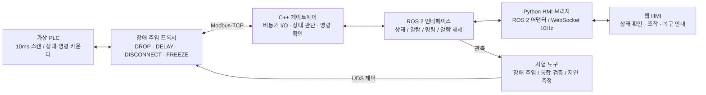

# ROS 2 Modbus-TCP Industrial Gateway

**PLC와 ROS 2 사이의 통신 장애를 재현하고, 상태 판단·명령 확인·복구 절차를 설계하는 학습 프로젝트입니다.**

현장 엔지니어에게 필요한 것은 통신 연결 자체뿐 아니라 **“지금 보이는 값은 믿을 수 있는가?”, “명령이 실제로 반영되었는가?”, “복구 후 무엇을 확인해야 하는가?”**를 설명하고 문제를 좁혀 가는 능력이라고 생각했습니다. 이 프로젝트는 가상 PLC, C++ 게이트웨이, 웹 HMI를 연결해 그 질문을 코드와 테스트로 다루는 과정을 기록합니다.

ROS 2 Jazzy · C++17 · Boost.Asio · Python / Pymodbus · FastAPI / WebSocket · React / TypeScript · Docker Compose

> **검증 범위:** 가상 PLC와 WSL2 기반 개발 환경의 구현·시험 기록입니다. 실제 제조 라인 적용, 물리 PLC 호환성, 하드 실시간 성능 또는 기능 안전 인증을 입증하는 자료는 아닙니다.

## 프로젝트를 한눈에 보기

| 현장에서 마주할 수 있는 질문 | 프로젝트에서 다룬 해결 방식 |
|---|---|
| 여러 번 읽은 상태값이 서로 다른 시점의 값이라면? | 상태를 6개 연속 레지스터로 모아 FC03 한 번으로 읽기 |
| 응답은 오는데 PLC 로직이 멈췄다면? | TCP 연결 상태와 별개로 heartbeat의 진행 여부 감시 |
| 쓰기 응답을 받으면 명령 성공으로 봐도 될까? | 명령 반영 카운터와 실제 상태를 다시 읽어 성공 확인 |
| 통신이 복구되면 바로 START를 허용해도 될까? | 데이터 유효성과 알람 래치를 분리하고 명시적으로 해제 |
| 장애를 우연히 기다리지 않고 어떻게 시험할까? | 유실·지연·단절·PLC 정체를 주입하고 결과 확인 |
| 운영자는 알람을 보고 다음 행동을 알 수 있을까? | HMI에 상태, 제어 가능 여부, 복구 안내를 함께 표시 |

**읽는 순서:** [문제 해결 과정](#문제-해결-과정) → [검증 결과와 근거](#검증-결과와-근거) → [직접 실행하기](#직접-실행하기) → [학습 문서](#학습-문서와-다음-과제)

## 시스템 구성



게이트웨이는 기본 20ms 주기(50Hz)로 상태를 읽습니다. I/O 스레드와 ROS 실행 스레드는 `GatewayBuffer`를 통해 상태를 공유하며, HMI는 ROS 인터페이스를 통해 연결됩니다. HMI만 살펴보는 경우에는 별도의 Mock 어댑터로 실행할 수 있습니다.

| 인터페이스 | 역할 | 설계 의도 |
|---|---|---|
| `/plc/state` | 최신 상태, 데이터 유효성, 통신 지표 | Best Effort / Depth 1로 최신 상태 전달에 집중 |
| `/safety/alarm` | 알람 발생·해제 이벤트 | Reliable / Transient Local / Depth 1로 늦게 연결한 구독자도 마지막 상태 확인 |
| `/plc/trigger_command` | START, STOP, RESET, SETPOINT | 요청 접수 이후 PLC 반영 여부를 확인해 결과 응답 |
| `/plc/clear_fault` | 게이트웨이 알람 래치 해제 | 통신 복구와 운전 허용을 별도 절차로 처리 |

인터페이스 계약은 [`msg/`](msg/)와 [`srv/`](srv/), 기본 주기와 타임아웃은 [`config/gateway.yaml`](config/gateway.yaml)에 있습니다.

## 문제 해결 과정

### 1. 읽기 횟수를 줄이되, 상태를 함께 해석할 수 있게 만들기

**문제:** 초기 명세는 `레지스터 읽기 → 코일 읽기 → 레지스터 재확인`의 세 트랜잭션으로 상태를 확인하는 Seqlock 방식을 사용했습니다. 읽는 사이 PLC 상태가 바뀌면 표본을 버리고 다시 확인해야 하며, 통신 왕복도 늘어나는 구조였습니다.

**판단과 구현:** 필요한 상태를 6개 연속 Holding Register에 모으고, 코일 상태는 `status_flags` 비트로 표현했습니다. 정상 상태 조회는 FC03 한 번으로 끝내며, 제어 코일 쓰기와 SETPOINT 레지스터 쓰기는 별도로 유지했습니다.

**배운 점:** 정합성 문제를 재시도 로직만으로 해결하기보다 데이터 배치와 프로토콜 계약부터 단순화할 수 있습니다. 상태 읽기 트랜잭션 수는 설계상 **3회 → 1회**로 줄지만, 이를 전체 트래픽 66% 절감 실측으로 해석하지 않습니다. 실제 PLC에서도 한 응답의 값이 같은 스캔의 상태인지 별도로 확인해야 합니다.

근거: [`register_map.hpp`](include/ros2_modbus_gateway/register_map.hpp) · [`station_context.cpp`](src/station_context.cpp) · [Phase 1 기록](docs/phases/%5BPhase_1%5D_기본_골격_및_가상_환경_구축.md)

### 2. 연결 상태, 데이터 신선도, 운전 허용을 구분하기

**문제:** 소켓이 연결되어 있어도 PLC 로직이 정체될 수 있습니다. 반대로 통신이 회복되었다고 알람까지 자동으로 해제하면, 장애 원인을 확인하기 전에 운전을 다시 요청할 수 있습니다.

**판단과 구현:** I/O 실패 횟수, heartbeat 진행 여부, 표본의 나이를 따로 확인합니다. 기본 설정은 응답 타임아웃 25ms, 연속 실패 한도 3회, heartbeat 정체 한도 80ms입니다. `data_valid`는 관측값의 유효성을, `alarm_active`는 유지 중인 알람 래치를 나타냅니다. 유효한 상태를 다시 받아도 알람 래치는 유지하며, START는 래치가 남아 있으면 거부합니다.

```text
통신 장애 발생     → data_valid=false, 알람 래치 활성
통신·유효 표본 복구 → data_valid=true,  알람 래치는 유지
원인 확인·해제      → 명시적 RESET 또는 조건에 맞는 ClearFault
운전 재개           → 별도 START 요청과 PLC 반영 확인
```

**배운 점:** “값이 다시 보인다”와 “운전해도 된다”는 서로 다른 판단입니다. 연속 실패 필터는 일시적 유실에 대한 오경보를 줄이지만 감지 시간을 늘립니다. 따라서 장애 적용부터 ROS 알람 수신까지의 시간을 시험해야 합니다. 게이트웨이의 알람·명령 차단은 물리 안전 회로나 상위 제어기의 수신 watchdog을 대체하지 않습니다.

근거: [`safety_monitor.cpp`](src/safety_monitor.cpp) · [`gateway_buffer.cpp`](src/gateway_buffer.cpp) · [`test_safety_monitor.cpp`](tests/test_safety_monitor.cpp) · [`test_gateway_buffer.cpp`](tests/test_gateway_buffer.cpp)

### 3. 명령을 보냈다는 사실과 실행되었다는 사실을 구분하기

**문제:** Modbus 쓰기 응답만으로 설비 동작을 확정하면 PLC 인터록에 막힌 요청을 성공으로 보고할 수 있습니다. 쓰기 후 응답이 유실된 경우에는 이미 실행된 명령을 재전송할 위험도 있습니다.

**판단과 구현:** 스테이션마다 진행 중인 명령을 하나만 허용하고, 중복 요청에는 `BUSY`를 반환합니다. 쓰기 이후 FC03 표본의 `applied_command_counter`와 명령별 상태를 확인해야 `CONFIRMED`가 됩니다. 실행 여부를 확정할 수 없으면 `UNKNOWN`으로 구분하며 쓰기 명령을 자동 재전송하지 않습니다. 재연결 시에는 세션 번호인 `generation`으로 이전 세션의 표본과 대기 명령을 구분합니다.

**배운 점:** 제어 인터페이스의 성공은 패킷 전송 여부보다 설비에서 관측한 결과로 정의해야 합니다. 단일 명령 슬롯은 처리량을 제한하지만, 어떤 요청을 확인하고 있는지 명확하게 만듭니다. `UNKNOWN`을 받으면 상위 시스템에서 상태를 다시 확인해야 합니다.

근거: [`TriggerCommand.srv`](srv/TriggerCommand.srv) · [`station_context.cpp`](src/station_context.cpp) · [`gateway_buffer.cpp`](src/gateway_buffer.cpp) · [`run_integration.py`](tests/run_integration.py)

### 4. 알람을 빠르게 전달하면서 스레드 간 교착을 피하기

**문제:** 알람 확인을 짧은 주기 타이머로 반복하면 대기 중에도 CPU를 사용합니다. 공유 버퍼의 락을 잡은 채 외부 콜백을 호출하면, 콜백이 같은 버퍼를 조회할 때 교착이 생길 수 있습니다.

**판단과 구현:** Boost.Asio로 소켓과 타이머를 비동기 처리합니다. 버퍼 갱신과 콜백 실행을 분리해 **락을 해제한 뒤 외부 콜백을 호출**합니다. 알람은 `GuardCondition` 기반 Waitable로 ROS 실행기를 깨워 전달하고, 일반 상태는 정해진 주기로 발행합니다.

**배운 점:** 알람의 긴급성과 일반 텔레메트리의 주기를 분리할 수 있습니다. 이벤트 기반 구조는 다음 확인 타이머를 기다리는 일을 줄이지만 OS 스케줄링과 DDS 전달 지연까지 없애지는 않습니다. 따라서 `0ms 지연`, `락 점유 1µs 이하` 같은 수치는 별도 측정 없이 성과로 주장하지 않습니다.

근거: [`modbus_client.cpp`](src/modbus_client.cpp) · [`gateway_buffer.cpp`](src/gateway_buffer.cpp) · [`gateway_node.cpp`](src/gateway_node.cpp) · [Phase 3 기록](docs/phases/%5BPhase_3%5D_비동기_통신_및_ROS_노드_결합.md)

### 5. 재현 가능한 장애 시험과 운영 화면으로 연결하기

**문제:** 정상 통신만 시험하면 장애 감지와 복구 과정의 빈틈이 드러나지 않습니다. 알람 코드만 보여 주면 운영자는 원인과 다음 행동을 판단하기 어렵습니다. 여러 언어에 같은 의미의 상수가 흩어지면 계층 사이의 해석도 달라질 수 있습니다.

**판단과 구현:** 가상 PLC 앞에 장애 주입 프록시를 두고 UDS 제어로 유실·지연·단절·heartbeat 정체를 재현합니다. 16개 시나리오 스크립트는 명령 경합, 장애 알람, 복구 후 래치 유지, 늦게 연결한 구독자, 수신 watchdog 등을 확인합니다. HMI에는 상태·알람·조작 가능 여부·복구 안내를 배치하고 한/영 전환을 제공합니다.

상수 관리는 다언어 코드 생성기를 도입하는 대신 각 계층의 상수 정의와 경량 계약 테스트를 선택했습니다. 현재 계약 테스트는 C++과 Python의 레지스터·명령·오류 코드 등을 비교합니다. HMI는 레지스터 주소 대신 ROS 데이터 모델을 소비하도록 구성했습니다.

**배운 점:** 장애를 다시 만들 수 있어야 수정 전후를 비교할 수 있습니다. 화면은 진단과 다음 행동을 돕고, 명령 수락 여부는 코어가 판단하도록 책임을 구분합니다. 계약 테스트도 검사하는 항목에 한해 정합성을 확인합니다.

근거: [`fault_proxy.py`](mock_plc/fault_proxy.py) · [`run_fault_scenarios.py`](tests/run_fault_scenarios.py) · [`hmi/`](hmi/) · [`test_contract.py`](tests/test_contract.py) · [ADR 001](docs/architecture/ADR_001_LAYERED_SSOT_AND_CONTRACT_TESTING.md)

## 시연 화면


상태 배지, 공정값, 통신 지표, 운영 버튼, 장애 시험 패널을 한 화면에서 확인하는 HMI입니다. ISA-101의 상황 인식 설계 원칙을 참고했으며, 표준 적합성 검증 결과는 아닙니다.

<details>
<summary>터미널 장애 주입 시연 보기</summary>


저장된 시연 자료는 정상 통신 → 장애 주입 → 알람 → 통신 복구 → 명시적 알람 해제 순서를 보여 줍니다. 화면에 표시된 지연은 해당 실행의 결과입니다.

</details>

## 검증 결과와 근거

### 이번 문서 정리 시 재확인한 항목

2026-10-01, Windows / Python 3.11.9에서 `python -m pytest tests/ -q`를 실행해 **40개 테스트 통과**를 확인했습니다.

| 검증 항목 | 결과 | 확인하는 범위 |
|---|---|---|
| C++ ↔ Python 계약 테스트 | 6개 통과 | 레지스터·명령·오류 코드·비트마스크 정의 |
| PLC 제어 프로토콜 테스트 | 9개 통과 | 장애 주입 제어 요청과 입력 검증 |
| 가상 PLC 데이터스토어 테스트 | 12개 통과 | 스캔 로직, 명령 반영, 인터록, 카운터 |
| HMI 테스트 | 13개 통과 | Mock 어댑터, REST/WebSocket, 상태 표현, 번역 사전 |

이 40개는 Python 테스트입니다. C++ 빌드·GTest, ROS 2 통합 서비스, 실제 네트워크 장애 시험의 통과를 대신하지 않습니다. 해당 테스트 코드와 스크립트는 저장소에 있으며 이번 문서 정리에서는 재실행하지 않았습니다. 기존 단계별 문서의 통과 기록은 해당 개발 시점의 기록입니다.

### 저장소에 남아 있는 성능 측정 기록

[`benchmark/summary_3000.json`](benchmark/summary_3000.json)의 2026-09-22 기록입니다. **WSL2 Linux / Python 3.12.3 / 3,000개 표본 / 60.07초** 조건이며, 실제 공장 설비의 성능이나 최악 지연 보장을 뜻하지 않습니다. P99는 표본의 99%가 해당 값 이하였다는 통계입니다.

| 지표 | 기록값 | 해석 |
|---|---:|---|
| FC03 읽기 RTT, P99 | 0.6997ms | 기록된 목표 5ms 이하 |
| 폴링 지터, P99 | 0.0813ms | 기록된 목표 2ms 이하 |
| 표본 → ROS 수신 지연, P99 | 14.1648ms | RTT와 구분해서 봐야 하는 전체 전달 지연 |
| 게이트웨이 프로세스 CPU 사용률 | 1.86% | 측정 구간 평균, 기록된 목표 2% 이하 |
| 유효 표본 수집률 | 49.94Hz | 기본 50Hz 설정에서의 수집 결과 |

현재 [`summary.json`](benchmark/summary.json)도 같은 3,000개 표본 기록을 담고 있으므로 별도의 1,000회 실험으로 중복 집계하지 않습니다. JSON의 `overall_pass`는 RTT와 지터 판정을 묶은 값이며 모든 요구의 통과 판정이 아닙니다.

장애 감지 100ms는 시나리오 시험의 목표입니다. 원시 장애 CSV와 최신 반복 실행 로그는 Git에 포함되어 있지 않아, 여기서는 `16/16 최신 통과`나 장애별 최대 지연을 확정 수치로 제시하지 않습니다.

## 직접 실행하기

저장소 루트에서 실행합니다. **HMI Mock 실행**과 **ROS 2 게이트웨이 통합 실행**은 서로 다른 확인 단계입니다.

### 1. Windows에서도 HMI 화면과 조작 흐름 살펴보기

Python 3.11 환경에서 이번 테스트에 사용한 패키지 버전을 기준으로 한 예시입니다. 가상 환경에서 설치하는 것을 권장합니다.

```bash
python -m pip install fastapi==0.104.1 uvicorn==0.24.0 pydantic==2.5.0 httpx==0.25.1 websockets==15.0.1 pytest==7.4.3 pytest-asyncio==0.21.1
python -m pip install -r mock_plc/requirements.txt
python -m hmi.run --host 127.0.0.1 --port 8000 --adapter mock
```

브라우저에서 `http://localhost:8000`에 접속합니다. 이 모드의 값과 명령 결과는 `MockHmiAdapter`의 시뮬레이션이며 C++ 게이트웨이나 Docker PLC를 제어하지 않습니다. `/api/health`에서 사용 중인 어댑터를 확인할 수 있습니다.

현재 React 빌드가 [`hmi_web_prototype/dist/`](hmi_web_prototype/dist/)에 포함되어 있습니다. 프런트엔드를 수정했다면 `hmi_web_prototype` 폴더에서 `npm ci`와 `npm run build`를 실행해 다시 빌드합니다.

### 2. 가상 PLC와 ROS 2 게이트웨이 연결하기

Docker Engine의 Linux 컨테이너 환경과 Docker Compose가 필요합니다.

```bash
docker compose up -d --build
docker compose ps

# 게이트웨이 컨테이너의 기본 명령은 bash이므로 노드를 별도로 실행합니다.
# 이 터미널은 실행 상태로 두고, 관측·시험은 다른 터미널에서 진행합니다.
docker compose exec ros2_gateway /gateway-entrypoint.sh ros2 launch ros2_modbus_gateway gateway.launch.py
```

첫 실행 시 entrypoint가 ROS 작업 공간을 빌드합니다. 기본 통신 대상은 Compose 네트워크 내부의 `mock_plc:5020`입니다.

```bash
# 다른 터미널: 상태 확인과 정상 기동 후 게이트웨이 시작 알람 래치 해제
docker compose exec ros2_gateway /gateway-entrypoint.sh ros2 topic list
docker compose exec ros2_gateway /gateway-entrypoint.sh ros2 topic echo /plc/state --once --qos-reliability best_effort
docker compose exec ros2_gateway /gateway-entrypoint.sh ros2 service call /plc/clear_fault ros2_modbus_gateway/srv/ClearFault "{force_clear: false}"

# 패킷 유실 주입 → 알람 관찰 → 통신 복구
docker compose exec mock_plc python -m mock_plc.fault_injector --mode DROP
docker compose exec ros2_gateway /gateway-entrypoint.sh ros2 topic echo /safety/alarm --once --qos-durability transient_local --qos-reliability reliable
docker compose exec mock_plc python -m mock_plc.fault_injector --mode NORMAL
```

복구 후 `/plc/state`의 `data_valid`와 `alarm_active`를 각각 확인합니다. 정상 통신으로 돌아오는 것만으로 알람이 해제되지 않는 과정이 관찰 포인트입니다.

실제 ROS 데이터를 HMI에서 보려면 ROS 2와 생성된 `ros2_modbus_gateway` Python 인터페이스가 있는 환경에서 브리지를 실행하고, 게이트웨이와 DDS 통신이 가능해야 합니다(`ROS_DOMAIN_ID=42`). Windows Mock 화면이 Docker 내부 ROS에 자동 연결되는 구성은 아닙니다.

### 3. 검증 수준별 실행 명령

```bash
# 로컬 Python 테스트: ROS 2 없이 실행
python -m pytest tests/ -q

# C++ / ROS 2 테스트: 빌드된 컨테이너에서 실행
docker compose exec ros2_gateway /gateway-entrypoint.sh colcon test --packages-select ros2_modbus_gateway
docker compose exec ros2_gateway /gateway-entrypoint.sh colcon test-result --verbose

# 게이트웨이 노드가 실행 중인 가상 환경에서 통합 서비스 확인
docker compose exec ros2_gateway /gateway-entrypoint.sh python /ros2_ws/src/ros2_modbus_gateway/tests/run_integration.py

# 16개 시나리오 시험: 마지막 항목은 SIGSTOP/SIGCONT로 노드를 일시 정지·재개합니다.
docker compose exec ros2_gateway /gateway-entrypoint.sh python /ros2_ws/src/ros2_modbus_gateway/tests/run_fault_scenarios.py

# 정상 상태에서 3,000개 표본 측정: summary.json과 로컬 CSV를 새로 생성합니다.
docker compose exec ros2_gateway /gateway-entrypoint.sh python /ros2_ws/src/ros2_modbus_gateway/benchmark/measure_latency.py 3000
```

위 Docker 명령은 코드·설정에 맞춘 재현 절차이며 이번 README 정리에서 컨테이너 통합 실행을 재검증한 결과는 아닙니다.

## 학습 문서와 다음 과제

README는 전체 문제 해결 과정을 설명하는 입구입니다. 구현 계약과 당시의 상세 판단은 아래 문서로 이어집니다. 기존 문서에는 개발 당시의 목표·완료 표현과 Obsidian 링크가 남아 있으므로, 검증 수치와 현재 상태는 위 근거를 함께 확인해 주세요.

| 문서 | 읽으면서 확인할 질문 |
|---|---|
| [구현 명세](spec_production.md) | 상태·타임아웃·명령 성공 조건을 어떻게 정의했는가? |
| [Phase 1: 골격과 가상 환경](docs/phases/%5BPhase_1%5D_기본_골격_및_가상_환경_구축.md) | 읽기 구조와 테스트 환경을 왜 먼저 정했는가? |
| [Phase 2: 도메인 코어와 테스트](docs/phases/%5BPhase_2%5D_도메인_코어_및_TDD_검증.md) | 알람·유효성·명령 슬롯을 어떤 규칙으로 분리했는가? |
| [Phase 3: 비동기 통신과 ROS](docs/phases/%5BPhase_3%5D_비동기_통신_및_ROS_노드_결합.md) | 스레드와 콜백의 책임을 어떻게 나누었는가? |
| [Phase 4: 장애 주입과 측정](docs/phases/%5BPhase_4%5D_장애_주입_및_16대_시나리오_검증.md) | 장애를 어떻게 재현하고 결과를 판정했는가? |
| [ADR 001: 상수 관리와 계약 테스트](docs/architecture/ADR_001_LAYERED_SSOT_AND_CONTRACT_TESTING.md) | 코드 생성 대신 계약 테스트를 선택한 이유는 무엇인가? |
| [HMI 설계 기록](docs/hmi/HMI_DESIGN_AND_IMPLEMENTATION_PLAN.md) | 운영자가 원인과 다음 행동을 알 수 있게 했는가? |
| [학습 관점 가이드](docs/learning/개발자_역량_성장_가이드라인_및_학습_관점_가드레일.md) · [지식 허브](docs/00_KNOWLEDGE_HUB.md) | 통신·동시성·설계·현장 운영 관점에서 무엇을 더 공부할 것인가? |

**다음 확인 과제:** 실제 PLC의 레지스터 갱신 방식과 인터록 확인, 장애 주입 반복 시험과 원시 CSV·로그·환경 설정 보관, 표본 → ROS 수신 지연을 발행 주기·실행기·DDS 경로별로 분석하기입니다.

**포트폴리오 브리핑:** 이 프로젝트에서 보여 주려는 역량은 통신·명령·복구 문제를 구체적인 질문으로 정의하고, 대안을 선택한 이유를 설명하며, 재현 가능한 시험과 측정 근거로 결과와 남은 과제를 구분하는 문제 해결 과정입니다.
