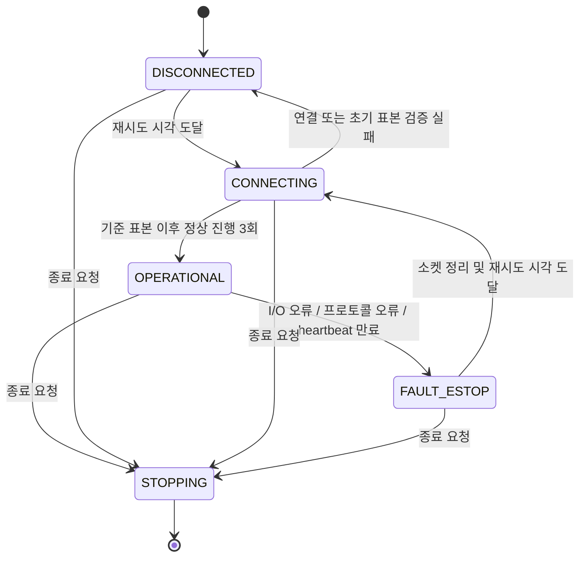
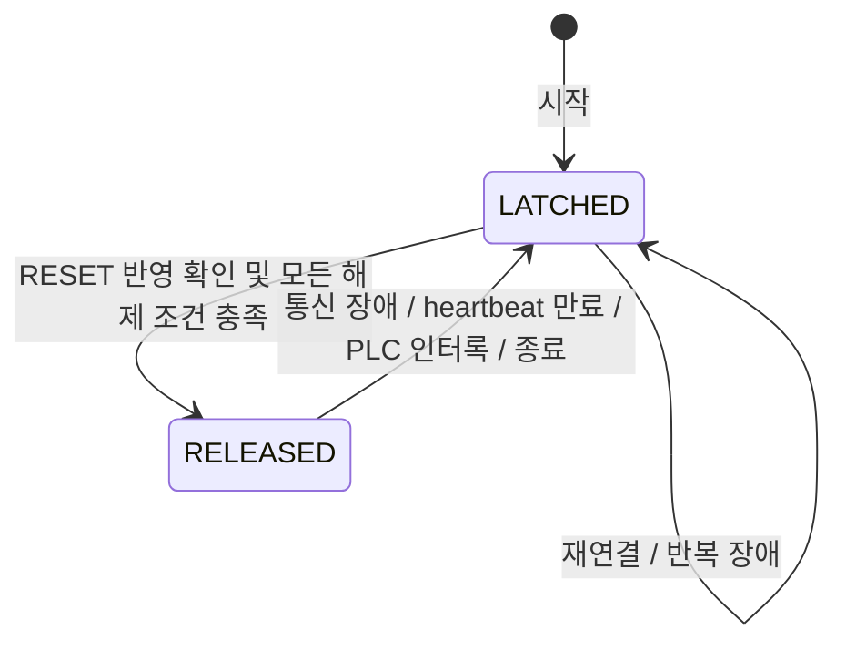

# 1. 시스템 아키텍처 및 소스 파일 설계

## 1.1 구현 기준 및 요구사항 해석

| 항목 | 확정 규격 |
|---|---|
| 패키지명 / 실행 파일명 | `ros2_modbus_gateway` / `gateway_node` |
| 운영 환경 | ROS 2 Jazzy, Ubuntu 24.04, C++17, `rclcpp`, `libmodbus` |
| 가상 PLC | Python 3.11, `pymodbus==3.8.6`, 단일 `asyncio` 이벤트 루프 |
| 배포 단위 | `mock_plc`, `ros2_gateway`의 2개 컨테이너 |
| 정상 폴링 / 발행 주기 | 기본 10ms / 10ms. 각각 20ms 설정도 허용 |
| 통신 대상 | 게이트웨이 1개가 PLC 1개를 제어. 다중 제어 클라이언트 미지원 |
| 외부 인터페이스 | ROS 2 Topic·Service, Modbus-TCP. HTTP API 미구현 |
| 명령 처리 | 호출자는 최종 서비스 응답을 기다림. ROS 콜백은 I/O 완료를 기다리지 않음 |
| 자동 복구 | 통신만 자동 복구. E-Stop 해제와 설비 재가동은 자동 수행하지 않음 |
| 안전 기능의 범위 | 소프트웨어 정지 요구 신호. 인증된 안전 PLC·하드웨어 비상정지 회로를 대체하지 않음 |
| 제외 | 웹 UI, Gazebo, MoveIt, OPC-UA, MQTT, 물리 PLC별 전용 드라이버 |

### 100ms 요구사항의 구현상 해석

원문의 “100ms 무응답 감지”와 “장애 발생 후 100ms 이내 수신자에게 E-Stop 전달”은 동일한 조건이 아니다. 감지 임계값을 정확히 100ms로 두면 스케줄링·발행·전달 시간이 추가된다.

다음과 같이 보수적으로 확정한다.

| 구간 | 예산 |
|---|---:|
| 마지막 정상 heartbeat 진행 이후 감지 임계값 | 90ms |
| 안전 타이머 확인 지연 | 목표 최대 1ms |
| 발행 및 수신 콜백까지 잔여 예산 | 목표 최대 9ms |
| 종단 간 검증 기준 | 100ms 이내 |

- 명시적인 소켓 오류·프로토콜 오류는 90ms를 기다리지 않고 즉시 정지 처리한다.
- WSL2·일반 Linux·Docker·DDS에서는 위 시간을 **하드 실시간 상한으로 보장하지 않는다**. 지정 시험 환경에서 충족해야 하는 성능 인수 조건이다.
- 프로세스 정지, OS 스케줄링 정지, DDS 전체 장애에서는 게이트웨이가 정지 토픽을 발행하지 못할 수 있다. 수신 제어기는 별도 상태 수신 타임아웃과 하드웨어 인터록을 가져야 한다.
- 평균 지연 3ms, 신뢰성 100%, 플랫폼 간 성능 동일성은 사전 보장값으로 사용하지 않는다.

## 1.2 레이어 및 의존성

```text
ROS 인터페이스 계층
  GatewayNode
      ↓
실행 조정 계층
  GatewayRuntime
      ├── GatewayBuffer → SafetyController
      └── ModbusClient
              ↓
          libmodbus

공통 계약
  types / config / register_map / monotonic_clock
```

| 레이어 | 책임 | 의존성 제한 |
|---|---|---|
| 공통 계약 | 타입, 주소, 단위, 설정, 시각 정의 | ROS·libmodbus 의존 금지 |
| Modbus 어댑터 | 연결, 읽기, 쓰기, 통신 오류 정규화 | ROS 메시지·안전 상태 전이 참조 금지 |
| 안전 정책 | heartbeat 판정, 래치, 복구 조건 | 소켓·ROS·파일 I/O 금지 |
| 공유 상태 | 최신 표본, 명령 슬롯, 세션 세대, 안전 이벤트 동기화 | 잠금 내부 외부 I/O 금지 |
| 실행 조정 | 워커 수명, 폴링, 명령 진행, 재연결 | ROS API 호출 금지 |
| ROS 어댑터 | 파라미터, DTO 변환, Topic·Service 제공 | 직접 Modbus 호출 금지 |
| 가상 PLC | 레지스터 모델과 장애 주입 | ROS 의존 금지 |
| 벤치마크 | 실제 인터페이스 관측·기록·판정 | 게이트웨이 내부 상태 직접 수정 금지 |

## 1.3 스레드·소유권 규칙

| 실행 주체 | 소유 자원 / 수행 작업 |
|---|---|
| Modbus 워커 1개 | `modbus_t`, 소켓, 연결·읽기·쓰기·재연결 |
| ROS `SingleThreadedExecutor` | 1ms 제어 타이머, 토픽 발행, 서비스 수신·응답 |
| DDS 내부 스레드 | 미들웨어 관리. 애플리케이션 공유 상태 직접 접근 금지 |
| PLC 이벤트 루프 | 데이터스토어, 10ms PLC 스캔, TCP 프록시, 제어 소켓 |

공유 상태 규칙:

1. `GatewayBuffer`의 단일 `std::mutex`가 표본·상태·명령·이벤트를 함께 보호한다.
2. `SafetyController`는 해당 mutex가 보호하는 연산에서만 변경한다.
3. 잠금 내부에서 소켓 I/O, ROS 발행, 로그 출력, 파일 기록, `sleep`, 조건변수 대기를 수행하지 않는다.
4. 최신 표본은 **단일 슬롯 덮어쓰기**로 관리한다. 과거 표본 FIFO를 쌓지 않는다.
5. 명령 슬롯은 **대기·실행 중을 합쳐 최대 1개**다. 초과 요청은 `BUSY`.
6. 소켓의 생성·종료·해제는 워커만 수행한다. ROS 스레드에서 `modbus_close()`를 호출하지 않는다.
7. 안전 장애는 세션 `generation`을 무효화한다. 이전 세대의 표본·명령 완료가 현재 상태를 복구시켜서는 안 된다.
8. 종료 시 워커를 `join`한다. `detach` 금지.

원문의 `thread_safe_queue.hpp`는 생성하지 않는다. 최신 상태와 명령의 저장·포화 정책이 다르므로 `GatewayBuffer`로 책임을 명확히 분리한다.

## 1.4 전체 파일 트리

`[생성물]`은 프로그램·도구 실행으로 생성하며 수작업 데이터로 대체하지 않는다.

```text
ros2_modbus_industrial_gateway/
├── PROJECT_GUIDE.md                         # 기존 기획 문서; 변경하지 않음
├── README.md                                # 빌드·실행·복구·측정·안전 한계
├── CMakeLists.txt                           # ament, 인터페이스 생성, 라이브러리·실행 파일·테스트
├── package.xml                              # ROS 의존성 및 rosidl 패키지 선언
├── .gitignore                               # build/install/log/캐시/임시 측정물 제외
├── .dockerignore                            # 이미지 빌드 컨텍스트 제외 규칙
├── .gitattributes                           # 소스·셸 파일 LF 고정
├── docker-compose.yml                       # 2서비스, 네트워크, 볼륨, 종료 정책
│
├── docker/
│   ├── Dockerfile.gateway                   # Jazzy, libmodbus-dev, 빌드·측정 의존성
│   ├── Dockerfile.plc                       # Python 3.11, 고정 Python 의존성
│   └── gateway-entrypoint.sh                # ROS 환경 로드, 빌드, 실행 및 신호 전달
│
├── config/
│   ├── gateway.yaml                         # 게이트웨이 시작 파라미터
│   └── fastdds.xml                          # 발행 방식·reliable 대기 상한 설정
│
├── launch/
│   └── gateway.launch.py                    # 설정 파일 경로 및 노드 실행
│
├── include/ros2_modbus_gateway/
│   ├── types.hpp                            # 순수 도메인 타입·열거형·결과 타입
│   ├── config.hpp                           # 설정 타입 및 검증 선언
│   ├── register_map.hpp                     # Coils/HR 주소·권한·단위 상수
│   ├── monotonic_clock.hpp                  # 단조 시각 취득 선언
│   ├── modbus_client.hpp                    # libmodbus RAII 어댑터 선언
│   ├── safety_controller.hpp                # 안전 정책 선언
│   ├── gateway_buffer.hpp                   # 동기화 저장소·명령 슬롯 선언
│   ├── gateway_runtime.hpp                  # 워커 및 처리 파이프라인 선언
│   └── gateway_node.hpp                     # ROS 노드 선언
│
├── src/
│   ├── config.cpp                           # 설정 유효성 검사
│   ├── monotonic_clock.cpp                  # Linux CLOCK_MONOTONIC 어댑터
│   ├── modbus_client.cpp                    # 연결·읽기·쓰기·오류 변환
│   ├── safety_controller.cpp                # 상태·heartbeat·래치 판정
│   ├── gateway_buffer.cpp                   # 공유 상태의 원자적 갱신
│   ├── gateway_runtime.cpp                  # 폴링·명령 확인·재연결·종료
│   ├── gateway_node.cpp                     # ROS 콜백·DTO 변환·발행
│   └── main.cpp                             # 초기화·실행·종료 코드 분류
│
├── msg/
│   ├── PlcState.msg                         # 설비 상태·유효성·표본 시각
│   └── EmergencyStop.msg                    # 래치 상태·이벤트 식별자·원인
│
├── srv/
│   └── TriggerCommand.srv                   # 명령 요청과 최종 결과
│
├── mock_plc/
│   ├── requirements.txt                     # pymodbus==3.8.6
│   ├── mock_plc_server.py                   # PLC 스캔·서버·제어 소켓의 수명 관리
│   ├── datastore.py                         # 5 Coils/5 HR, 접근 권한, 제어 반영
│   ├── fault_proxy.py                       # TCP 장애 주입 프록시
│   ├── control_protocol.py                  # 제어 DTO·JSON 검증·응답 규격
│   └── fault_injector.py                    # 단발 명령 및 키보드 인터랙티브 CLI
│
├── tests/
│   ├── test_config.cpp                     # 설정 경계·잘못된 조합
│   ├── test_safety_controller.cpp          # 시간 경계·wrap·래치·복구
│   ├── test_gateway_buffer.cpp             # 포화·세대 경쟁·늦은 완료
│   ├── test_datastore.py                   # 주소·권한·인터록·명령 반영
│   ├── run_integration.py                  # 실제 ROS 서비스/Modbus 종단 검증
│   └── run_fault_scenarios.py              # 장애 주입·정지·복구 자동 검증
│
└── benchmark/
    ├── requirements.txt                    # matplotlib==3.9.4
    ├── measure_latency.py                  # 상태 수신·중복 제거·CSV 기록
    ├── plot_latency.py                     # CSV 검증·통계·그래프 생성
    ├── latency.csv                         # [생성물] 정상 구간 측정
    ├── fault_events.csv                    # [생성물] 장애·E-Stop 시각
    ├── summary.json                        # [생성물] 환경·통계·합격 판정
    ├── latency_jitter.png                  # [생성물] 지연·지터 그래프
    └── demo.gif                            # [생성물] 실제 터미널 시연 녹화
```

## 1.5 빌드·컨테이너 계약

| 항목 | 규격 |
|---|---|
| ROS 패키징 | `ament_cmake`, C++17, `rosidl_default_generators`, `rosidl_default_runtime` |
| ROS 의존성 | `rclcpp`, `builtin_interfaces`, `unique_identifier_msgs`, `rmw_fastrtps_cpp` |
| C++ 연결 | `libmodbus`, 시스템 스레드 라이브러리 |
| Python 도구 | 게이트웨이의 ROS Python 환경에서 `rclpy` 사용. PLC는 별도 Python 3.11 환경 |
| 기본 이미지 | `ros:jazzy-ros-base`, `python:3.11-slim-bookworm` |
| 릴리스 재현성 | 배포 시 이미지 digest·설치 패키지 버전·CPU 아키텍처를 `summary.json`에 기록 |
| 실행 사용자 | 양쪽 컨테이너 UID/GID 1000 |
| 네트워크 | 전용 Compose bridge. Modbus·DDS 포트의 호스트 공개 없음 |
| PLC 외부 포트 | 컨테이너 내부 `0.0.0.0:5020` |
| PLC 백엔드 | 동일 컨테이너 `127.0.0.1:15020`; 외부 공개 금지 |
| 제어 소켓 | named volume의 `/run/plc/control.sock`; 양쪽 컨테이너에서 접근 |
| 소스 마운트 | 저장소 → `/ros2_ws/src/ros2_modbus_gateway` |
| 빌드 산출물 | `/ros2_ws/build`, `/ros2_ws/install`, `/ros2_ws/log`는 Linux named volume |
| 초기 실행 | `docker compose up --build`로 빌드 후 두 프로세스 실행 |
| 소스 수정 | 이미지 재빌드 불필요. C++는 `colcon build --symlink-install` 후 프로세스 재실행 필요 |
| 시작 순서 | PLC 준비 여부와 무관하게 게이트웨이 시작 허용. 미연결 상태에서 안전 래치 유지 |
| 종료 | `init: true`, `stop_grace_period: 3s` |
| ROS 시각 | `use_sim_time=false`; 변경 요청 거부 |
| DDS | `ROS_DOMAIN_ID=42`, `rmw_fastrtps_cpp`; ROS CLI도 같은 컨테이너 환경 사용 |

Fast DDS는 비동기 발행을 사용하고 reliable writer의 `max_blocking_time`을 1ms로 설정한다. 설정 적용 여부는 시작 로그와 실제 지연 시험으로 확인한다. 이 설정만으로 종단 간 전달 시간을 보장하지 않는다.

---

# 2. 데이터 엔티티 및 인터페이스 규격

## 2.1 공통 타입

표의 필드는 별도 표시가 없으면 모두 필수다.

| 타입 | 정의 |
|---|---|
| `MonotonicNs` | `uint64_t`; Linux `CLOCK_MONOTONIC` 기준 ns. 유효 시각은 0보다 큼 |
| `DurationNs` | `uint64_t`; 음수 불허 |
| `Generation` | `uint64_t`; 연결 시도별 식별자. 프로세스 내 재사용 금지 |
| `CommandId` | `uint64_t`; 수락한 명령에 1부터 부여. 0은 미수락 |
| `SampleSequence` | `uint64_t`; 채택한 일관된 표본마다 증가 |
| `InstanceId` | UUID 16바이트; 게이트웨이 프로세스 시작마다 새로 생성 |
| `Result<T>` | `T` 또는 `GatewayError` 중 정확히 하나 |
| `Result<void>` | 성공 표식 또는 `GatewayError` 중 정확히 하나 |
| `Optional<T>` | C++ `std::optional<T>`; 내부 타입에만 사용 |

### 열거형

| 타입 | 값 |
|---|---|
| `LinkState : uint8_t` | `0 DISCONNECTED`, `1 CONNECTING`, `2 OPERATIONAL`, `3 FAULT_ESTOP`, `4 STOPPING` |
| `Command : uint8_t` | `1 START`, `2 STOP`, `3 RESET`, `4 SET_SETPOINT` |
| `CommandPhase : uint8_t` | `QUEUED`, `WRITE_STARTED`, `WAITING_CONFIRMATION`, `TERMINAL` |
| `CommandOutcome : uint8_t` | `0 NOT_SENT`, `1 CONFIRMED`, `2 UNKNOWN`, `3 REJECTED` |
| `SafetyCause : uint8_t` | `0 STARTUP`, `1 COMMUNICATION`, `2 HEARTBEAT`, `3 PLC_INTERLOCK`, `4 MANUAL_RESET`, `5 SHUTDOWN`, `6 INTERNAL` |

`OPERATIONAL`은 **통신 준비 완료**만 의미한다. E-Stop 해제나 설비 운전 상태를 의미하지 않는다.

## 2.2 설정 엔티티 `GatewayConfig`

모든 파라미터는 시작 시에만 적용한다. 실행 중 변경은 실패로 응답한다.

| 필드 / ROS 파라미터 | 타입 | 기본값 | 제약 |
|---|---|---:|---|
| `plc_host` | `string` | `mock_plc` | 1~253자; IPv4 또는 DNS 호스트명. URL·스킴·경로 불허 |
| `plc_port` | `uint16` | 5020 | 1~65535 |
| `unit_id` | `uint8` | 1 | 1~247; broadcast 0 불허 |
| `coil_base` | `uint16` | 0 | 0~65531 |
| `holding_base` | `uint16` | 0 | 0~65531 |
| `poll_period_ms` | `uint16` | 10 | 10 또는 20 |
| `publish_period_ms` | `uint16` | 10 | 10 또는 20 |
| `response_timeout_ms` | `uint16` | 20 | 본 버전에서는 20 고정 |
| `connect_timeout_ms` | `uint16` | 200 | 주소별 연결 시도 200 고정 |
| `watchdog_timeout_ms` | `uint16` | 90 | 90 고정 |
| `safety_tick_ms` | `uint16` | 1 | 1 고정 |
| `command_timeout_ms` | `uint16` | 250 | 250 고정 |
| `recovery_progress_count` | `uint8` | 3 | 3 고정 |

- 위 타이밍 고정값은 설정 파일에 명시하되 다른 값은 시작 오류로 처리한다.
- Coil·HR 개수는 각각 5로 고정한다.
- PLC의 주소·Unit ID 설정도 게이트웨이 설정과 일치해야 한다.
- 재연결 대기 시간은 `100 → 200 → 400 → 800 → 1000ms`, 이후 1000ms 유지다.

## 2.3 Modbus 데이터 맵

주소는 **PDU의 0-based 주소**다. `40001` 표기법을 내부 주소로 사용하지 않는다.

- Coil 절대 주소: `coil_base + offset`.
- HR 절대 주소: `holding_base + offset`.
- HR은 unsigned 16-bit, Modbus 표준 big-endian.
- Coil의 비트 순서와 FC05 값 인코딩은 Modbus 표준을 따른다.
- FC01·FC03·FC05·FC06만 사용한다.

### Coils: 5개

| Offset | 이름 | 권한 | 초기값 | 의미 |
|---:|---|---|---:|---|
| 0 | `run_requested` | R/W, FC05 | false | PLC 운전 요청 |
| 1 | `reset_requested` | R/W, FC05 | false | PLC가 다음 스캔에서 소비하는 리셋 요청 |
| 2 | `ready` | R | true | 물리 E-Stop이 해제되고 PLC fault가 없음 |
| 3 | `running` | R | false | 실제 모의 운전 상태 |
| 4 | `physical_estop` | R | false | 물리 E-Stop 입력의 모의값 |

### Holding Registers: 5개

| Offset | 이름 | 권한 | 초기값 | 범위 / 단위 |
|---:|---|---|---:|---|
| 0 | `heartbeat` | R | 0 | 매 PLC 스캔 증가, modulo 65536 |
| 1 | `sensor_raw` | R | 0 | 0~1000, 0.1% 단위 |
| 2 | `fault_code` | R | 0 | 0 정상, 1 모의 공정 fault, 2 물리 E-Stop |
| 3 | `setpoint_raw` | R/W, FC06 | 0 | 0~1000, 0.1% 단위 |
| 4 | `applied_command_counter` | R | 0 | 제어 쓰기 반영마다 증가, modulo 65536 |

`SET_SETPOINT`는 Holding Register 쓰기 경로를 제공하는 최소 명령이다. 임의 주소 쓰기 API는 제공하지 않는다.

### PLC 데이터스토어 규칙

- 읽기는 유효 범위의 연속 구간만 허용한다.
- 읽기 전용 주소 쓰기와 범위 초과는 Modbus exception `0x02`.
- 허용하지 않은 값은 `0x03`.
- 미지원 function code는 `0x01`.
- Unit ID 불일치는 유효 장치 요청으로 처리하지 않는다.
- `pymodbus` 내부 주소 보정은 `datastore.py` 한 곳에서만 수행한다. wire 주소 0이 정의한 offset 0을 가리켜야 한다.
- PLC 모델 갱신은 이벤트 루프에서 중간 `await` 없이 완료하여 스캔 중간 상태를 노출하지 않는다.

### PLC 스캔 규칙

스캔 주기: 10ms.

1. 수락된 제어 쓰기를 수신 순서대로 반영한다.
2. `reset_requested=true`이면 `run_requested=false`로 만들고 리셋 요청을 소비한다.
3. 물리 E-Stop이 해제된 경우에만 RESET이 공정 fault를 해제한다.
4. 물리 E-Stop 활성 시 `fault_code=2`, `ready=false`, `running=false`, `run_requested=false`.
5. 그 외 공정 fault가 있으면 `ready=false`, `running=false`, `run_requested=false`.
6. 정상일 때 `running`은 `run_requested`와 같다.
7. `sensor_raw`는 운전 중 `setpoint_raw`, 정지 중 0이다.
8. 반영한 제어 쓰기마다 `applied_command_counter`를 1 증가시킨다.
9. 스캔 완료 시 `heartbeat`를 1 증가시킨다.

통신 단절만으로 PLC가 실제 정지했다고 간주하지 않는다. 이 모델에는 별도 하드웨어 안전 회로나 PLC 통신 watchdog이 없다.

## 2.4 내부 도메인 모델

### `RawPlcImage`

| 필드 | 타입 | 제약 |
|---|---|---|
| `coils` | `std::array<uint8_t, 5>` | 각 원소 0 또는 1 |
| `holding` | `std::array<uint16_t, 5>` | 주소 맵의 범위·의미 준수 |

### `PlcSample`

| 필드 | 타입 | 제약 |
|---|---|---|
| `generation` | `Generation` | 채택 시 현재 세대와 같아야 함 |
| `sequence` | `SampleSequence` | 1부터 증가 |
| `image` | `RawPlcImage` | 완전하고 일관된 표본 |
| `poll_started_ns` | `MonotonicNs` | 첫 읽기 직전 |
| `sampled_ns` | `MonotonicNs` | 최종 읽기 완료 시각 |
| `read_rtt_ns` | `std::array<DurationNs, 3>` | HR 전·Coils·HR 후 읽기 순서 |
| `poll_jitter_ns` | `int64_t` | 실제 폴링 시작 간격 − 설정 주기 |

### `CommandRequest`

| 필드 | 타입 | 제약 |
|---|---|---|
| `command` | `Command` | 정의된 4개 값만 허용 |
| `value` | `uint16_t` | SET_SETPOINT는 0~1000, 나머지는 반드시 0 |

### `CommandTask`

| 필드 | 타입 | 제약 |
|---|---|---|
| `id` | `CommandId` | 수락한 요청에만 할당 |
| `request` | `CommandRequest` | 입력 검증 완료 |
| `generation` | `Generation` | 수락 당시 세대 |
| `accepted_ns` | `MonotonicNs` | 슬롯 수락 시각 |
| `deadline_ns` | `MonotonicNs` | `accepted_ns + 250ms` |
| `phase` | `CommandPhase` | 명령 라이프사이클 준수 |
| `expected_counter` | `Optional<uint16_t>` | 전송 준비 시 이전 반영 카운터 + 1, modulo 65536 |

### `GatewayError`

| 필드 | 타입 | 제약 |
|---|---|---|
| `code` | `uint16_t` | §4.1의 코드 |
| `system_errno` | `int32_t` | OS 오류 없으면 0 |
| `modbus_exception` | `uint8_t` | Modbus exception 없으면 0 |
| `detail` | `string` | UTF-8 최대 160바이트; 프로그램 분기 기준으로 사용 금지 |

### `CommandResult`

| 필드 | 타입 | 제약 |
|---|---|---|
| `id` | `CommandId` | 원 요청과 일치 |
| `generation` | `Generation` | 명령을 수락한 세대 |
| `outcome` | `CommandOutcome` | `CONFIRMED`만 성공 |
| `error` | `GatewayError` | 성공이면 code 0 |
| `completed_ns` | `MonotonicNs` | 최종 결과 확정 시각 |
| `confirmed_sample_sequence` | `uint64_t` | 확인 표본 없으면 0 |

### `GatewayStatus`

| 필드 | 타입 | 제약 |
|---|---|---|
| `link_state` | `LinkState` | 현재 연결 상태 |
| `generation` | `Generation` | 현재 연결 시도 |
| `estop_active` | `bool` | 안전 래치 |
| `last_sample` | `Optional<PlcSample>` | 최초 유효 표본 이전에는 없음 |
| `last_progress_ns` | `Optional<MonotonicNs>` | 마지막 heartbeat 전진 시각 |
| `data_valid` | `bool` | §3.1 조건으로만 true |
| `last_error` | `GatewayError` | 현재 상태 원인 |
| `poll_attempt_count` | `uint64_t` | 성공·실패 포함 폴링 시도 누적 |
| `io_error_count` | `uint64_t` | I/O 오류 누적 |
| `incoherent_count` | `uint64_t` | 폐기한 불일관 표본 누적 |

### `SafetyEvent`

| 필드 | 타입 | 제약 |
|---|---|---|
| `sequence` | `uint64_t` | 프로세스 내 1부터 증가 |
| `active` | `bool` | 변경 후 래치 상태 |
| `cause` | `SafetyCause` | 이벤트 원인 |
| `error` | `GatewayError` | 상세 원인 |
| `generation` | `Generation` | 이벤트 발생 세대 |
| `detected_ns` | `MonotonicNs` | 상태 변경 확정 시각 |
| `last_progress_ns` | `Optional<MonotonicNs>` | heartbeat 기준 시각 |

`TickOutput`은 `GatewayStatus`, `Optional<SafetyEvent>`, `Optional<CommandResult>`를 각각 하나씩 포함한다.

## 2.5 모듈 메서드 시그니처

아래는 선언 규격이며 함수 본문은 포함하지 않는다.

### 공통·Modbus

| 소유 모듈 | 시그니처 |
|---|---|
| Config | `validate_config(const GatewayConfig& config) -> Result<void>` |
| Clock | `now_ns() noexcept -> MonotonicNs` |
| ModbusClient | `connect(const GatewayConfig& config) -> Result<void>` |
| ModbusClient | `close() noexcept -> void` |
| ModbusClient | `read_coils(uint16_t address, uint16_t count) -> Result<std::array<uint8_t, 5>>` |
| ModbusClient | `read_holding(uint16_t address, uint16_t count) -> Result<std::array<uint16_t, 5>>` |
| ModbusClient | `write_coil(uint16_t address, bool value) -> Result<void>` |
| ModbusClient | `write_register(uint16_t address, uint16_t value) -> Result<void>` |

읽기 `count`는 게이트웨이 내부 호출에서 항상 5다. 다른 값은 `INVALID_ARGUMENT`.

### 안전·공유 상태·실행 조정

| 소유 모듈 | 시그니처 |
|---|---|
| SafetyController | `observe(const PlcSample& sample, MonotonicNs now) -> void` |
| SafetyController | `evaluate(MonotonicNs now) -> Optional<SafetyEvent>` |
| SafetyController | `trip(SafetyCause cause, const GatewayError& error, MonotonicNs now) -> Optional<SafetyEvent>` |
| SafetyController | `reset(const PlcSample& confirmed_sample, MonotonicNs now) -> Result<SafetyEvent>` |
| GatewayBuffer | `begin_connection(MonotonicNs now) -> Generation` |
| GatewayBuffer | `accept_sample(const PlcSample& sample) -> Result<void>` |
| GatewayBuffer | `report_failure(Generation generation, const GatewayError& error, MonotonicNs now) -> void` |
| GatewayBuffer | `submit(const CommandRequest& request, MonotonicNs now) -> Result<CommandId>` |
| GatewayBuffer | `take_command(Generation generation, MonotonicNs now) -> Optional<CommandTask>` |
| GatewayBuffer | `complete_command(const CommandResult& result) -> void` |
| GatewayBuffer | `tick(MonotonicNs now) -> TickOutput` |
| GatewayBuffer | `begin_shutdown(MonotonicNs now) -> void` |
| GatewayRuntime | `start() -> Result<void>` |
| GatewayRuntime | `submit(const CommandRequest& request) -> Result<CommandId>` |
| GatewayRuntime | `tick() -> TickOutput` |
| GatewayRuntime | `request_stop() noexcept -> void` |
| GatewayRuntime | `join() -> void` |

### ROS 어댑터

| 소유 모듈 | 시그니처 |
|---|---|
| GatewayNode | `on_control_tick() -> void` |
| GatewayNode | `on_trigger_command(std::shared_ptr<rmw_request_id_t> header, std::shared_ptr<TriggerCommand::Request> request) -> void` |
| GatewayNode | `publish_state(const GatewayStatus& status, MonotonicNs published_ns) -> void` |
| GatewayNode | `publish_estop(const SafetyEvent& event) -> void` |
| GatewayNode | `send_command_response(const CommandResult& result) -> void` |

`on_trigger_command`는 Jazzy의 **deferred response 콜백 형태**를 사용한다. 요청 헤더를 보관하고 최종 결과에서 `Service::send_response()`를 한 번 호출한다.

### Python 모듈

| 소유 모듈 | 시그니처 |
|---|---|
| PlcDataStore | `read_coils(address: int, count: int) -> list[bool]` |
| PlcDataStore | `read_holding(address: int, count: int) -> list[int]` |
| PlcDataStore | `request_write(function_code: int, address: int, value: int) -> None` |
| PlcDataStore | `scan(now_ns: int) -> None` |
| FaultProxy | `set_mode(mode: FaultMode, delay_ms: int | None) -> FaultStatus` |
| ControlProtocol | `parse_request(payload: bytes) -> ControlRequest` |
| ControlProtocol | `encode_response(response: ControlResponse) -> bytes` |
| FaultInjector | `send_control(request: ControlRequest, timeout_ms: int) -> ControlResponse` |

## 2.6 ROS API 명세

### 엔드포인트

| Path | Method | 타입 | QoS |
|---|---|---|---|
| `/plc/state` | Publish | `ros2_modbus_gateway/msg/PlcState` | Best Effort, Volatile, Keep Last 1 |
| `/safety/emergency_stop` | Publish | `ros2_modbus_gateway/msg/EmergencyStop` | Reliable, Transient Local, Keep Last 1 |
| `/plc/trigger_command` | Service Call | `ros2_modbus_gateway/srv/TriggerCommand` | ROS service 기본 Reliable/Volatile |

HTTP GET·POST에 대응하는 별도 API는 만들지 않는다.

### `PlcState.msg`

| 필드 | ROS 타입 | 의미 |
|---|---|---|
| `stamp` | `builtin_interfaces/Time` | 발행 시각; 표시 용도 |
| `instance_id` | `unique_identifier_msgs/UUID` | 프로세스 식별 |
| `publish_sequence` | `uint64` | 발행마다 증가 |
| `sample_sequence` | `uint64` | 새 표본 채택 때만 증가; 미수신은 0 |
| `generation` | `uint64` | 현재 연결 세대 |
| `link_state` | `uint8` | 열거형 값 |
| `has_sample` | `bool` | 표본 존재 여부 |
| `data_valid` | `bool` | 현재 제어에 사용할 수 있는 데이터인지 |
| `estop_active` | `bool` | 게이트웨이 안전 래치 |
| `coils` | `bool[5]` | 주소 맵 순서 |
| `holding_registers` | `uint16[5]` | 주소 맵 순서 |
| `sample_age_ns` | `uint64` | 표본 미수신이면 최댓값 |
| `heartbeat_age_ns` | `uint64` | heartbeat 기준 미설정이면 최댓값 |
| `poll_started_ns` | `uint64` | 표본 폴링 시작 |
| `sampled_ns` | `uint64` | 표본 수신 완료 |
| `published_ns` | `uint64` | 발행 직전 단조 시각 |
| `read_rtt_ns` | `uint64[3]` | 3개 읽기 트랜잭션 시간 |
| `poll_jitter_ns` | `int64` | 폴링 간격 지터 |
| `poll_attempt_count` | `uint64` | 누적 폴링 횟수 |
| `io_error_count` | `uint64` | 누적 통신 오류 |
| `incoherent_count` | `uint64` | 누적 표본 불일치 |
| `error_code` | `uint16` | 현재 오류 코드 |

표본이 없으면 배열과 표본 관련 시각은 0으로 채우고 `has_sample=false`, `data_valid=false`로 발행한다. **0으로 채운 데이터를 정상 측정값으로 해석해서는 안 된다.**

### `EmergencyStop.msg`

| 필드 | ROS 타입 |
|---|---|
| `stamp` | `builtin_interfaces/Time` |
| `instance_id` | `unique_identifier_msgs/UUID` |
| `event_sequence` | `uint64` |
| `active` | `bool` |
| `cause` | `uint8` |
| `error_code` | `uint16` |
| `generation` | `uint64` |
| `detected_ns` | `uint64` |
| `published_ns` | `uint64` |
| `last_progress_ns` | `uint64`; 기준 없으면 0 |

- 시작 시 `active=true` 이벤트를 1회 발행한다.
- 이후 래치 변경 때만 발행한다.
- 이미 true인 상태에서 반복 오류가 발생해도 true 이벤트를 반복 발행하지 않는다.
- “정확히 1회”는 **정상 실행 중 애플리케이션의 전이별 발행 횟수**다. DDS 수준의 end-to-end exactly-once 보장은 아니다.
- 늦게 참여한 구독자는 동일한 Transient Local QoS로 마지막 상태를 받아야 한다.
- 수신자는 `(instance_id, event_sequence)`로 중복을 구분한다.

### `TriggerCommand.srv`

**Request**

| 필드 | ROS 타입 | 제약 |
|---|---|---|
| `command` | `uint8` | START=1, STOP=2, RESET=3, SET_SETPOINT=4 |
| `value` | `uint16` | SET_SETPOINT 외에는 0 |

**Response**

| 필드 | ROS 타입 | 의미 |
|---|---|---|
| `success` | `bool` | `outcome=CONFIRMED`일 때만 true |
| `command_id` | `uint64` | 수락 전 거부는 0 |
| `outcome` | `uint8` | 명령 결과 |
| `error_code` | `uint16` | 성공은 0 |
| `system_errno` | `int32` | 없으면 0 |
| `modbus_exception` | `uint8` | 없으면 0 |
| `message` | `string<=160` | 진단 문자열 |
| `generation` | `uint64` | 명령 수락 당시 세대 |
| `confirmed_sample_sequence` | `uint64` | 확인 표본 없으면 0 |
| `elapsed_ms` | `uint32` | 서비스 수신부터 결과 확정까지 |

서비스 클라이언트의 권장 응답 대기 시간은 500ms다. 클라이언트 대기 시간 초과는 서버 측 취소 요청이 아니다.

## 2.7 장애 주입 제어 API

| 항목 | 규격 |
|---|---|
| Path | `/run/plc/control.sock` |
| Transport | Unix Domain Stream Socket |
| Method | 한 연결에서 요청 1개 / 응답 1개 후 종료 |
| Encoding | UTF-8 JSON 한 줄, LF 종료 |
| 최대 크기 | LF 포함 4096바이트 |
| 클라이언트 timeout | 1000ms |
| 접근 권한 | UID/GID 1000만 쓰기 가능 |

### Request DTO

| 필드 | 타입 | 필수 조건 |
|---|---|---|
| `request_id` | 정수, 1~2⁶³−1 | 항상 |
| `op` | `SET_FAULT` / `SET_INPUTS` / `GET_STATUS` | 항상 |
| `mode` | `NORMAL` / `DROP` / `DELAY` / `DISCONNECT` / `FREEZE` / `MALFORMED` | SET_FAULT |
| `delay_ms` | 정수 1~1000 | DELAY일 때만 |
| `physical_estop` | bool | SET_INPUTS |
| `process_fault` | bool | SET_INPUTS |

정의되지 않은 키, 중복 JSON 키, 조건과 맞지 않는 필드는 거부한다. JSON의 `true/false`를 정수로 수락하지 않는다.

### Response DTO

| 필드 | 타입 | 규격 |
|---|---|---|
| `request_id` | 정수 또는 null | 해석 가능한 ID만 반환 |
| `ok` | bool | 적용 성공 여부 |
| `error_code` | uint16 | 성공 0, 잘못된 입력 1 |
| `message` | string | 최대 160바이트 |
| `applied_ns` | 정수 또는 null | 성공 시 실제 적용 시각 |
| `mode` | string 또는 null | 성공 시 현재 mode |
| `delay_ms` | 정수 또는 null | DELAY 외에는 null |
| `physical_estop` | bool 또는 null | 성공 시 현재 입력 |
| `process_fault` | bool 또는 null | 성공 시 현재 입력 |

---

# 3. 기능별 비즈니스 규칙 및 라이프사이클

## 3.1 입력 및 표본 유효성

### 설정 검증

- ROS 정수 파라미터를 좁은 타입으로 변환하기 **전에** 범위를 검사한다.
- `base + 4`가 65535를 넘으면 시작 실패.
- 필수 설정 오류를 기본값으로 조용히 대체하지 않는다.
- 지원하지 않는 실행 중 파라미터 변경은 거부한다.

### 완전한 표본의 조건

폴링 1회는 다음 순서의 읽기 3개로 구성한다.

1. Holding Registers 5개 읽기: `HR_before`.
2. Coils 5개 읽기.
3. Holding Registers 5개 읽기: `HR_after`.

채택 조건:

- 세 요청이 모두 정상 길이로 성공.
- `HR_before.heartbeat = HR_after.heartbeat`.
- `HR_before.applied_command_counter = HR_after.applied_command_counter`.
- 모든 값이 데이터 맵의 유효 범위 안에 있음.
- 표본 세대가 현재 세대와 같음.

불일치 시 부분 데이터를 게시하지 않는다. `incoherent_count`만 증가시키고 다음 정규 폴링을 기다린다. 즉시 무제한 재읽기 금지.

### heartbeat 판정

직전 heartbeat와 현재 heartbeat의 modulo 65536 차이를 사용한다.

| 차이 | 처리 |
|---:|---|
| 0 | 응답은 왔지만 PLC 진행 증거가 아님. watchdog 갱신 금지 |
| 1~32767 | 정상 진행. `last_progress_ns` 갱신 |
| 32768~65535 | 역행·리셋·비정상 점프로 처리. 세션 무효화 및 안전 래치 설정 |

- 새 연결의 첫 표본은 기준값만 설정한다.
- 이후 서로 다른 정상 진행 표본 3개를 확인해야 `OPERATIONAL`.
- `65535 → 0`은 정상 진행이다.
- 단순 TCP 연결 성공, Coil만 읽기 성공, 쓰기 응답 성공으로 watchdog을 갱신하지 않는다.

### `data_valid=true` 조건

다음 조건을 모두 만족해야 한다.

- `link_state=OPERATIONAL`.
- 현재 세대의 완전한 표본 존재.
- 표본 age가 90ms 미만.
- heartbeat age가 90ms 미만.

`estop_active=true`여도 통신 데이터 자체는 유효할 수 있다.

## 3.2 연결 상태 머신



| 전이 / 상태 | 부수 효과 |
|---|---|
| 시작 | E-Stop true, 데이터 무효, 명령 거부 |
| CONNECTING 진입 | 새 generation 할당, 이전 heartbeat 기준 폐기 |
| OPERATIONAL 진입 | backoff 초기화, 데이터 유효화 가능 |
| FAULT_ESTOP 진입 | 세대 무효화, 데이터 무효, 진행 명령 결과 확정, E-Stop true |
| 재연결 성공 | E-Stop 래치 유지. START 자동 전송 금지 |
| 물리 E-Stop / PLC fault | 통신은 OPERATIONAL 유지 가능. 안전 래치만 true |
| STOPPING | 신규 명령 거부, 정지 이벤트 처리, 워커 종료 요청 |

## 3.3 안전 래치 라이프사이클



해제 조건:

1. 현재 세대가 OPERATIONAL.
2. 표본이 fresh.
3. RESET 쓰기 응답이 정상.
4. 쓰기 이후 heartbeat가 실제 진행함.
5. 반영 카운터가 기대값과 일치.
6. `physical_estop=false`, `fault_code=0`.
7. `running=false`, `run_requested=false`, `reset_requested=false`.

네트워크 복구, fault 입력 해제, 시간이 지남만으로 래치를 해제하지 않는다.

## 3.4 정상 데이터 파이프라인

1. 워커가 절대 주기 기준으로 폴링 시작 시각을 결정한다.
2. 현재 세션과 중지 여부를 확인한다.
3. HR → Coils → HR을 읽는다.
4. 완전성·일관성·주소 범위를 검증한다.
5. 공유 mutex를 획득하여 generation을 재확인한다.
6. heartbeat와 최신 표본을 함께 갱신한다.
7. mutex를 해제한다.
8. ROS 1ms 타이머가 안전 판정과 명령 완료를 확인한다.
9. 발행 주기 도달 시 최신 상태를 `/plc/state`에 발행한다.

추가 규칙:

- 처리 시간이 주기를 넘으면 지난 주기들을 건너뛴다. 밀린 폴링을 연속 실행하지 않는다.
- 새 표본이 없어도 상태 토픽은 설정 주기로 발행한다.
- 반복 발행의 `sample_sequence`는 유지하고 `publish_sequence`만 증가한다.
- 장애 중 마지막 값을 보존하되 `data_valid=false`를 표시한다.
- 100Hz 발행을 100Hz의 새로운 PLC 데이터 획득으로 표현하지 않는다.

## 3.5 명령 처리

### 명령별 계약

| 명령 | Modbus 쓰기 | 수락 조건 | 성공 확인 조건 |
|---|---|---|---|
| START | FC05, Coil 0=true | OPERATIONAL, fresh, 래치 해제, ready=true, fault=0 | 기대 반영 카운터, `run_requested=true`, `running=true` |
| STOP | FC05, Coil 0=false | OPERATIONAL, fresh. 래치 true여도 허용 | 기대 반영 카운터, `run_requested=false`, `running=false` |
| RESET | FC05, Coil 1=true | OPERATIONAL, fresh, physical_estop=false | §3.3의 해제 조건 전체 |
| SET_SETPOINT | FC06, HR 3=value | OPERATIONAL, fresh, 래치 해제, 값 0~1000 | 기대 반영 카운터, `setpoint_raw=value` |

모든 성공 확인은 쓰기 응답 이후 완료된 일관된 표본과 heartbeat 진행을 필요로 한다.

### 처리 시퀀스

1. 서비스 콜백이 요청 필드와 상태 조건을 검사한다.
2. 명령 슬롯이 점유 중이면 즉시 `BUSY`.
3. 수락하면 Command ID와 250ms 절대 deadline을 부여한다.
4. 요청 헤더를 보관하고 ROS 콜백을 반환한다.
5. 워커가 명령을 가져오며 세대·deadline·안전 조건을 재검사한다.
6. 현재 반영 카운터를 기준으로 기대 카운터를 확정한다.
7. 슬롯을 `WRITE_STARTED`로 변경한 뒤 mutex를 해제하고 쓰기를 실행한다.
8. 정상 쓰기 응답을 받으면 `WAITING_CONFIRMATION`.
9. 정상 폴링을 계속하면서 성공 조건을 확인한다.
10. 성공·장애·deadline 중 먼저 확정된 결과를 기록한다.
11. ROS 타이머가 최종 응답을 정확히 한 번 전송한다.

### 원자성·재시도 규칙

- 쓰기 전 로컬 검증 실패: `NOT_SENT`.
- 명확한 PLC 거부 응답: `REJECTED`.
- 쓰기 시작 후 응답 유실·단절·세대 변경·확인 timeout: `UNKNOWN`.
- 반영이 표본으로 확인됨: `CONFIRMED`.
- 쓰기 명령 자동 재시도 금지.
- 서비스 재호출은 새로운 명령이다. 서버는 서로 다른 호출의 업무적 중복을 추정하지 않는다.
- 결과가 UNKNOWN이면 클라이언트는 상태 확인 후 새 명령 여부를 결정한다.
- 안전 판정 직후 이미 전송 중인 START를 네트워크에서 취소할 수는 없다. 이 경쟁은 PLC 인터록으로 방어해야 한다.
- STOP은 일반 제어 명령이다. 소프트웨어 E-Stop을 대체하거나 실행 중 I/O를 선점하지 않는다.

## 3.6 통신·재연결

- `libmodbus` 자동 오류 복구 기능은 사용하지 않는다. 재시도는 워커가 단독 관리한다.
- byte timeout을 0으로 설정하여 response timeout이 전체 응답 수신을 제한하도록 한다.
- 연결 시 response timeout을 200ms로 사용하고, 연결 후 20ms로 전환한다.
- 연결 후 소켓 송신 대기에도 20ms timeout을 적용한다.
- 트랜잭션 실패 후 해당 소켓을 재사용하지 않는다.
- backoff 대기는 조건변수로 중단 가능해야 한다.
- DNS 조회는 워커에서 수행한다. ROS 안전 타이머가 DNS에 종속되어서는 안 된다.
- `getaddrinfo` 지연은 주소별 connect timeout에 포함되지 않는다. DNS가 멈춘 경우 프로세스의 graceful shutdown 상한까지 보장한다고 주장하지 않는다.
- 종료 유예 초과 시 컨테이너 관리자가 프로세스를 종료한다.

## 3.7 장애 주입 모드

가상 PLC 앞에 같은 프로세스의 TCP 프록시를 둔다. `pymodbus` 비공개 내부 구현을 monkey patch하지 않는다.

| Mode | 동작 |
|---|---|
| NORMAL | 요청·응답 정상 중계 |
| DROP | 연결은 유지하되 요청을 백엔드에 전달하지 않고 응답도 보내지 않음 |
| DELAY | 요청은 즉시 전달, 응답은 지정 시간 지연 |
| DISCONNECT | 기존 연결 종료. 활성 중 새 연결도 즉시 종료 |
| FREEZE | PLC 스캔 중지. 서버는 마지막 값으로 읽기 응답 |
| MALFORMED | 다음 응답의 MBAP Protocol ID를 1로 변경. 1회 적용 후 NORMAL |

- 네트워크 mode는 동시에 하나만 활성화한다.
- mode 변경 시 대기 중인 지연 응답을 취소하고 기존 연결을 닫아 이전 응답이 새 세션에 섞이지 않게 한다.
- 단, DROP·FREEZE 진입 시에는 기존 연결을 유지한다. 해당 장애를 단순 연결 종료로 바꾸지 않는다.
- NORMAL은 물리 E-Stop·공정 fault 입력을 해제하지 않는다.
- FREEZE 해제 시 PLC 스캔을 재개한다. 데이터 전체 초기화 금지.
- 제어 소켓은 Modbus 장애 mode와 독립적으로 동작해야 한다.

## 3.8 종료

1. 상태를 STOPPING으로 변경한다.
2. 신규 요청은 `SHUTTING_DOWN`.
3. 래치가 해제되어 있으면 true 이벤트를 생성한다.
4. 아직 시작하지 않은 명령은 `NOT_SENT`; 시작한 명령은 확인 여부에 따라 결과를 확정한다.
5. 가능한 응답과 정지 이벤트를 전송한다.
6. 워커 중지 플래그와 조건변수를 알린다.
7. 워커가 소켓을 닫고 자원을 해제한 뒤 종료한다.
8. `join` 후 ROS 엔티티와 context를 정리한다.

SIGKILL·프로세스 crash에서는 위 순서가 수행되지 않는다. 구독자 측 수신 watchdog이 필요하다.

---

# 4. 엣지 케이스 및 예외 처리 정책

## 4.1 표준 오류 코드

| 코드 | 이름 | 의미 |
|---:|---|---|
| 0 | OK | 성공 |
| 1 | INVALID_ARGUMENT | 요청 필드·값 오류 |
| 2 | INVALID_CONFIG | 시작 설정 오류 |
| 3 | NOT_READY | 미연결·초기화 중·데이터 무효 |
| 4 | BUSY | 명령 슬롯 점유 |
| 5 | ESTOP_LATCHED | 래치 때문에 명령 금지 |
| 6 | INTERLOCK_ACTIVE | 물리 E-Stop 또는 PLC 준비 조건 불충족 |
| 10 | CONNECT_FAILED | DNS·TCP 연결 실패 |
| 11 | IO_TIMEOUT | 읽기·쓰기 응답 timeout |
| 12 | CONNECTION_LOST | EOF, reset, broken pipe |
| 13 | PROTOCOL_ERROR | libmodbus 검증 실패, 잘못된 응답 구조·값 |
| 14 | MODBUS_EXCEPTION | PLC exception 응답 |
| 15 | HEARTBEAT_STALE | 90ms 이상 진행 없음 |
| 16 | INCOHERENT_SAMPLE | 두 HR 읽기의 스캔·반영 카운터 불일치 |
| 17 | COMMAND_TIMEOUT | deadline 내 명령 완료 불가 |
| 18 | COMMAND_OUTCOME_UNKNOWN | 쓰기 적용 여부 판단 불가 |
| 19 | GENERATION_EXPIRED | 이전 세대 결과 |
| 20 | SHUTTING_DOWN | 종료 중 |
| 21 | INTERNAL_ERROR | 예상하지 못한 내부 실패 |
| 22 | PLC_FAULT | PLC fault 또는 물리 정지 감지 |
| 23 | RESPONSE_DELIVERY_FAILED | 서비스 응답 발송 실패 |
| 24 | COMMAND_CONFLICT | 기대하지 않은 제어 반영 카운터 변화 |

오류 코드와 `outcome`은 별개다. 예를 들어 쓰기 후 timeout은 `error_code=11`, `outcome=UNKNOWN`일 수 있다.

## 4.2 장애별 정책

| 시나리오 | 방어 및 상태 처리 | 외부 결과 |
|---|---|---|
| 시작 시 PLC 없음 | DISCONNECTED 유지, backoff 재시도 | 초기 E-Stop true, 상태 invalid, 명령 NOT_READY |
| TCP reset·EOF | 즉시 세대 무효화 및 FAULT_ESTOP | true 전이 1회, 진행 쓰기는 UNKNOWN 가능 |
| 응답 없음 | 전체 응답 20ms timeout 후 소켓 폐기 | IO_TIMEOUT, 안전 래치 |
| 바이트를 조금씩 보내는 응답 | byte timeout 비활성, 전체 응답 deadline 사용 | timeout 후 폐기 |
| 읽기 응답은 오지만 heartbeat 고정 | 응답 수신만으로 watchdog 갱신 금지 | 90ms 기준 HEARTBEAT_STALE |
| PLC 재시작으로 heartbeat 역행 | 현재 세션 폐기, 새 기준으로 재연결 | PROTOCOL_ERROR, 래치 유지 |
| heartbeat 정상 wrap | modulo 차이 1로 처리 | fault 없음 |
| HR·Coil 스캔 시점 불일치 | 표본 전체 폐기, 다음 주기 재시도 | INCOHERENT_SAMPLE 누적; 장기화 시 watchdog |
| 잘못된 FC·길이·트랜잭션 응답 | 성공 데이터로 반영 금지, 소켓 폐기 | PROTOCOL_ERROR |
| 센서·setpoint 범위 초과 | 표본 무효, 프로토콜 오류 | 래치 설정 |
| 여러 서비스 동시 요청 | 단일 슬롯 수락만 성공 | 나머지 BUSY, 소켓 쓰기 없음 |
| 명령 대기 중 장애 | 아직 전송 전이면 폐기 | NOT_SENT |
| 쓰기 후 ACK 유실 | 적용 여부 추정·재전송 금지 | UNKNOWN |
| ACK는 왔지만 상태 반영 미확인 | 250ms deadline까지 정상 폴링 | COMMAND_TIMEOUT + UNKNOWN |
| 늦은 쓰기 결과 | Command ID·generation·terminal 여부 확인 | 기존 최종 결과 변경 금지 |
| 재연결 후 이전 상태 도착 | generation 불일치로 폐기 | 정상 상태 복구에 사용 금지 |
| 명령 반영 카운터가 기대값보다 더 진행 | 다중 writer·예상 외 실행으로 취급 | COMMAND_CONFLICT, 래치 설정 |
| RESET 도중 물리 E-Stop 활성화 | 해제 조건 다시 검사 | 래치 유지, 성공 응답 금지 |
| 반복 장애 | 이미 active=true면 이벤트 추가 생성 금지 | 상태 오류·카운터만 갱신 |
| 시스템 시각/NTP 변경 | 모든 deadline은 단조 시각 사용 | watchdog·지연 측정에 영향 없음 |
| 클라이언트가 응답 전에 종료 | 수락 명령을 취소했다고 가정하지 않음 | 완료 결과 보존 후 응답 시도 |
| ROS 서비스 응답 송신 실패 | 동일 명령 재실행 금지 | 로컬 진단 기록; 클라이언트는 timeout |
| 안전 토픽 발행 예외 | 로그 후 실패 종료; 정상처럼 계속 실행 금지 | 수신자는 상태 수신 watchdog으로 정지 |
| 느린 상태 구독자 | Best Effort, depth 1로 오래된 상태 적체 방지 | 중간 상태 손실 허용 |
| 늦게 접속한 안전 구독자 | Transient Local로 현재 래치 전달 | 최신 안전 상태 수신 |
| 노드 crash·SIGKILL | 토픽 발행 불가능 | 수신자 자체 timeout 및 물리 안전 필요 |

Modbus exception `0x01`, `0x02`, `0x03` 및 처리 전 거부가 명확한 `0x06`은 `REJECTED`로 분류한다. 처리 여부가 불명확한 장치·중계 오류는 `UNKNOWN`으로 분류한다.

## 4.3 자원·로그 정책

- 최신 표본 1개, 명령 1개, 최종 결과 1개, 미발행 안전 이벤트 1개로 저장 공간을 제한한다.
- true 이벤트가 미처리 상태이면 RESET으로 false 이벤트를 덮어쓰지 않는다.
- 명령 timeout 응답 이후에도 실제 워커 작업이 정리되기 전에는 해당 실행 슬롯을 재사용하지 않는다.
- 정상 100Hz 표본을 콘솔에 매번 출력하지 않는다.
- 상태 전이·명령 최종 결과·안전 이벤트는 각각 기록한다.
- 같은 통신 오류의 반복 로그는 1초에 최대 1개로 제한하고 누적 횟수를 포함한다.
- 로그에는 `instance_id`, `generation`, `command_id`, `error_code`, `monotonic_ns`를 포함한다.
- 비밀값·인증정보는 이 프로젝트의 통신 모델에 없으며, Modbus 자체에 인증·암호화가 있다고 가정하지 않는다.
- 신뢰되지 않은 네트워크로 Modbus·제어 소켓을 노출하지 않는다.

## 4.4 수신 제어기 계약

게이트웨이 사용자는 다음을 만족해야 한다.

1. 최초 상태를 받기 전에는 정지 상태.
2. `EmergencyStop.active=true` 수신 시 즉시 자체 정지 처리.
3. `data_valid=false` 또는 `estop_active=true`인 상태를 운전 허가로 사용하지 않음.
4. `/plc/state` 수신이 로컬 단조 시각 기준 100ms 이상 중단되면 자체 정지.
5. 게이트웨이 `instance_id`가 바뀌면 이전 해제 상태를 승계하지 않음.
6. 게이트웨이 RESET 성공을 로봇·설비의 자동 재가동 명령으로 해석하지 않음.

---

# 5. 구현 실행 체크리스트

## Step 1. 패키지 및 빌드 계약 구성

**대상**

- `CMakeLists.txt`, `package.xml`
- `.gitignore`, `.dockerignore`, `.gitattributes`
- `types.hpp`, `register_map.hpp`
- `msg/*`, `srv/*`

**인수 조건**

- 패키지명과 namespace가 `ros2_modbus_gateway`로 일치한다.
- `ros2 interface show`로 두 메시지와 서비스를 조회할 수 있다.
- 모든 enum 수치·필드 타입·배열 길이가 본 명세와 일치한다.
- core 라이브러리는 ROS 생성 메시지 헤더 없이 컴파일된다.

## Step 2. 설정·시각·안전 정책 구현

**대상**

- `config.hpp/.cpp`
- `monotonic_clock.hpp/.cpp`
- `safety_controller.hpp/.cpp`
- `config/gateway.yaml`
- `tests/test_config.cpp`
- `tests/test_safety_controller.cpp`

**인수 조건**

- 잘못된 base·Unit ID·타이밍·명령 값이 축소 변환 전에 거부된다.
- watchdog age가 90ms 미만이면 heartbeat timeout이 발생하지 않고, 90ms 이상이면 발생한다.
- 같은 heartbeat의 반복 수신은 만료를 지연시키지 않는다.
- `65535 → 0`이 정상으로 처리된다.
- 재연결만으로 래치가 해제되지 않는다.
- 시간 시험은 실제 sleep이 아니라 입력 시각으로 결정된다.

## Step 3. 가상 PLC 데이터 모델 구현

**대상**

- `mock_plc/requirements.txt`
- `mock_plc/datastore.py`
- `mock_plc/mock_plc_server.py`
- `tests/test_datastore.py`

**인수 조건**

- FC01·FC03으로 정확히 5개씩 읽을 수 있다.
- wire 주소 0과 4가 각각 첫·마지막 항목이다.
- 읽기 전용 주소 쓰기와 범위 초과 요청이 명시된 exception을 반환한다.
- START·STOP·RESET·SET_SETPOINT가 PLC 스캔 후 관측 가능한 상태를 만든다.
- 물리 E-Stop 중 운전 요청이 `running=true`를 만들지 못한다.
- command counter와 heartbeat의 wrap이 데이터 손상을 만들지 않는다.

## Step 4. Compose 개발 환경 구축

**대상**

- `docker/Dockerfile.gateway`
- `docker/Dockerfile.plc`
- `docker/gateway-entrypoint.sh`
- `docker-compose.yml`

**인수 조건**

- Compose 서비스가 정확히 2개다.
- 비루트 사용자로 실행된다.
- 컨테이너 간 `mock_plc:5020` 통신이 가능하다.
- 호스트에 Modbus·DDS 포트가 공개되지 않는다.
- 소스 수정이 컨테이너에 반영되고 Linux 볼륨에서 빌드된다.
- PLC가 아직 준비되지 않아도 게이트웨이가 재시도 상태로 실행된다.
- 실행 버전·이미지 식별 정보를 조회할 수 있다.

## Step 5. libmodbus 어댑터 구현

**대상**

- `modbus_client.hpp/.cpp`

**인수 조건**

- 실제 가상 PLC에 연결하여 5 Coils·5 HR 읽기 및 허용 쓰기를 수행한다.
- 20ms 응답 timeout과 byte timeout 비활성 설정이 적용된다.
- 쓰기 응답 유실 시 자동 재전송하지 않는다.
- 오류 직후 소켓을 폐기하고 다음 연결은 새 세션을 사용한다.
- 반복 연결·종료 100회에서 파일 디스크립터 수가 지속 증가하지 않는다.

## Step 6. 공유 상태 및 워커 구현

**대상**

- `gateway_buffer.hpp/.cpp`
- `gateway_runtime.hpp/.cpp`
- `tests/test_gateway_buffer.cpp`

**인수 조건**

- HR → Coils → HR 일관성 검사를 통과한 데이터만 채택된다.
- 통신 지연 중에도 공유 mutex가 I/O 시간만큼 점유되지 않는다.
- 폴링 지연 후 밀린 요청이 연속 폭주하지 않는다.
- 동시 요청 중 1개만 수락되고 나머지는 BUSY다.
- 이전 generation 표본과 늦은 명령 결과가 현재 상태를 변경하지 못한다.
- 동일 명령에 최종 결과가 두 번 생성되지 않는다.

## Step 7. ROS Topic·deferred Service 통합

**대상**

- `gateway_node.hpp/.cpp`
- `main.cpp`
- `launch/gateway.launch.py`
- `config/fastdds.xml`

**인수 조건**

- ROS 서비스 콜백에서 Modbus 완료를 기다리지 않는다.
- 통신 I/O가 지연되어도 1ms 제어 타이머가 실행된다.
- 시작 직후 E-Stop true와 `data_valid=false` 상태가 관측된다.
- 새 표본이 없으면 sample sequence는 유지되고 publish sequence만 증가한다.
- 기본 설정으로 정상 60초 동안 수신 발행률이 95~105Hz다.
- 20ms 설정에서는 47.5~52.5Hz다.
- 10ms 설정의 정상 구간 발행 간격 P99가 20ms 이하인지 측정한다.
- 명령 성공 응답은 PLC 반영 확인 이후에만 반환된다.

## Step 8. 장애 주입 API·CLI 구현

**대상**

- `mock_plc/control_protocol.py`
- `mock_plc/fault_proxy.py`
- `mock_plc/fault_injector.py`

**인수 조건**

- 모든 mode를 Modbus 경로와 독립적인 제어 소켓으로 변경할 수 있다.
- DROP·FREEZE가 기존 TCP 연결을 유지한다.
- DELAY에서 쓰기는 이미 PLC에 전달되었지만 응답만 늦는 상황을 만들 수 있다.
- NORMAL 복귀 시 지연된 이전 응답이 다음 연결로 유입되지 않는다.
- 잘못된 JSON·중복 키·4096바이트 초과·조건부 필드 오류가 명시적으로 거부된다.
- 키보드 조작으로 장애 적용과 복구가 가능하다.
- 응답의 `applied_ns`가 실제 mode 변경 시점을 나타낸다.

## Step 9. 종단 명령·안전·복구 검증

**대상**

- `tests/run_integration.py`
- `tests/run_fault_scenarios.py`

**인수 조건**

다음 시나리오를 실제 두 컨테이너에서 수행한다.

| 시나리오 | 합격 조건 |
|---|---|
| 정상 RESET → START → STOP | 각 결과 CONFIRMED, 상태 일치 |
| SET_SETPOINT 경계 | 0·1000 성공, 범위 밖 입력 거부 |
| E-Stop 래치 중 START | Modbus 쓰기 없이 ESTOP_LATCHED |
| 동시 서비스 호출 | 수락 1개, 나머지 BUSY |
| DROP | 장애 이후 E-Stop 수신까지 100ms 이내 |
| DISCONNECT | E-Stop 수신까지 100ms 이내 |
| DELAY 200ms | I/O timeout과 안전 래치 발생 |
| FREEZE | TCP 응답이 계속되어도 E-Stop 발생 |
| MALFORMED | 잘못된 응답을 상태에 반영하지 않음 |
| 쓰기 후 응답 유실 | UNKNOWN, 자동 재실행 없음 |
| 장애 반복 | false→true 전이당 true 발행 1회 |
| NORMAL 복귀 | 정상 DNS·응답 조건에서 2초 이내 OPERATIONAL |
| 재연결 완료 | E-Stop true 유지, 운전 자동 재개 없음 |
| 명시적 RESET | 모든 조건 충족 시에만 false 이벤트 |
| 늦은 구독자 | 현재 안전 래치 수신 |
| gateway 강제 종료 | 시험용 수신자가 자체 100ms timeout으로 정지 |

- 정지 지연 시험은 각 mode별 100회 수행한다.
- 매 반복 전 정상 복구와 명시적 RESET으로 래치를 해제한다.
- 평균·P95만으로 합격시키지 않는다. 최대값이 100ms를 넘으면 해당 시험은 실패다.
- 성공하지 못한 시험을 샘플에서 제거하지 않는다.

## Step 10. 정량 측정·그래프 생성

**대상**

- `benchmark/requirements.txt`
- `benchmark/measure_latency.py`
- `benchmark/plot_latency.py`

**측정 규격**

| 지표 | 정의 |
|---|---|
| Modbus transaction RTT | 각 읽기 호출 시작부터 정상 완료까지 |
| 표본 획득 시간 | `sampled_ns − poll_started_ns` |
| 폴링 지터 | 실제 시작 간격 − 설정 주기 |
| 표본→발행 지연 | `published_ns − sampled_ns` |
| 표본→구독 지연 | 구독 콜백 단조 시각 − `sampled_ns` |
| 장애→정지 지연 | 정지 구독 시각 − 장애 `applied_ns` |
| watchdog→정지 지연 | 정지 구독 시각 − 마지막 정상 heartbeat 진행 시각 |

**인수 조건**

- 정상 워밍업 5초 이후 고유 `(instance_id, sample_sequence)` 1000개를 수집한다.
- 1000개 표본의 읽기 RTT는 총 3000개다. 표본 획득 시간과 단일 요청 RTT를 혼동하지 않는다.
- 반복 발행한 동일 표본을 추가 샘플로 집계하지 않는다.
- 무효 데이터·sequence 누락·오류 횟수를 별도로 기록한다.
- 통계에 평균·P50·P95·P99·최대값·표본 수를 포함한다.
- percentile은 오름차순 정렬 후 nearest-rank 방식으로 계산한다.
- 최초 폴링처럼 이전 시작 시각이 없는 행의 지터는 CSV에서 빈 값으로 기록한다.
- `summary.json`에 CPU, 아키텍처, OS, 이미지 digest, 라이브러리 버전, 주기, DDS 설정을 기록한다.
- 컨테이너 간 시각을 비교하기 전에 Linux boot ID와 time namespace 일치를 확인한다. 불일치하면 교차 프로세스 절대 시각 차이를 계산하지 않는다.
- `latency_jitter.png`는 실제 CSV에서 생성하며 측정값을 수동 수정하지 않는다.
- 평균 3ms 달성 여부는 결과로 보고하며 사전 합격값으로 꾸미지 않는다.

## Step 11. 실행 문서 및 실제 시연 산출물

**대상**

- `README.md`
- `benchmark/latency.csv`
- `benchmark/fault_events.csv`
- `benchmark/summary.json`
- `benchmark/latency_jitter.png`
- `benchmark/demo.gif`

**인수 조건**

- README만으로 빌드·기동·상태 조회·RESET·START·장애 주입·복구를 재현할 수 있다.
- 레지스터 주소·명령 의미·QoS·UNKNOWN 처리·수동 안전 해제 절차를 명시한다.
- GIF는 실제 터미널을 녹화한다. 한쪽은 장애 주입, 다른 쪽은 안전 이벤트와 측정 시간을 표시한다.
- GIF에 장애 적용, true 전이 1회, 통신 복구, 래치 유지, 명시적 RESET 후 해제가 보인다.
- 통신 복구와 물리 설비 안전 복구를 구분한다.
- 하드 실시간·안전 인증·100% 신뢰성을 주장하지 않는다.
- 임시 smoke 프로그램과 임시 측정 파일은 제거하고, 재현 도구·회귀 시험·검증 산출물만 유지한다.

### 구현 API 확인 근거

- [ROS 2 Jazzy deferred service callback](https://github.com/ros2/rclcpp/blob/jazzy/rclcpp/include/rclcpp/any_service_callback.hpp)
- [ROS 2 Jazzy `Service::send_response`](https://github.com/ros2/rclcpp/blob/jazzy/rclcpp/include/rclcpp/service.hpp)
- [libmodbus response timeout](https://libmodbus.org/reference/modbus_set_response_timeout/)
- [libmodbus byte timeout 비활성 시 전체 응답 timeout](https://libmodbus.org/reference/modbus_set_byte_timeout/)
- [pymodbus 3.8.6 데이터스토어](https://pymodbus.readthedocs.io/en/v3.8.6/source/library/datastore.html)
