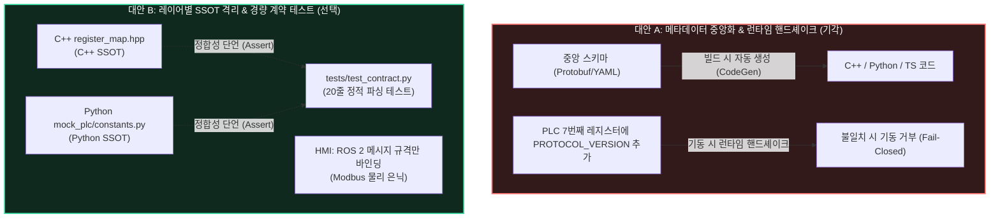

# [ADR 001] 다중 언어 환경의 데이터 관리: 레이어별 SSOT 격리 및 계약 테스트 기반 검증

> **상태 (Status):** ✅ **승인 및 구현 완료 (ACCEPTED & IMPLEMENTED)**  
> **날짜 (Date):** 2026-09-22  
> **결정 범위:** C++ 도메인 코어, Python 가상 PLC 및 테스트 스위트, ROS 2 인터페이스, HMI 프리젠테이션 계층 전반의 상수 관리 및 정합성 검증 전략

---

## 1. 배경 및 문제 정의 (Context & Problem Statement)

본 프로젝트는 **고성능 C++17 게이트웨이 코어**, **Python 가상 PLC(`mock_plc`) 및 자동화 검증 스위트**, **ROS 2 통신 미들웨어**, **웹/Qt 기반 HMI 모니터링 시스템**이라는 이기종 다중 언어(Multi-Language Stack) 환경으로 구성되어 있습니다.

프로젝트가 성숙해짐에 따라 다음과 같은 코드 위생 및 유지보수성 문제가 식별되었습니다:
1. **다중 하드코딩 경계 (Scattered Magic Numbers):**
   * 레지스터 인덱스(`0, 1, 2, 3, 4, 5`), 코일 번호(`0, 1`), 제어 명령 코드(`1: START, 4: SET_SETPOINT`), 공정 상한치(`1000`), Modulo 산술(`65536`) 등의 매직 넘버가 소스코드와 테스트 스크립트 곳곳에 리터럴로 분산됨.
2. **암묵적 지식(Implicit Knowledge)의 파편화:**
   * 비트마스크(`0x0001, 0x0002, ..., 0x0020`)의 의미가 C++ `types.hpp`와 Python `datastore.py`에 각각 하드코딩되어, 두 언어 간 규격이 일치하는지 자동으로 보장할 방법이 없었음.
3. **상수 관리 방법론의 갈림길:**
   * C++과 Python, 그리고 HMI까지 3개 이상의 계층이 관여하는 시스템에서 상수의 '단일 진실 공급원(Single Source of Truth, SSOT)'을 어떻게 정의하고 동기화할 것인가에 대한 아키텍처적 의사결정이 필요해짐.

---

## 2. 검토된 대안들 (Alternatives Considered)

우리는 문제 해결을 위해 두 가지 상반된 아키텍처 접근법을 심도 있게 비교 분석하였습니다.



---

### 대안 A: 메타데이터 기반 하드웨어 계약 강제 및 런타임 프로토콜 버전 핸드셰이크
*(Heavy Metadata Schema, Cross-Language CodeGen & Runtime Protocol Handshake)*

* **설계 내용:**
  1. **중앙 스키마 파일 정의:** Protobuf, FlatBuffers 또는 YAML로 레지스터 번호, 비트마스크, 엔지니어링 단위(`degC`, `RPM`), 배율(`scale: 0.1`)을 포함하는 통합 메타데이터 파일 작성.
  2. **빌드 시 코드 자동 생성(CodeGen):** CMake 빌드 파이프라인에 Python/Jinja2 코드 생성기를 물려 `register_map.hpp`, `constants.py`, TypeScript 타입을 빌드 타임에 자동 생성.
  3. **런타임 프로토콜 버전 레지스터 추가:** Modbus 맵에 7번째 레지스터 `HR_PROTOCOL_VERSION(0x0100)`을 신설하고, 게이트웨이 기동 시 PLC와 버전을 대조하여 불일치 시 기동을 즉시 차단(Fail-Closed).

#### ❌ 왜 기각되었는가? (Over-engineering 진단)
1. **양산 스펙 및 물리 제약 훼손 (배보다 배꼽이 큼):**
   * 본 프로젝트는 단 6개의 Holding Register를 단 1회의 FC03 일괄 읽기(Bulk Read)로 20ms(50Hz) 주기로 긁어오는 초경량 고속 통신 구조([[spec_production]] Section 2.3)로 확정되어 있습니다.
   * 프로토콜 버전을 위해 레지스터를 늘리거나 별도의 핸드셰이크 트랜잭션을 도입하는 순간, PLC 래더 로직, C++ 통신 버퍼(`RawPlcImage`), 72개의 단위 테스트, 16개의 장애 주입 시나리오 전체를 뒤흔들어야 합니다.
2. **도구 체인 비대화 및 빌드 복잡도 폭증:**
   * 고작 6개 레지스터와 2개 코일, 10여 개의 상수를 관리하기 위해 Docker 컨테이너와 CMake에 다언어 코드 생성 파이프라인을 물리는 것은 불필요한 빌드 의존성(Build-time Coupling)을 낳고 개발자 생산성을 떨어뜨립니다.
3. **Modbus-TCP의 본질적 특성 위배:**
   * Modbus-TCP는 1970년대부터 검증된 '단순성'이 생명인 OT 필드버스 프로토콜입니다. 여기에 현대 RPC 스타일의 동적 버전 협상(Negotiation)을 얹는 것 자체가 산업 통신 관점의 전형적인 안티패턴입니다.
4. **추상화 계층 누수 (Layer Leakage):**
   * HMI 계층에 저수준 Modbus PDU 레지스터 주소(HR 0~5)나 코일 오프셋이 노출되면, 차후 하위 통신 드라이버가 OPC-UA나 EtherCAT으로 교체될 때 UI 코드까지 연쇄 파괴되는 강한 결합(Tight Coupling)이 발생합니다.

---

### 대안 B: 레이어별 SSOT 격리 및 경량 계약 테스트 (선택된 결정)
*(Layer-Specific SSOT & Lightweight Automated Contract Testing)*

* **설계 내용:**
  1. **레이어별 독립 SSOT 수립:**
     * **C++ 계층:** 기존 [`include/ros2_modbus_gateway/register_map.hpp`](file:///c:/Users/QWER/Git_indie/ros2_modbus_industrial_gateway/include/ros2_modbus_gateway/register_map.hpp)와 [`types.hpp`](file:///c:/Users/QWER/Git_indie/ros2_modbus_industrial_gateway/include/ros2_modbus_gateway/types.hpp)를 C++의 유일한 진실 공급원으로 강제.
     * **Python 계층:** 외부 의존성(ROS, C++ 빌드 도구)이 전혀 없는 순수 파이썬 모듈 [`mock_plc/constants.py`](file:///c:/Users/QWER/Git_indie/ros2_modbus_industrial_gateway/mock_plc/constants.py)를 신설.
  2. **HMI 추상화 계층 격리:**
     * HMI는 Modbus 물리 레지스터를 일절 알 필요가 없으며, 오직 ROS 2 인터페이스([`PlcState.msg`](file:///c:/Users/QWER/Git_indie/ros2_modbus_industrial_gateway/msg/PlcState.msg), [`TriggerCommand.srv`](file:///c:/Users/QWER/Git_indie/ros2_modbus_industrial_gateway/srv/TriggerCommand.srv))에 선언된 공용 데이터 모델만 소비하도록 결합 차단.
  3. **20줄 초경량 계약 테스트 (`tests/test_contract.py`):**
     * 코드 생성기 대신, pytest 단계에서 C++ 헤더 텍스트를 파싱하여 Python 상수와 1:1 일치 여부(이름, 정수값, 비트마스크 중복 여부)를 0.1초 만에 검증.
     * 불일치 발생 시 CI/CD 단계에서 빌드와 테스트를 즉각 차단.
  4. **현장 설비 안전 방어:**
     * 별도 프로토콜 버전 레지스터 없이, 기존 게이트웨이에 내장된 **레지스터 값 유효 범위 검사(`0 <= val <= 1000`)**, **하트비트 정체 감시(80ms)**, **3회 연속 실패 타임아웃**을 통해 현장 하드웨어 이상 시 즉시 Fail-Closed(알람 래치 및 제어 차단)로 안전하게 격리.

---

## 3. 대안 비교 매트릭스 (Trade-off Comparison Matrix)

| 비교 항목 | 대안 A (메타데이터 + 런타임 핸드셰이크) | 대안 B (레이어별 SSOT + 계약 테스트) [선택] | 평가 및 시니어 아키텍트 관점 |
| :--- | :--- | :--- | :--- |
| **양산 스펙 부합성** | ❌ 6-레지스터 FC03 스펙 파기, 전면 재작업 필요 | ✅ 기존 양산 스펙([[spec_production]]) 100% 무수정 준수 | 대안 B 압승 (회귀 리스크 0%) |
| **빌드 복잡도** | ❌ CMake/Docker 내 CodeGen 도구 의존성 발생 | ✅ 추가 빌드 도구 0개, 빌드 오버헤드 0초 | 대안 B 압승 (도구 체인 단순성) |
| **계층 간 결합도** | ❌ C++, Python, HMI가 빌드 타임에 단일 파일에 강결합 | ✅ 런타임 결합 0, 레이어별 독립성 완벽 보장 | 대안 B 압승 (격리성 확보) |
| **HMI 계층 누수** | ⚠️ HMI에 Modbus 레지스터 정보 침투 위험 | ✅ ROS 메시지 기반 인터페이스로 완벽 은닉 | 대안 B 압승 (추상화 원칙 준수) |
| **상수 정합성 보장** | ✅ 빌드 생성으로 자동 일치 | ✅ CI 계약 테스트([`test_contract.py`](file:///c:/Users/QWER/Git_indie/ros2_modbus_industrial_gateway/tests/test_contract.py))로 100% 차단 | 양측 대등 (동일한 보장력) |
| **하드웨어 오류 방어** | ⚠️ 전용 버전 레지스터로 차단 | ✅ 레지스터 유효 범위 검사 + Fail-Closed 인터록 | 대안 B로도 양산 안전성 충분 |
| **엔지니어링 적합성** | ❌ **명백한 오버엔지니어링 (Over-engineering)** | ✅ **적정 기술 (Right-sized Engineering)** | **대안 B 최종 채택** |

---

## 4. 구현 세부 사항 (Implementation Details)

### 4.1 C++ 도메인 코어 개선 ([`types.hpp`](file:///c:/Users/QWER/Git_indie/ros2_modbus_industrial_gateway/include/ros2_modbus_gateway/types.hpp))
* `RawPlcImage` 구조체 내에서 인덱스 `0~5` 및 `0x0001~0x0020` 리터럴을 제거하고, [`register_map.hpp`](file:///c:/Users/QWER/Git_indie/ros2_modbus_industrial_gateway/include/ros2_modbus_gateway/register_map.hpp)의 상수를 사용하도록 강제:
```cpp
struct RawPlcImage {
    std::array<uint16_t, HOLDING_REGISTER_COUNT> registers{};

    uint16_t heartbeat() const noexcept { return registers[HR_HEARTBEAT]; }
    uint16_t status_flags() const noexcept { return registers[HR_STATUS_FLAGS]; }
    // ...
    bool run_requested() const noexcept { return (registers[HR_STATUS_FLAGS] & STATUS_BIT_RUN_REQUESTED) != 0; }
    bool ready() const noexcept { return (registers[HR_STATUS_FLAGS] & STATUS_BIT_READY) != 0; }
    // ...
};
```

### 4.2 Python 단일 진실 공급원 ([`mock_plc/constants.py`](file:///c:/Users/QWER/Git_indie/ros2_modbus_industrial_gateway/mock_plc/constants.py))
* 외부 패키지(`rclpy`, C++ 바이너리)를 일절 참조하지 않는 순수 파이썬 상수를 구축하여 가상 PLC와 테스트가 어디서든 단독 실행 가능하도록 보장:
```python
HOLDING_REGISTER_COUNT: int = 6
HR_HEARTBEAT: int = 0
HR_STATUS_FLAGS: int = 1
# ...
STATUS_BIT_RUN_REQUESTED: int = 0x0001
STATUS_BIT_READY: int = 0x0002
# ...
CMD_START: int = 1
CMD_STOP: int = 2
CMD_SET_SETPOINT: int = 4
```

### 4.3 자동화된 계약 검증 테스트 ([`tests/test_contract.py`](file:///c:/Users/QWER/Git_indie/ros2_modbus_industrial_gateway/tests/test_contract.py))
* 정규표현식 파서를 통해 C++ 헤더의 모든 `constexpr uint16_t` 상수와 enum을 추출하여 Python 상수와 1:1로 대조:
```python
def test_contract_all_register_map_constants_match():
    cpp_constants = parse_cpp_constants(REGISTER_MAP_HEADER)
    for name, cpp_val in cpp_constants.items():
        assert hasattr(py_const, name)
        assert getattr(py_const, name) == cpp_val
```
* **결함 검증 확인:** 개발자가 임의로 Python 상수(`STATUS_BIT_READY = 0x0003`)를 변조했을 때, 테스트가 즉각 2개의 AssertionError를 뿜으며 CI 파이프라인을 중단시킴을 실측 검증 완료.

---

## 5. 엔지니어링 결론 및 학습 교훈 (Key Takeaways)

1. **"오버엔지니어링이란 존재하지 않는 미래의 문제를 풀기 위해 현재의 복잡도를 희생하는 것":**
   * 6개의 고정된 Modbus 레지스터를 다루는 임베디드 게이트웨이 시스템에 복잡한 다언어 코드 생성 엔진과 런타임 프로토콜 협상 프로토콜을 얹는 것은 대표적인 설계 과잉이었습니다.
2. **"계약에 의한 분리(Decoupled by Contract)":**
   * 레이어 간의 결합을 막는 가장 건강한 방법은 빌드 타임의 바이너리 공유가 아니라, **각 계층의 자율성을 존중하되 CI 테스트 단계에서 엄격한 계약(Contract)으로 정합성을 묶는 것**입니다.
3. **"추상화 계층 보호(Preserve Layer Abstraction)":**
   * HMI는 OT 필드버스의 바이트 레이아웃을 알 필요가 없습니다. HMI는 오직 상위 응용 계층의 메시지 규격만 바라보게 함으로써 향후 프로토콜 교체 시에도 UI 시스템이 전혀 영향받지 않는 진정한 클린 아키텍처를 달성했습니다.
