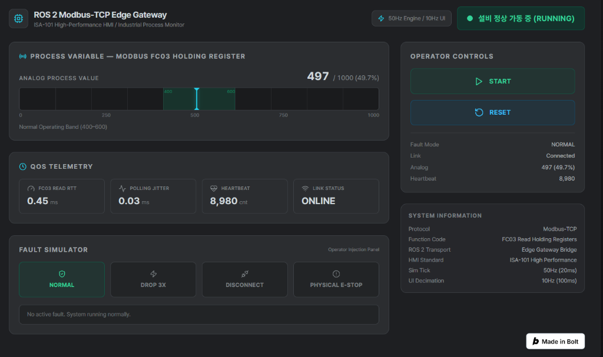

# HMI 웹 프런트엔드

게이트웨이 상태를 보여 주고 기동·정지·이상 해제를 보내는 운전 화면입니다. React + TypeScript + Vite로 만들었고, 빌드 결과(`dist/`)를 `hmi.bridge_server`(FastAPI)가 `/`에서 서빙합니다.



처음에는 bolt.new로 만든 프로토타입이었고, 지금은 ISA-101 원칙(회색 바탕, 경보에만 색 사용, 색·모양·번호로 경보 순위 구분)에 맞춘 화면입니다. 설계 배경은 [HMI 설계 문서](../docs/hmi/HMI_DESIGN_AND_IMPLEMENTATION_PLAN.md), 백엔드는 [hmi/README.md](../hmi/README.md)를 참고하세요.

## 실행

```bash
cd hmi_web_prototype
npm ci
npm run dev        # http://localhost:3000 (WebSocket은 같은 호스트의 /ws)
npm run build      # 타입 검사 후 dist/ 생성
```

화면 확인만 할 때는 저장소 루트에서 Mock 어댑터로 서버를 띄웁니다. 빌드한 `dist/`를 그대로 서빙합니다.

```bash
python -m hmi.run --host 127.0.0.1 --port 8000 --adapter mock
# http://localhost:8000
```

서버에 연결되지 않으면 프런트엔드가 자체 시뮬레이션으로 대체됩니다(`src/services/api.ts`). 연결이 되면 시뮬레이션은 멈춥니다.

## 화면 구성

| 영역 | 파일 | 내용 |
|---|---|---|
| 제목줄 | `src/App.tsx` | 스테이션, DDS 주기, heartbeat, `Test Bench` 토글, `KO / EN` |
| 경보 요약 | `components/TopSafetyBanner.tsx` | 활성 경보와 원인, 복구 1·2단계 |
| 설비 상태 | `components/MachineStateBadge.tsx` | 운전 중 / 준비 / 대기 / 이상 / 비상정지 |
| 공정값 PV | `components/ProcessSensorGauge.tsx` | 0–1000 막대, 400–600 정상 대역 |
| 설정값 SP | `components/SetpointControl.tsx` | 슬라이더, 숫자 입력, 프리셋, 적용 |
| 통신 상태 | `components/CommHealthMetrics.tsx` | RTT, 지터, heartbeat, 링크 |
| 조작 | `components/OperatorControls.tsx` | 기동 / 정지 / 이상 해제 |
| 확인 창 | `components/ConfirmationModal.tsx` | 1.5초 길게 눌러 승인 |
| 시험 패널 | `components/TestBench.tsx` | 비상정지·공정 결함 주입, 설정값 경계 시험, 통신 결함 시나리오 |
| 경보 표시 | `components/AlarmMarker.tsx` | 순위별 모양·색·번호 마커 |
| 문구 | `src/locales/ko.ts`, `en.ts`, `types.ts` | 한/영 사전(키 구조는 두 파일이 같아야 함) |

## 디자인 규칙

- 색은 `index.html`의 Tailwind 설정(`hmi.*`, `p1`, `p2`, `p3`, `sel`)에서만 정의합니다. 컴포넌트에서 임의의 색 값을 쓰지 않습니다.
- 정상 상태에는 색을 쓰지 않습니다. 경보 색(빨강·주황·노랑)은 경보 마커, 경보 띠, 화면 테두리에만 씁니다.
- 경보와 상태는 색과 함께 모양·글자로도 표시합니다.
- 깜빡임, 번짐, 바운스 효과와 이모지를 쓰지 않습니다.
- 문구를 추가하면 `ko.ts`, `en.ts`, `types.ts`를 함께 고칩니다. `tests/test_hmi.py::test_locale_dictionary_integrity`가 구조를 검사합니다.

## 참고

- Tailwind는 CDN 스크립트(`index.html`)로 불러오므로 화면을 보려면 인터넷 연결이 필요합니다. 폐쇄망에 배포하려면 Tailwind를 빌드 단계로 옮겨야 합니다.
- 폰트(Pretendard)도 CDN에서 불러오며, 실패하면 시스템 폰트로 대체됩니다.
