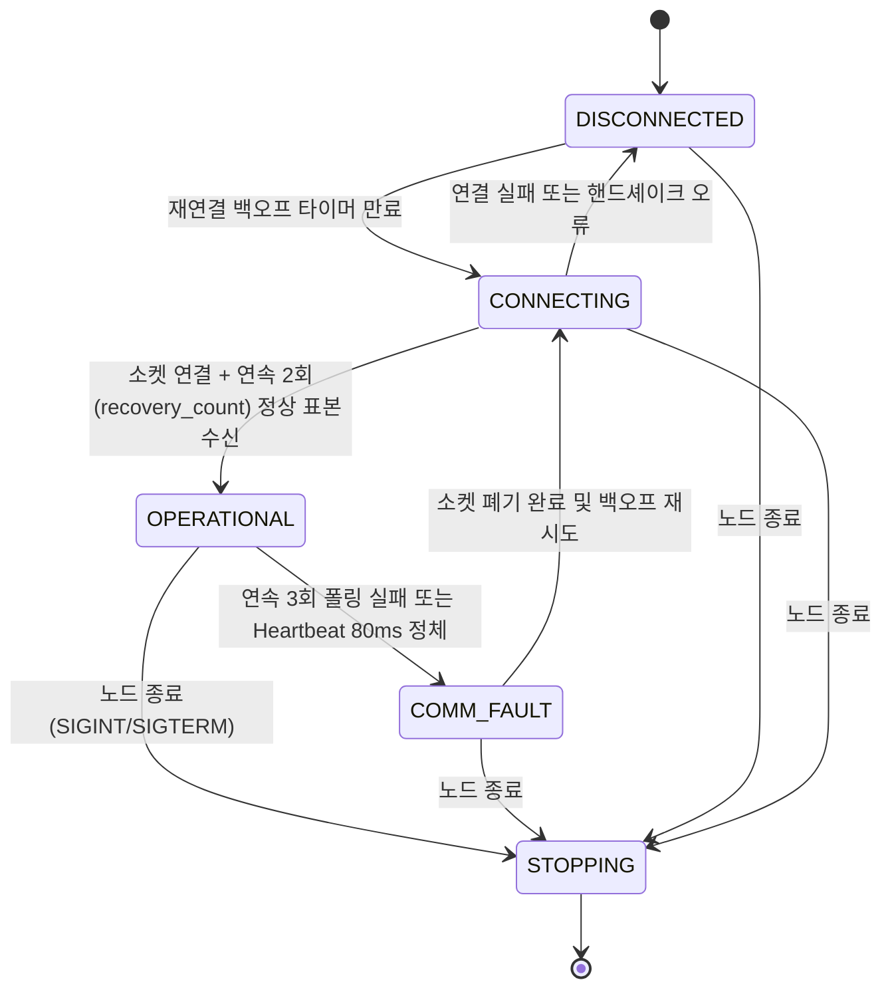
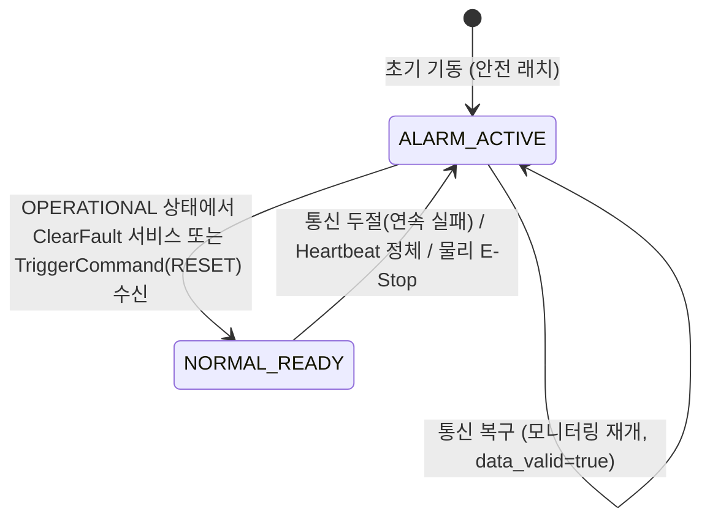
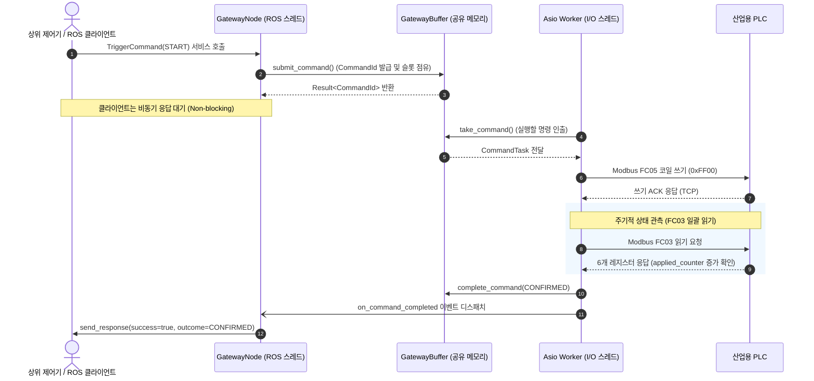

# 1. 시스템 아키텍처 및 소스 파일 설계 (양산 공장 환경 규격: `spec_production.md`)

## 1.1 구현 기준 및 요구사항 해석 (현장 중심 개정)

본 문서는 `spec_full.md`의 연구·PoC 중심 과잉 설계를 실제 양산 공장 제조 라인(Production Factory) 환경에 최적화하여 전면 개정한 기술 명세서다. **본 단일 문서 하나만으로 시스템 전체 세부 사항을 즉시 구현·검증할 수 있도록 완전한 수준의 상세 정의**를 제공한다.

기존 PoC 규격(`spec_full.md`)과의 주요 차이 및 양산 공장 환경 개정 5대 원칙을 다음과 같이 확정한다.

| 항목 | 확정 규격 (`spec_production.md`) | 개정 및 현장 적용성 근거 |
|---|---|---|
| 패키지명 / 실행 파일명 | `ros2_modbus_gateway` / `gateway_node` | ROS 2 표준 패키지 및 노드 명명 규칙 유지 |
| 운영 환경 | ROS 2 Jazzy, Ubuntu 24.04, C++17, `rclcpp`, Boost.Asio 비동기 I/O | 블로킹 스레드 격리 방식에서 Boost.Asio 기반의 고성능 비동기 네트워크 엔진으로 전환 |
| 가상 PLC | Python 3.11, `pymodbus==3.8.6`, 단일 `asyncio` 이벤트 루프 | 6개 Holding Register 통합 모델 및 TCP 장애 주입 프록시 탑재 |
| 배포 단위 | `mock_plc`, `ros2_gateway`의 2개 컨테이너 | Docker Compose 기반 격리 및 재현 가능한 배포 체계 |
| 정상 폴링 / 발행 주기 | **기본 20ms / 20ms (50Hz)** (파라미터로 10ms~100ms 가변 설정 허용) | 현장 PLC 통신 프로세서(CP 카드) 과부하 방지 및 네트워크 대역폭 최적화 |
| 폴링 트랜잭션 방식 | **1주기당 단 1회의 일괄 읽기 (Single Bulk Read, FC03)** | 기존 Seqlock 3회 트랜잭션(HR전→Coil→HR후) 및 불일치 표본 폐기(`incoherent_count`) 전면 폐기 |
| 통신 대상 | 게이트웨이 1개가 단일 PLC 기본 제어 및 **1:N 다중 스테이션 확장 구조** 지원 | 공장 라인별 다수 PLC 수용을 위한 `StationConfig` 및 YAML 설정 파라미터 구조 제공 |
| 외부 인터페이스 | ROS 2 Topic·Service, Modbus-TCP. HTTP API 미구현 | 불필요한 웹 스택 지터 차단 및 공정 제어 실시간성 집중 |
| 명령 처리 | 호출자는 비동기 서비스 응답을 대기 (Jazzy deferred response). ROS 콜백 논블로킹 | ROS 2 콜백 스레드가 소켓 I/O를 직접 기다리지 않는 이벤트 드리븐 구조 |
| 안전 감시 메커니즘 | **이벤트 기반(Event-driven) 즉시 통지 (1ms 고속 타이머 폐기)** | 비-실시간 Linux 환경의 1ms 주기 폴링 오버헤드를 없애고 CPU 사용률을 1% 미만으로 절감 |
| 장애 감지 임계값 | **연속 N회 폴링 실패 기반 (기본 3~4회 연속 실패, ~60~80ms)** | 일시적 네트워크 패킷 지연 수용으로 오경보 방지, 파라미터 기반 가변 튜닝 지원 |
| 안전 신호의 법적 성격 | **"통신 두절 알람 (Comm-Loss Alarm)"** (`/safety/alarm`) | 인증된 하드웨어 STO(Safe Torque Off) 및 안전 릴레이 회로와 명확히 역할 분리 |
| 자동 복구 및 래치 해제 | **통신 자동 복구 + 상위 제어기의 1-shot 리셋 서비스 호출 (`/plc/clear_fault` 또는 `TriggerCommand(RESET)`)** | 7단계 가혹 인터록을 폐기하고 재연결 즉시 데이터 갱신, 1회 리셋으로 즉시 제어권 복원 (MTTR 극소화) |
| 제외 | 웹 UI, Gazebo, MoveIt, OPC-UA, MQTT, 물리 PLC별 전용 드라이버 | 단일 목적의 산업용 고신뢰성 게이트웨이 사수 |

---

### 통신 두절 알람 및 100ms 요구사항의 현장 중심 해석

1. **하드웨어 안전(Safety)과의 엄격한 역할 분리:**
   - 100ms 이내의 물리적 비상 정지(인명 보호, 모터 토크 차단)는 하드웨어 E-Stop 버튼, 안전 펜스 인터록 도어 스위치, 안전 릴레이 및 서보 드라이브의 하드웨어 STO(Safe Torque Off) 라인이 물리적으로 직접 담당한다.
   - 본 소프트웨어 게이트웨이가 발행하는 `/safety/alarm` 신호는 ISO 13849-1 또는 IEC 61508 인증 안전 루프를 대체하는 것이 아니며, **"상위 제어기(로봇 제어기, AGV 네비게이터, 라인 관제 PLC)에 통신 두절을 즉각 알려 제어 소프트웨어가 제어형 감속 정지(Controlled Deceleration Stop, Category 1 Stop)를 수행하게 만드는 통신 무결성 경보(Comm-Loss Alarm)"**로 정의한다.

2. **현실적인 종단 간(End-to-End) 시간 예산 분할:**
   - 공장 네트워크 스위치 및 Wi-Fi/5G 산업용 망에서의 일시적 지터(Jitter)로 인해 단 1회(20ms) 패킷이 지연되었다고 고가의 설비 전체를 비상 정지시키는 것은 양산 라인 가동률(OEE)을 치명적으로 떨어뜨린다.
   - 따라서 연속 N회(기본 3회, 20ms 주기 기준 60ms) 누락 시 확정 경보를 발생시키는 필터링을 적용하며, 전체 종단 간 시간 예산을 다음과 같이 보수적으로 확정한다.

| 구간 | 예산 | 설명 |
|---|---:|---|
| 연속 폴링 타임아웃 감지 (25ms × 3회 즉시 재시도) | 75ms | 25ms 타임아웃 만료 즉시 재시도하여 3회 연속 실패 확정 |
| 비동기 I/O 에러 이벤트 통지 | 목표 최대 5ms | 워커/Asio 이벤트 루프에서 ROS 노티파이어로 신호 전달 |
| ROS 퍼블리시 및 DDS 전달 | 목표 최대 10ms | Fast DDS 비동기 퍼블리시 및 상위 제어기 수신 콜백 |
| 상위 제어기 수신 및 감속 개시 잔여 예산 | 10ms | 상위 제어기 감속 루틴 진입 |
| **종단 간(End-to-End) 검증 기준** | **100ms 이내** | 장애 주입 시점부터 상위 수신 콜백 도달까지 (총 90ms 소요) |

- WSL2, 일반 Linux, Docker 환경은 16대 시나리오 기능 통과율(100% Pass) 검증용으로 운용하며, 100ms 이내 하드 실시간 종단간 SLA 검증은 공장 표준 OS(PREEMPT_RT 커널 또는 리얼타임 이더넷 설정)가 적용된 지정 시험 환경에서 통과해야 하는 양산 인수 조건이다.
- 게이트웨이 프로세스 크래시나 커널 패닉 상황에 대비하여, 상위 제어기는 반드시 자체 수신 타임아웃(Watchdog Timer, 100ms)을 독립적으로 유지해야 한다.

---

## 1.2 레이어 및 의존성

불필요하게 복잡했던 다중 트랜잭션 Seqlock 모방 계층을 걷어내고, 현대적인 비동기 I/O(Boost.Asio 기반)와 명확한 이벤트 구동형 레이어로 재구성한다. 1:N 다중 스테이션 확장을 위해 런타임 하위에 스테이션별 독립 실행 문맥(`StationContext`)을 둔다.

```text
ROS 2 인터페이스 계층
  GatewayNode (Topic/Service/Parameter 관리, 이벤트 기반 비동기 알람 발행)
      ↓ (이벤트 알림 / 명령 전달)
실행 조정 및 버퍼 계층
  GatewayRuntime (워커 수명 관리, Asio io_context 구동, 타이머 관리)
      └── std::unordered_map<StationId, std::unique_ptr<StationContext>> (스테이션별 독립 격리)
              ├── GatewayBuffer (스테이션별 독립 mutex 기반 원자적 최신 표본 스냅샷 및 명령 슬롯)
              ├── SafetyMonitor (스테이션별 연속 실패 카운터, Heartbeat 정체 감시, 알람 래치)
              └── Async ModbusClient (스테이션별 Boost.Asio 비동기 소켓, 1회 FC03 일괄 읽기 / 쓰기)
                      ↓ (Modbus-TCP PDU)
                  산업용 PLC / mock_plc

공통 계약
  types / config / register_map / monotonic_clock
```

| 레이어 | 책임 | 의존성 제한 |
|---|---|---|
| 공통 계약 | 타입, 주소, 비트필드, 설정, 단조 시각 정의 | ROS·네트워크 라이브러리 의존 금지 |
| 스테이션 컨텍스트 (`StationContext`) | 단일 PLC에 대한 독립 버퍼, 모니터, 클라이언트 캡슐화 | 타 스테이션 문맥 참조 금지 (완전 격리) |
| 비동기 Modbus 어댑터 | Boost.Asio 기반 연결, 단일 FC03 일괄 읽기, FC05/FC06 쓰기, 소켓 오류 정규화 | ROS 메시지·안전 상태 머신 참조 금지 |
| 안전 모니터 (`SafetyMonitor`) | 연속 폴링 실패 판정, heartbeat 진행 감시, 알람 래치, 1-shot 리셋 검증 | 소켓 I/O·ROS 토픽 직접 발행·파일 I/O 금지 |
| 공유 상태 (`GatewayBuffer`) | 스테이션 최신 표본 보관, 단일 명령 슬롯, 원자적 상태 동기화 | 락(Mutex) 내부 외부 I/O, 블로킹 sleep 금지 |
| 실행 조정 (`GatewayRuntime`) | Asio 이벤트 루프 구동, 스테이션 컨텍스트 목록 관리, 재연결 백오프 | ROS rclcpp 노드 API 직접 호출 금지 |
| ROS 어댑터 (`GatewayNode`) | 파라미터 로드, DTO 변환, 상태 주기 발행, 알람 즉시 발행, 비동기 서비스 응답 | 직접 Modbus 소켓 호출 금지 |
| 가상 PLC (`mock_plc`) | 6개 Holding Register 모델 및 TCP 장애 주입 프록시 | ROS 의존 금지 |
| 벤치마크 도구 | 실제 인터페이스 관측, 지연/지터 기록, CSV 및 통계 보고서 생성 | 게이트웨이 내부 메모리 직접 조작 금지 |

---

## 1.3 스레드·소유권 규칙 & 비동기 I/O 모델

| 실행 주체 | 소유 자원 / 수행 작업 |
|---|---|
| Boost.Asio I/O 스레드 (1개) | `boost::asio::io_context`, 스테이션별 비동기 소켓, 타이머, 주기적 FC03 읽기, 쓰기 트랜잭션, 재연결 핸들러 |
| ROS `SingleThreadedExecutor` (1개) | 파라미터 로드, 상태 토픽 주기적 발행(20ms), 알람 이벤트 즉시 발행, 서비스 수신 및 응답 처리 |
| DDS 내부 스레드 | Fast DDS 미들웨어 통신 관리. 게이트웨이 내부 공유 상태에 직접 접근 불가 |
| PLC 이벤트 루프 (별도 컨테이너) | 단일 `asyncio` 루프, 데이터스토어, 10ms PLC 스캔, TCP 장애 프록시, 제어 소켓 |

### 공유 상태 및 동기화 규칙

1. **스테이션별 독립 뮤텍스 격리:** 각 `StationContext` 내부의 `GatewayBuffer`마다 독립된 `std::mutex`가 해당 스테이션의 최신 표본 스냅샷, 알람 상태, 단일 명령 슬롯을 보호한다. 1번 스테이션의 소켓 지연, 락 점유, 명령 대기가 타 스테이션에 절대 간섭하지 않는다.
2. **락(Lock) 점유 시간 최소화:** 뮤텍스 내부에서는 단순 메모리 복사(`memcpy` 수준)만 수행하며, 소켓 I/O, ROS 발행, 파일 쓰기, 콘솔 출력, `std::this_thread::sleep_for`를 절대 수행하지 않는다. (락 점유 시간 < 1µs)
3. **단일 슬롯 덮어쓰기(Atomic Latest Snapshot):** 최신 표본은 단일 슬롯에 덮어쓴다. 과거 데이터 FIFO 큐를 쌓지 않는다.
4. **스테이션별 단일 명령 슬롯:** 각 스테이션마다 대기 또는 실행 중인 명령은 최대 1개다. 해당 스테이션의 명령이 진행 중일 때 들어오는 추가 요청은 즉시 `BUSY`로 거부한다.
5. **소켓 자원 소유권:** 소켓의 생성, 연결, 데이터 송수신, 해제는 오직 Asio I/O 스레드만 수행한다. ROS 스레드에서 직접 소켓을 건드리지 않는다.
6. **이벤트 기반 알람 디스패치 및 퍼블리시 위임 (`rclcpp::GuardCondition` 즉시 기상):**
   - 워커 스레드가 연속 실패 임계값 초과나 소켓 단절을 감지하면 즉시 `GatewayBuffer`의 알람 상태를 `true`로 설정하고 등록된 이벤트 콜백을 디스패치한다.
   - **스레드 책임 분리 및 즉각 기상 프리미티브:** Asio 워커 스레드는 Fast DDS 락 및 버퍼 경합에 따른 블로킹(최대 1ms)을 차단하기 위해 ROS API(`publish`)를 직접 호출하지 않는다. 대신 ROS 2 표준 멀티스레드 비동기 통지 프리미티브인 `rclcpp::GuardCondition::trigger()`를 호출한다.
   - 평소 20ms 주기 타이머 대기(`epoll_wait`)로 잠들어 있던 ROS `SingleThreadedExecutor`는 `GuardCondition`에 의해 0.1ms 이내로 즉시 잠에서 깨어나 `/safety/alarm` 토픽을 즉시 전담 발행(Edge Triggered)한다. 이로써 불필요한 타이머 만료 대기 지연(최대 20ms)을 완벽히 제거한다.
7. **외계인 메서드 호출(Alien Method Call) 방어 및 데드락 원천 차단:**
   - `GatewayBuffer`의 뮤텍스 락(`std::unique_lock`)을 쥔 상태로 외부 등록 콜백(`alarm_callback`, `command_callback`)을 호출하는 것을 절대 금지한다.
   - 반드시 내부 상태 변경 및 복사를 완료한 후 **락을 완전히 해제(`unlock()`)한 직후에 콜백 함수를 호출**하여, 콜백 내부에서 버퍼 재접근 시 발생하는 데드락을 원천 차단한다.
8. **세션 식별자(`Generation`) 검증:** 소켓 연결 시도마다 단조 증가하는 `generation`을 유지하여, 이전 세션에서 발생한 지연 패킷이나 명령 완료가 현재 세션의 상태를 오염시키지 않도록 차단한다.
9. **종료 시 자원 회수:** 종료 시 Asio `io_context`를 중지하고 스레드를 반드시 `join`한다. `detach`는 금지한다.

---

## 1.4 전체 파일 트리

```text
ros2_modbus_industrial_gateway/
├── PROJECT_GUIDE.md                         # 초기 요구사항 및 프로젝트 가이드라인
├── README.md                                # 빌드, 실행, 복구, 튜닝 및 벤치마크 결과 가이드
├── spec_full.md                             # [참조] 연구·PoC용 원본 명세서 (보존)
├── spec_production.md                       # [본 문서] 양산 공장 개정 기술 명세서
├── CMakeLists.txt                           # ament, C++17, Boost 의존성, 메시지 생성, 빌드 규칙
├── package.xml                              # ROS 2 의존성(rclcpp, std_msgs 등) 및 rosidl 패키지 선언
├── .gitignore                               # build, install, log, 캐시 및 임시 측정 파일 제외
├── .dockerignore                            # Docker 컨텍스트 빌드 제외 규칙
├── .gitattributes                           # 소스 및 셸 스크립트 LF 개행 고정
├── docker-compose.yml                       # mock_plc, ros2_gateway 2개 서비스 구성
│
├── docker/
│   ├── Dockerfile.gateway                   # ROS Jazzy, libboost-all-dev, 빌드 및 실행 환경
│   ├── Dockerfile.plc                       # Python 3.11-slim, pymodbus==3.8.6 환경
│   └── gateway-entrypoint.sh                # ROS 환경 로드, colcon 빌드, 실행 엔트리포인트
│
├── config/
│   ├── gateway.yaml                         # 게이트웨이 파라미터 (주기 20ms, 타임아웃, 다중 스테이션 설정)
│   └── fastdds.xml                          # Fast DDS 비동기 발행 및 max_blocking_time 설정
│
├── launch/
│   └── gateway.launch.py                    # 설정 파일 경로 주입 및 노드 실행 런치 스크립트
│
├── include/ros2_modbus_gateway/
│   ├── types.hpp                            # 순수 도메인 타입, 열거형, Result, 에러 구조체
│   ├── config.hpp                           # GatewayConfig, StationConfig 구조체 및 유효성 검사 선언
│   ├── register_map.hpp                     # 6개 Holding Register 주소, 비트필드 상수, 코일 주소 정의
│   ├── monotonic_clock.hpp                  # 단조 시각(CLOCK_MONOTONIC) 나노초 취득 선언
│   ├── modbus_client.hpp                    # Boost.Asio 기반 비동기 Modbus-TCP 클라이언트 어댑터
│   ├── safety_monitor.hpp                   # 연속 실패 감시, Heartbeat 정체 감시, 알람 래치 선언
│   ├── gateway_buffer.hpp                   # 원자적 스냅샷 저장소, 단일 명령 슬롯 관리 선언
│   ├── gateway_runtime.hpp                  # Asio io_context 구동, 주기적 폴링 루프, 런타임 수명 선언
│   └── gateway_node.hpp                     # ROS 2 노드, 주기 발행기, 이벤트 알람 발행기, 서비스 콜백 선언
│
├── src/
│   ├── config.cpp                           # 파라미터 경계값 검사 및 YAML 파싱 검증 구현
│   ├── monotonic_clock.cpp                  # Linux 단조 시각 취득 함수 구현
│   ├── modbus_client.cpp                    # Boost.Asio 비동기 TCP 소켓, FC03 일괄 읽기 및 쓰기 구현
│   ├── safety_monitor.cpp                   # 연속 실패 누적, Heartbeat 판정, 1-shot 리셋 로직 구현
│   ├── gateway_buffer.cpp                   # 뮤텍스 기반 스냅샷 원자적 갱신 및 명령 상태 머신 구현
│   ├── gateway_runtime.cpp                  # 비동기 폴링 타이머, 이벤트 통지 및 백오프 재연결 구현
│   ├── gateway_node.cpp                     # ROS 2 토픽 발행, 비동기 서비스 응답, 파라미터 바인딩 구현
│   └── main.cpp                             # 노드 초기화, 시그널 핸들링 및 graceful shutdown 구현
│
├── msg/
│   ├── PlcState.msg                         # 설비 상태 주기 발행 메시지 (20ms)
│   └── SafetyAlarm.msg                      # 통신 두절 및 이상 발생 즉시 통지 알람 메시지
│
├── srv/
│   ├── TriggerCommand.srv                   # START / STOP / RESET / SET_SETPOINT 제어 명령 서비스
│   └── ClearFault.srv                       # [신규] 통신 복구 후 알람 래치 1-shot 해제 서비스
│
├── mock_plc/
│   ├── requirements.txt                     # pymodbus==3.8.6
│   ├── mock_plc_server.py                   # 가상 PLC 서버 메인 및 비동기 이벤트 루프 관리
│   ├── datastore.py                         # 6개 Holding Register + 2개 Coils 데이터스토어 및 10ms 스캔 로직
│   ├── fault_proxy.py                       # TCP 장애 주입 프록시 (DROP, DELAY, DISCONNECT, FREEZE 등)
│   ├── control_protocol.py                  # 제어 소켓 JSON 파서 및 유효성 검증
│   └── fault_injector.py                    # 단발 명령 전송 및 인터랙티브 CLI 장애 제어 도구
│
├── tests/
│   ├── test_config.cpp                      # 설정 파라미터 경계값 및 1:N 스테이션 설정 단위 테스트
│   ├── test_safety_monitor.cpp              # 연속 실패 판정, Heartbeat 정체 및 1-shot 리셋 단위 테스트
│   ├── test_gateway_buffer.cpp              # 최신 스냅샷 원자성 및 단일 명령 슬롯 경합 단위 테스트
│   ├── test_datastore.py                    # 가상 PLC 6개 레지스터 FC03 읽기 및 쓰기 반영 단위 테스트
│   ├── run_integration.py                   # ROS 서비스 호출 및 PLC 제어 종단간 통합 검증
│   └── run_fault_scenarios.py               # 장애 주입별 100ms 이내 알람 도달 및 복구 자동화 테스트
│
└── benchmark/
    ├── requirements.txt                     # matplotlib==3.9.4
    ├── measure_latency.py                   # 20ms 주기 상태 수신 지연 및 왕복 RTT 측정 스크립트
    ├── plot_latency.py                      # 지연 분포, 지터 및 알람 반응 시간 시각화 그래프 생성
    ├── latency.csv                          # [생성물] 정상 구간 1000개 표본 지연 측정 데이터
    ├── fault_events.csv                     # [생성물] 장애 주입 시각 및 알람 수신 시각 기록
    ├── summary.json                         # [생성물] 환경 정보, P50/P95/P99 지연 통계 및 합격 판정
    ├── latency_jitter.png                   # [생성물] 왕복 지연 및 지터 그래프
    └── demo.gif                             # [생성물] 실제 장애 주입 및 즉각 알람 동작 터미널 녹화 영상
```

---

## 1.5 빌드·컨테이너 계약

| 항목 | 확정 규격 |
|---|---|
| ROS 패키징 | `ament_cmake`, C++17, `rosidl_default_generators`, `rosidl_default_runtime` |
| ROS 라이브러리 | `rclcpp`, `builtin_interfaces`, `unique_identifier_msgs`, `rmw_fastrtps_cpp` |
| 비동기 I/O 라이브러리 | `boost::asio`, `boost::system`, 시스템 `pthread` (libmodbus 사용 배제) |
| Python 도구 | 게이트웨이: `rclpy` (ROS Jazzy 환경) / 가상 PLC: Python 3.11, `pymodbus==3.8.6` |
| 기본 베이스 이미지 | `ros:jazzy-ros-base`, `python:3.11-slim-bookworm` |
| 컨테이너 사용자 | 양쪽 컨테이너 모두 UID/GID 1000 (`non-root`) 실행 |
| 네트워크 구성 | 전용 Compose bridge 네트워크 (`gateway_net`). 호스트로 Modbus/DDS 포트 외부 노출 없음 |
| 가상 PLC 포트 | 컨테이너 내부 `0.0.0.0:5020` (프록시), 백엔드 `127.0.0.1:15020` |
| 제어 유닉스 소켓 | Docker named volume 공유: `/run/plc/control.sock` |
| 소스 마운트 | 호스트 저장소 → 컨테이너 `/ros2_ws/src/ros2_modbus_gateway` 마운트 |
| 빌드 디렉터리 | `/ros2_ws/build`, `/ros2_ws/install`, `/ros2_ws/log`는 컨테이너 볼륨 분리 |
| 빌드 방식 | `colcon build --symlink-install` 지원 |
| 시작 순서 독립성 | PLC가 켜지지 않아도 게이트웨이는 시작되며, 재연결 백오프 상태를 유지 |
| 프로세스 종료 계약 | Docker `stop_grace_period: 3s`, SIGINT/SIGTERM 수신 시 안전 종료 및 워커 join |
| ROS 시간 소스 | `use_sim_time=false` 고정 |
| DDS 설정 | `ROS_DOMAIN_ID=42`, `rmw_fastrtps_cpp`, `fastdds.xml` 프로파일 자동 로드 |

Fast DDS 프로파일(`fastdds.xml`)은 비동기 퍼블리시 모드(`ASYNCHRONOUS_PUBLISH_MODE`)를 적용하고, reliable writer의 `max_blocking_time`을 1ms로 제한하여 네트워크 지연이 ROS 콜백 실행을 지연시키지 않도록 보장한다.

---

# 2. 데이터 엔티티 및 인터페이스 규격

## 2.1 공통 타입 (`types.hpp`)

모든 필드는 명시적으로 정의된 타입을 따르며 임의 확장을 금지한다.

| 타입 | 정의 |
|---|---|
| `MonotonicNs` | `uint64_t`; Linux `CLOCK_MONOTONIC` 기준 나노초 (ns). 유효 시각은 항상 0보다 큼 |
| `DurationNs` | `uint64_t`; 나노초 단위 경과 시간 |
| `Generation` | `uint64_t`; TCP 소켓 연결 시도마다 1씩 증가하는 세션 식별자 |
| `CommandId` | `uint64_t`; 수락된 제어 명령에 1부터 순차 부여되는 고유 번호 (0은 미수락) |
| `SampleSequence` | `uint64_t`; 정상 수신된 새 표본마다 1씩 증가 |
| `InstanceId` | UUID 16바이트; 게이트웨이 프로세스 기동마다 신규 생성되는 인스턴스 고유 식별자 |
| `StationId` | `uint8_t`; 다중 스테이션(1:N) 환경에서 각 PLC를 구분하는 ID (기본 1) |
| `Result<T>` | 성공 시 `T value`, 실패 시 `GatewayError`를 담는 결과 타입 |
| `Result<void>` | 성공 여부 플래그 및 실패 시 `GatewayError`를 담는 타입 |
| `Optional<T>` | C++17 `std::optional<T>` |

### 열거형 정의

```cpp
namespace ros2_modbus_gateway {

enum class LinkState : uint8_t {
    DISCONNECTED = 0,   // 소켓 닫힘, 재시도 대기 상태
    CONNECTING   = 1,   // TCP 연결 핸드셰이크 진행 중
    OPERATIONAL  = 2,   // 정상 통신 중, 폴링 및 제어 가능
    COMM_FAULT   = 3,   // 통신 단절 또는 연속 실패로 인한 오류 상태
    STOPPING     = 4    // 게이트웨이 노드 종료 진행 중
};

enum class Command : uint8_t {
    START        = 1,   // PLC 운전 시작 요청
    STOP         = 2,   // PLC 운전 정지 요청
    RESET        = 3,   // PLC 오류 리셋 요청
    SET_SETPOINT = 4    // 공정 설정값(Setpoint) 변경 요청
};

enum class CommandPhase : uint8_t {
    EMPTY                = 0,   // 슬롯 비어있음
    QUEUED               = 1,   // 서비스 수락 완료, 송신 대기
    EXECUTING            = 2,   // Modbus 쓰기 패킷 송신 완료
    WAITING_CONFIRMATION = 3,   // PLC 상태 반영 대기 중
    TERMINAL             = 4    // 완료 또는 실패 확정
};

enum class CommandOutcome : uint8_t {
    NOT_SENT  = 0,      // 검증 실패 또는 사전 연결 단절로 전송되지 않음
    CONFIRMED = 1,      // PLC 레지스터에 성공적으로 반영됨을 확인
    UNKNOWN   = 2,      // 쓰기 후 통신 두절 또는 타임아웃으로 반영 여부 불명
    REJECTED  = 3       // PLC가 Modbus Exception을 반환하거나 조건 미충족 거부
};

enum class AlarmCause : uint8_t {
    NONE            = 0, // 정상 (알람 없음)
    STARTUP         = 1, // 노드 초기 기동 시 안전 래치 활성화
    COMM_TIMEOUT    = 2, // 연속 N회 폴링 실패 또는 소켓 타임아웃
    HEARTBEAT_STALE = 3, // 응답 패킷은 오나 PLC heartbeat가 멈춤
    PLC_INTERLOCK   = 4, // 물리 E-Stop 또는 PLC 내부 공정 결함 감지
    MANUAL_STOP     = 5, // 상위 시스템 또는 오퍼레이터 수동 정지
    SHUTDOWN        = 6, // 게이트웨이 노드 정상 종료
    INTERNAL        = 7  // 시스템 내부 버퍼 오류 또는 예외
};

enum class ErrorCode : uint16_t {
    OK                        = 0,  // 성공
    INVALID_ARGUMENT          = 1,  // 요청 필드·값 오류
    INVALID_CONFIG            = 2,  // 시작 파라미터 오류
    NOT_READY                 = 3,  // 미연결·초기화 중·데이터 무효
    BUSY                      = 4,  // 명령 슬롯 점유 중
    ALARM_ACTIVE              = 5,  // 알람 래치 활성화로 제어 명령 금지
    INTERLOCK_ACTIVE          = 6,  // 물리 E-Stop 또는 PLC 준비 미충족
    CONNECT_FAILED            = 10, // TCP 소켓 연결 실패
    IO_TIMEOUT                = 11, // 읽기·쓰기 응답 타임아웃
    CONNECTION_LOST           = 12, // EOF, TCP RST, broken pipe
    PROTOCOL_ERROR            = 13, // MBAP 헤더 오류, 잘못된 응답 구조
    MODBUS_EXCEPTION          = 14, // PLC Modbus exception (0x01~0x04)
    HEARTBEAT_STALE           = 15, // 80ms 이상 heartbeat 무변화
    BULK_READ_MISMATCH        = 16, // 수신된 6개 레지스터 바이트 수 불일치
    COMMAND_TIMEOUT           = 17, // 300ms deadline 내 반영 미확인
    COMMAND_OUTCOME_UNKNOWN   = 18, // 쓰기 전송 후 단절로 반영 여부 불명
    GENERATION_EXPIRED        = 19, // 이전 세션의 지연 응답 유입
    SHUTTING_DOWN             = 20, // 노드 종료 진행 중
    INTERNAL_ERROR            = 21, // 내부 메모리 또는 시스템 예외
    PLC_FAULT                 = 22, // PLC 내부 공정 결함 코드 관측
    RESPONSE_DELIVERY_FAILED  = 23, // ROS 서비스 응답 발송 실패
    COMMAND_CONFLICT          = 24  // 기대치와 다른 반영 카운터 변화
};

// 콜백 함수 타입 정의
using ConnectCallback = std::function<void(const Result<void>&)>;
using ReadCallback    = std::function<void(const Result<std::array<uint16_t, 6>>&)>;
using WriteCallback   = std::function<void(const Result<void>&)>;
using AlarmCallback   = std::function<void(const struct AlarmEvent&)>;
using CommandCallback = std::function<void(const struct CommandResult&)>;

} // namespace ros2_modbus_gateway
```

`LinkState::OPERATIONAL`은 **Modbus 통신 세션이 정상 확립되어 폴링 데이터가 수신되고 있음**만을 의미하며, 설비의 실제 운전 여부나 알람 해제 여부와는 독립적이다.

---

## 2.2 설정 엔티티 `GatewayConfig` 및 다중 스테이션(1:N) 확장 구조

게이트웨이는 기본적으로 1:1 통신을 수행하되, 현장 확장을 위해 단일 노드 내에서 여러 대의 PLC를 독립된 세션으로 제어할 수 있는 1:N 스테이션 구조를 지원한다.

### 단일 스테이션 설정 (`StationConfig`)

| 필드 / ROS 파라미터 | 타입 | 기본값 | 허용 범위 | 상세 설명 |
|---|---|---:|---|---|
| `station_id` | `uint8` | 1 | 1~247 | 스테이션 고유 번호 |
| `plc_host` | `string` | `mock_plc` | 1~253자 호스트명/IP | 대상 PLC IPv4 주소 또는 DNS 이름 |
| `plc_port` | `uint16` | 5020 | 1~65535 | Modbus-TCP 서비스 포트 |
| `unit_id` | `uint8` | 1 | 1~247 | Modbus Unit ID (Slave ID) |
| `coil_base` | `uint16` | 0 | 0~65534 | 2개 제어 코일(START, RESET)의 PDU 시작 주소 |
| `holding_base` | `uint16` | 0 | 0~65530 | 6개 Holding Register의 PDU 시작 주소 |
| `poll_period_ms` | `uint16` | **20** | **10 ~ 100** | 정상 주기적 FC03 폴링 간격 (기본 50Hz) |
| `publish_period_ms` | `uint16` | **20** | **10 ~ 100** | `/plc/state` 토픽 주기적 발행 간격 |
| `response_timeout_ms`| `uint16` | **25** | **10 ~ 100** | 단일 Modbus 요청에 대한 소켓 응답 대기 한계 |
| `connect_timeout_ms` | `uint16` | 200 | 50 ~ 1000 | TCP 소켓 연결 타임아웃 |
| `consecutive_failures_limit` | `uint8` | **3** | **2 ~ 10** | 알람을 트리거할 연속 폴링 실패 횟수 (3회 = ~60ms) |
| `heartbeat_timeout_ms` | `uint16` | **80** | **40 ~ 300** | 패킷 수신 중 Heartbeat 무변화 허용 한계 시간 |
| `command_timeout_ms` | `uint16` | 300 | 100 ~ 1000 | 제어 명령 완료 확인 대기 한계 시간 |
| `recovery_progress_count` | `uint8` | 2 | 1 ~ 5 | 재연결 후 OPERATIONAL 전환에 필요한 정상 표본 수 |

### 전체 게이트웨이 설정 (`GatewayConfig`)

```cpp
struct GatewayConfig {
    std::string instance_name{"gateway_node"};
    std::vector<StationConfig> stations; // 1:N 다중 스테이션 목록
    
    // 단일 스테이션 환경 편의를 위한 헬퍼 접근자
    const StationConfig& default_station() const {
        if (stations.empty()) {
            throw std::runtime_error("No stations configured");
        }
        return stations.at(0);
    }
};
```

### 다중 스테이션 설정 검증 규칙

1. `stations` 목록이 비어있으면 `INVALID_CONFIG`로 기동 실패 처리한다.
2. `stations` 내의 각 `station_id`는 고유해야 하며 중복 ID가 존재하면 `INVALID_CONFIG`로 거부한다.
3. 동일한 `(plc_host, plc_port)`를 공유하는 경우 `unit_id`가 서로 달라야 한다.
4. 각 스테이션의 `holding_base + 5`가 65535를 초과하거나 `coil_base + 1`이 65535를 초과하면 즉시 거부한다.

### 다중 스테이션 YAML 설정 예시 (`gateway.yaml`)

```yaml
gateway_node:
  ros__parameters:
    stations:
      - station_id: 1
        plc_host: "mock_plc"
        plc_port: 5020
        unit_id: 1
        coil_base: 0
        holding_base: 0
        poll_period_ms: 20
        publish_period_ms: 20
        response_timeout_ms: 25
        connect_timeout_ms: 200
        consecutive_failures_limit: 3
        heartbeat_timeout_ms: 80
        command_timeout_ms: 300
        recovery_progress_count: 2
      # 다중 스테이션 확장 시 아래 항목 추가 주입 가능
      # - station_id: 2
      #   plc_host: "plc_cell_2"
      #   plc_port: 5020
      #   unit_id: 1
      #   coil_base: 0
      #   holding_base: 0
      #   ...
```

- 모든 파라미터는 노드 시작 시 1회 로드하며, 실행 중 동적 변경 요청은 명시적으로 거부한다.
- 재연결 지수 백오프는 `100ms → 200ms → 400ms → 800ms → 1000ms`(최대 1000ms 유지)로 동작한다.

---

## 2.3 현장 최적화 통합 레지스터 맵 (단 1회의 FC03 일괄 읽기)

기존 `spec_full.md`에서 Coils 5개와 Holding Registers 5개를 분리하여 폴링 1회당 3개 트랜잭션(HR전 → Coil → HR후)을 날리고 Seqlock 검증을 수행하던 방식을 **전면 폐기**한다.

양산 공장 PLC의 표준 관례에 맞추어 모든 주요 계측값, 명령 카운터, 비트 플래그를 **연속된 6개의 Holding Register(0-based offset 0~5)**로 통합 배치한다. 게이트웨이는 매 주기마다 **단 한 번의 FC03(Read Holding Registers, count=6) 요청**만으로 전체 설비 상태를 완벽히 획득한다.

> [!IMPORTANT]
> **주소 체계 엄격 적용 (0-based PDU vs 1-based PLC 표기):** 본 명세의 모든 주소는 **Modbus PDU 기준 0-based 오프셋(Wire Address `0x0000` = PLC 표기 `40001`)**을 엄격히 적용한다. 드라이버 및 가상 PLC(`mock_plc`) 구현 시 1-based 주소 차감(-1) 여부를 필히 점검하여 1바이트 오프셋 불일치 오류(Off-by-one error)를 원천 방지한다.

### Holding Register 맵: 6개 (PDU Offset 0~5)

| Offset | 레지스터명 | 권한 / FC | 단위 / 범위 | 상세 의미 및 현장 용도 |
|---:|---|---|---|---|
| 0 | `heartbeat` | R, FC03 | 0~65535 (modulo) | 매 PLC 스캔(10ms)마다 1씩 증가하는 생존 카운터 |
| 1 | `status_flags` | R, FC03 | 비트필드 (uint16) | 설비 운전/준비/비상정지/리셋 상태를 집약한 비트필드 (상세 아래 참조) |
| 2 | `sensor_raw` | R, FC03 | 0~1000 (0.1% 단위) | 공정 피드백 센서 계측값 (0.0% ~ 100.0%) |
| 3 | `setpoint_raw` | R/W, FC03/FC06 | 0~1000 (0.1% 단위) | 공정 목표 운전 설정값 (0.0% ~ 100.0%) |
| 4 | `fault_code` | R, FC03 | uint16 | 0: 정상, 1: 공정 오류, 2: 물리 비상정지 활성 |
| 5 | `applied_command_counter` | R, FC03 | 0~65535 (modulo) | 게이트웨이가 전송한 제어 쓰기 반영 시마다 1씩 증가 |

### `status_flags` 비트필드 상세 규격 (Offset 1)

| Bit | 플래그명 | 의미 (1일 때 / 0일 때) | 설명 |
|---:|---|---|---|
| 0 | `run_requested` | 운전 요청됨(1) / 정지 요청됨(0) | START 명령 성공 시 1, STOP/RESET 시 0 |
| 1 | `ready` | 준비 완료(1) / 운전 불가(0) | 물리 E-Stop 해제 및 fault 없음 상태 |
| 2 | `running` | 실제 가동 중(1) / 정지 상태(0) | PLC 로직에 의해 모터/공정이 실제 운전 중 |
| 3 | `physical_estop` | 물리 E-Stop 눌림(1) / 정상 해제(0) | 현장 하드웨어 비상정지 스위치 상태 모의값 |
| 4 | `reset_requested` | 리셋 요구 접수됨(1) / 없음(0) | RESET 명령 시 1로 쓰이고 PLC 스캔이 소비 후 0 클리어 |
| 5 | `alarm_tripped` | 설비 내부 알람 발생(1) / 정상(0) | 공정 결함 또는 인터록 정지 상태 |
| 6~15 | *Reserved* | 0으로 유지 | 향후 라인 확장을 위한 예약 비트 |

### 제어 쓰기 전용 Coils 맵: 2개 (PDU Offset 0~1)

명령 쓰기는 산업 표준 Modbus 관례에 따라 개별 코일 쓰기(FC05) 및 레지스터 쓰기(FC06)로 명확히 분리하여 수행한다. 폴링 중에는 Coils를 읽지 않으며(FC01 사용 안 함), 쓰기 시에만 다음 주소를 사용한다.

| Offset | 코일명 | 권한 / FC | 전송 값 | 설명 |
|---:|---|---|---|---|
| 0 | `run_requested` | W, FC05 | `0xFF00` (ON) / `0x0000` (OFF) | `START` 명령 시 `0xFF00`, `STOP` 명령 시 `0x0000` 기록 |
| 1 | `reset_requested` | W, FC05 | `0xFF00` (ON) | `RESET` 명령 시 `0xFF00` 기록 (PLC가 소비 후 자동 0 클리어) |

- 코일 절대 주소: `coil_base + offset`.
- 홀딩 레지스터 절대 주소: `holding_base + offset`.

### 제어 쓰기 매핑 규칙

1. **START (Command=1):** `coil_base + 0` (`run_requested`)에 FC05로 `0xFF00`(true)을 기록한다.
2. **STOP (Command=2):** `coil_base + 0` (`run_requested`)에 FC05로 `0x0000`(false)을 기록한다.
3. **RESET (Command=3):** `coil_base + 1` (`reset_requested`)에 FC05로 `0xFF00`(true)을 기록한다.
4. **SET_SETPOINT (Command=4):** `holding_base + 3` (`setpoint_raw`)에 FC06으로 0~1000 범위의 정수를 기록한다.

### PLC 데이터스토어 및 스캔 규칙

- **스캔 주기:** 10ms.
- **원자성 보장:** Python 가상 PLC의 데이터스토어는 단일 `asyncio` 이벤트 루프 내에서 중간 `await` 없이 스캔 함수(`scan()`)를 동기식으로 실행하여, 외부 FC03 읽기 시 스캔 중간 상태가 노출되지 않도록 보장한다.
- **스캔 로직:**
  1. 수신된 쓰기 요청(START/STOP/RESET/SET_SETPOINT)을 큐에서 꺼내 반영한다.
  2. `reset_requested`가 1이면 `physical_estop == 0`일 때 `fault_code`를 0으로 리셋하고 `reset_requested`를 0으로 소비한다.
  3. `physical_estop == 1`이면 `fault_code = 2`, `ready = 0`, `running = 0`, `run_requested = 0`.
  4. `fault_code != 0`이면 `ready = 0`, `running = 0`.
  5. 정상이면 `ready = 1`, `running = run_requested`.
  6. `running == 1`일 때 `sensor_raw = setpoint_raw`, 정지 중이면 `sensor_raw = 0`.
  7. 제어 쓰기를 성공적으로 반영할 때마다 `applied_command_counter = (applied_command_counter + 1) % 65536`.
  8. 스캔 루프 종료 시 `heartbeat = (heartbeat + 1) % 65536`.

---

## 2.4 내부 도메인 모델

### `RawPlcImage` (원시 레지스터 이미지)

```cpp
struct RawPlcImage {
    std::array<uint16_t, 6> registers{}; // offset 0~5의 6개 Holding Register 값
    
    // 도메인 필드 헬퍼 접근자
    uint16_t heartbeat() const noexcept { return registers[0]; }
    uint16_t status_flags() const noexcept { return registers[1]; }
    uint16_t sensor_raw() const noexcept { return registers[2]; }
    uint16_t setpoint_raw() const noexcept { return registers[3]; }
    uint16_t fault_code() const noexcept { return registers[4]; }
    uint16_t applied_command_counter() const noexcept { return registers[5]; }
    
    // 비트필드 플래그 파싱
    bool run_requested() const noexcept { return (registers[1] & 0x0001) != 0; }
    bool ready() const noexcept { return (registers[1] & 0x0002) != 0; }
    bool running() const noexcept { return (registers[1] & 0x0004) != 0; }
    bool physical_estop() const noexcept { return (registers[1] & 0x0008) != 0; }
    bool reset_requested() const noexcept { return (registers[1] & 0x0010) != 0; }
    bool alarm_tripped() const noexcept { return (registers[1] & 0x0020) != 0; }
};
```

### `PlcSample` (정상 수신된 단일 일괄 표본)

```cpp
struct PlcSample {
    Generation generation{0};
    SampleSequence sequence{0};
    RawPlcImage image{};
    MonotonicNs poll_started_ns{0};
    MonotonicNs sampled_ns{0};
    DurationNs read_rtt_ns{0};     // 단 1회 FC03 일괄 읽기의 왕복 RTT (ns)
    int64_t poll_jitter_ns{0};     // 이전 폴링 시작과의 간격 차이
    bool valid{false};             // 레지스터 값 유효 범위 충족 여부
};
```

### `CommandRequest` 및 `CommandTask`

```cpp
struct CommandRequest {
    Command command{Command::START};
    uint16_t value{0}; // SET_SETPOINT일 때 0~1000, 그 외 0
};

struct CommandTask {
    CommandId id{0};
    StationId station_id{1};       // 대상 스테이션 ID
    CommandRequest request{};
    Generation generation{0};
    MonotonicNs accepted_ns{0};
    MonotonicNs deadline_ns{0}; // accepted_ns + command_timeout_ms * 1'000'000ULL
    CommandPhase phase{CommandPhase::EMPTY};
    std::optional<uint16_t> expected_counter{};
};
```

### `GatewayError` 및 `CommandResult`

```cpp
struct GatewayError {
    uint16_t code{0};              // §4.1 표준 에러 코드
    int32_t system_errno{0};       // OS 소켓 errno (없으면 0)
    uint8_t modbus_exception{0};   // Modbus Exception 코드 (없으면 0)
    std::string detail;            // 진단용 메시지 (최대 160바이트)
};

struct CommandResult {
    CommandId id{0};
    StationId station_id{1};       // 대상 스테이션 ID
    Generation generation{0};
    CommandOutcome outcome{CommandOutcome::NOT_SENT};
    GatewayError error{};
    MonotonicNs completed_ns{0};
    uint64_t confirmed_sample_sequence{0};
};
```

### `GatewayStatus` 및 `AlarmEvent`

```cpp
struct GatewayStatus {
    StationId station_id{1};                    // 스테이션 고유 ID
    LinkState link_state{LinkState::DISCONNECTED};
    Generation generation{0};
    bool alarm_active{true};                    // 초기값은 true (안전 인터록)
    std::optional<PlcSample> last_sample{};     // 최신 표본
    std::optional<MonotonicNs> last_progress_ns{}; // 마지막 heartbeat 진행 시각
    bool data_valid{false};                     // 상위 제어기가 신뢰 가능한지 여부
    GatewayError last_error{};
    uint64_t poll_attempt_count{0};             // 누적 시도 횟수
    uint64_t io_error_count{0};                 // 누적 I/O 오류 횟수
    uint8_t consecutive_failures{0};            // 현재 연속 실패 횟수
};

struct AlarmEvent {
    StationId station_id{1};                    // 대상 스테이션 ID
    uint64_t sequence{0};                       // 1부터 단조 증가하는 알람 이벤트 번호
    bool active{true};                          // true: 알람 발생, false: 알람 해제
    AlarmCause cause{AlarmCause::NONE};
    GatewayError error{};
    Generation generation{0};
    MonotonicNs detected_ns{0};
    std::optional<MonotonicNs> last_progress_ns{};
};
```

---

## 2.5 모듈 메서드 시그니처

### C++ 공통 및 네트워크 (Boost.Asio 기반 비동기 Modbus 클라이언트)

| 소유 클래스/모듈 | 메서드 시그니처 | 설명 |
|---|---|---|
| `Config` | `validate_config(const GatewayConfig& config) -> Result<void>` | 설정 파라미터 경계값 검사 |
| `Clock` | `now_ns() noexcept -> MonotonicNs` | `CLOCK_MONOTONIC` 단조 시각 반환 |
| `ModbusClient` | `async_connect(const StationConfig& cfg, ConnectCallback cb) -> void` | 비동기 TCP 소켓 연결 수립 |
| `ModbusClient` | `close() noexcept -> void` | 소켓 자원 안전 정리 및 취소 |
| `ModbusClient` | `async_read_holding_bulk(uint16_t addr, uint16_t count, ReadCallback cb) -> void` | 단 1회의 FC03 일괄 읽기 (count=6) |
| `ModbusClient` | `async_write_coil(uint16_t addr, bool val, WriteCallback cb) -> void` | FC05 단일 코일 쓰기 (START/STOP/RESET) |
| `ModbusClient` | `async_write_register(uint16_t addr, uint16_t val, WriteCallback cb) -> void` | FC06 단일 레지스터 쓰기 (SETPOINT) |

### C++ 안전 모니터 (`SafetyMonitor`)
> 각 스테이션(`StationContext`)마다 1개씩 독립 인스턴스로 생성되어 독립 평가를 수행한다.

| 소유 클래스/모듈 | 메서드 시그니처 | 설명 |
|---|---|---|
| `SafetyMonitor` | `observe(const PlcSample& sample, MonotonicNs now) -> std::optional<AlarmEvent>` | 정상 표본 수신 시 heartbeat 진행 검사 |
| `SafetyMonitor` | `on_io_failure(const GatewayError& err, MonotonicNs now) -> std::optional<AlarmEvent>` | 폴링 실패 시 연속 실패 누적 및 알람 판정 |
| `SafetyMonitor` | `evaluate_stale(MonotonicNs now) -> std::optional<AlarmEvent>` | Heartbeat 장기 정체(~80ms) 검사 |
| `SafetyMonitor` | `trip(AlarmCause cause, const GatewayError& err, MonotonicNs now) -> std::optional<AlarmEvent>` | 강제 알람 트리거 |
| `SafetyMonitor` | `clear_alarm(bool force, MonotonicNs now) -> Result<AlarmEvent>` | 1-shot ClearFault 서비스 수신 시 래치 해제 |

### C++ 공유 상태 저장소 (`GatewayBuffer`)
> 각 스테이션(`StationContext`)마다 1개씩 독립 인스턴스로 생성되어 자체 `std::mutex`로 완전히 격리 동작한다.

| 소유 클래스/모듈 | 메서드 시그니처 | 설명 |
|---|---|---|
| `GatewayBuffer` | `begin_connection(MonotonicNs now) -> Generation` | 새 연결 시도 시 세대 증가 및 세션 초기화 |
| `GatewayBuffer` | `accept_sample(const PlcSample& sample) -> std::optional<AlarmEvent>` | 원자적 최신 스냅샷 갱신 및 연속 실패 리셋 |
| `GatewayBuffer` | `report_failure(Generation gen, const GatewayError& err, MonotonicNs now) -> std::optional<AlarmEvent>` | 실패 보고 및 알람 트리거 여부 반환 |
| `GatewayBuffer` | `submit_command(const CommandRequest& req, MonotonicNs now) -> Result<CommandId>` | 명령 슬롯 등록 (점유 중이면 BUSY) |
| `GatewayBuffer` | `take_command(Generation gen, MonotonicNs now) -> std::optional<CommandTask>` | 워커가 실행할 명령 인출 |
| `GatewayBuffer` | `complete_command(const CommandResult& res) -> void` | 명령 완료 결과 기록 |
| `GatewayBuffer` | `clear_fault(bool force, MonotonicNs now) -> Result<AlarmEvent>` | 상위 1-shot 리셋 적용 |
| `GatewayBuffer` | `get_status() const -> GatewayStatus` | 현재 상태 스냅샷 원자적 복사 |
| `GatewayBuffer` | `begin_shutdown(MonotonicNs now) -> void` | 노드 종료 상태 진입 |

### C++ 실행 조정 (`GatewayRuntime`)

| 소유 클래스/모듈 | 메서드 시그니처 | 설명 |
|---|---|---|
| `GatewayRuntime` | `start() -> Result<void>` | Asio 스레드 시작 및 모든 스테이션 폴링 개시 |
| `GatewayRuntime` | `submit(StationId sid, const CommandRequest& req) -> Result<CommandId>` | 특정 스테이션으로 비동기 명령 전달 |
| `GatewayRuntime` | `clear_fault(StationId sid, bool force) -> Result<void>` | 특정 스테이션의 1-shot 리셋 전달 |
| `GatewayRuntime` | `set_alarm_callback(AlarmCallback cb) -> void` | 알람 발생 시 즉각 구동할 ROS 콜백 등록 |
| `GatewayRuntime` | `set_command_callback(CommandCallback cb) -> void` | 명령 완료 시 구동할 ROS 콜백 등록 |
| `GatewayRuntime` | `request_stop() noexcept -> void` | 비동기 루프 정지 요청 |
| `GatewayRuntime` | `join() -> void` | Asio 워커 스레드 정상 종료 대기 |

### C++ ROS 어댑터 (`GatewayNode`)

| 소유 클래스/모듈 | 메서드 시그니처 | 설명 |
|---|---|---|
| `GatewayNode` | `on_publish_timer() -> void` | 20ms 주기 `/plc/state` 발행 타이머 콜백 |
| `GatewayNode` | `on_alarm_guard_condition() -> void` | `GuardCondition` 트리거 수신 즉시 ROS 스레드가 `/safety/alarm` 발행 (0ms 지연) |
| `GatewayNode` | `on_alarm_event(const AlarmEvent& event) -> void` | **[이벤트 구동]** 워커의 알람 신호 접수 및 GuardCondition 트리거 |
| `GatewayNode` | `on_command_completed(const CommandResult& res) -> void` | **[이벤트 구동]** 명령 완료 즉시 deferred response 전송 |
| `GatewayNode` | `on_trigger_command(std::shared_ptr<rmw_request_id_t> hdr, std::shared_ptr<TriggerCommand::Request> req) -> void` | 제어 명령 서비스 접수 콜백 (비동기 지연 응답) |
| `GatewayNode` | `on_clear_fault(std::shared_ptr<rmw_request_id_t> hdr, std::shared_ptr<ClearFault::Request> req) -> void` | 1-shot 알람 해제 서비스 접수 콜백 |
| `GatewayNode` | `publish_state(const GatewayStatus& st, MonotonicNs pub_ns) -> void` | 상태 메시지 직렬화 및 전송 |
| `GatewayNode` | `publish_alarm(const AlarmEvent& ev) -> void` | 알람 메시지 직렬화 및 전송 |
| `GatewayNode` | `send_command_response(const CommandResult& res) -> void` | 비동기 서비스 응답 전송 |

### Python 모듈 (`mock_plc`)

| 소유 모듈 | 시그니처 | 설명 |
|---|---|---|
| `PlcDataStore` | `read_holding(address: int, count: int) -> list[int]` | 6개 Holding Register 읽기 (count=6) |
| `PlcDataStore` | `write_coil(address: int, value: bool) -> bool` | Coil 0(run) 또는 Coil 1(reset) 단일 쓰기 |
| `PlcDataStore` | `write_register(address: int, value: int) -> bool` | HR 3(setpoint) 단일 레지스터 쓰기 |
| `PlcDataStore` | `scan(now_ns: int) -> None` | 10ms 주기 PLC 로직 스캔 및 상태/카운터 갱신 |
| `PlcDataStore` | `set_inputs(physical_estop: bool, process_fault: bool) -> None` | 물리 E-Stop 및 공정 결함 모의 입력 조작 |
| `PlcDataStore` | `get_snapshot() -> dict` | 데이터스토어 진단용 전체 레지스터 딕셔너리 반환 |
| `FaultProxy` | `async set_mode(mode: str, delay_ms: int | None = None) -> dict` | 장애 주입 모드 변경 및 기존 연결 상태 정리 |
| `FaultProxy` | `async handle_client(reader: asyncio.StreamReader, writer: asyncio.StreamWriter) -> None` | Modbus 클라이언트 TCP 세션 수신 및 장애 중계 |
| `FaultProxy` | `close() -> None` | 프록시 소켓 리소스 해제 |
| `ControlProtocol` | `parse_request(payload: bytes) -> dict` | UDS JSON 요청 파싱, 크기(4096B) 및 스키마 검증 |
| `ControlProtocol` | `encode_response(response: dict) -> bytes` | UDS JSON 응답 직렬화 및 LF 개행 추가 |
| `FaultInjector` | `send_command(request: dict, timeout_sec: float = 1.0) -> dict` | UDS 제어 소켓을 통한 단발 장애 명령 전송 |
| `FaultInjector` | `interactive_cli() -> None` | 터미널 키보드 입력 기반 대화형 장애 주입 루프 |

---

## 2.6 ROS 2 API 명세

### 통신 엔드포인트 목록

| 엔드포인트 경로 | 통신 방식 | 인터페이스 타입 | QoS 프로파일 | 발행/동작 주기 |
|---|---|---|---|---|
| `/plc/state` | Topic Publish | `ros2_modbus_gateway/msg/PlcState` | Best Effort, Volatile, Depth 1 | 설정 주기 (기본 20ms / 50Hz) |
| `/safety/alarm` | Topic Publish | `ros2_modbus_gateway/msg/SafetyAlarm` | Reliable, Transient Local, Depth 1 | **상태 변경 시 이벤트 기반 즉시 1회 발행** |
| `/plc/trigger_command` | Service Server | `ros2_modbus_gateway/srv/TriggerCommand` | Reliable / Volatile (ROS 기본) | 비동기 지연 응답 (타임아웃 300ms) |
| `/plc/clear_fault` | Service Server | `ros2_modbus_gateway/srv/ClearFault` | Reliable / Volatile (ROS 기본) | 즉시 응답 (1-shot 알람 해제) |

- **단일 스테이션 모드:** 위 기본 엔드포인트 경로를 그대로 사용한다.
- **다중 스테이션(1:N) 모드:** 각 엔드포인트 앞에 스테이션 네임스페이스가 부여된다.
  - Topic: `/station_1/plc/state`, `/station_1/safety/alarm`
  - Service: `/station_1/plc/trigger_command`, `/station_1/plc/clear_fault`

---

### `PlcState.msg`

#### 메시지 파일 정의
```text
builtin_interfaces/Time stamp
unique_identifier_msgs/UUID instance_id
uint8 station_id
uint64 publish_sequence
uint64 sample_sequence
uint64 generation
uint8 link_state              # 0:DISCONNECTED, 1:CONNECTING, 2:OPERATIONAL, 3:COMM_FAULT, 4:STOPPING
bool has_sample               # 정상 수신된 표본 존재 여부
bool data_valid               # 표본이 신선하고 유효하여 상위 제어기가 사용할 수 있는지 여부
bool alarm_active             # 통신 두절 또는 결함 알람 래치 여부

# 6개 Holding Register 필드 (Offset 0~5)
uint16 heartbeat              # Offset 0: 생존 카운터
uint16 status_flags           # Offset 1: 비트필드
bool run_requested            # status_flags Bit 0
bool ready                    # status_flags Bit 1
bool running                  # status_flags Bit 2
bool physical_estop           # status_flags Bit 3
bool reset_requested          # status_flags Bit 4
bool alarm_tripped            # status_flags Bit 5
uint16 sensor_raw             # Offset 2: 센서 계측값 (0~1000)
uint16 setpoint_raw           # Offset 3: 목표 설정값 (0~1000)
uint16 fault_code             # Offset 4: PLC 에러 코드
uint16 applied_command_counter# Offset 5: 반영된 제어 카운터

# 진단 및 벤치마크 지표
uint64 sample_age_ns          # 표본 수신 시점으로부터 발행 시점까지 경과한 ns
uint64 heartbeat_age_ns       # 마지막 heartbeat 진행 시점으로부터 경과한 ns
uint64 poll_started_ns        # FC03 요청 송신 시작 단조 시각
uint64 sampled_ns             # FC03 응답 수신 완료 단조 시각
uint64 published_ns           # ROS 토픽 발행 직전 단조 시각
uint64 read_rtt_ns            # 1회 FC03 왕복 지연 시간 (ns)
int64 poll_jitter_ns          # 폴링 간격 지터 (ns)
uint64 poll_attempt_count     # 누적 폴링 시도 횟수
uint64 io_error_count         # 누적 I/O 실패 횟수
uint8 consecutive_failures    # 현재 연속 실패 횟수
uint16 error_code             # 현재 상태 에러 코드 (0이면 정상)
```

#### 필드 세부 명세표

| 필드 | ROS 타입 | 단위 / 범위 | 상세 의미 및 제약 |
|---|---|---|---|
| `stamp` | `builtin_interfaces/Time` | ROS 시계 | 퍼블리시 시점의 시스템 시각 |
| `instance_id` | `unique_identifier_msgs/UUID` | 16바이트 | 노드 기동 시 생성되는 프로세스 고유 식별자 |
| `station_id` | `uint8` | 1~247 | 스테이션 고유 식별 번호 |
| `publish_sequence` | `uint64` | 1부터 단조 증가 | `/plc/state` 퍼블리시마다 무조건 1씩 증가 |
| `sample_sequence` | `uint64` | 1부터 단조 증가 | 신규 FC03 표본 채택 시에만 1씩 증가 (미수신 시 직전 값 유지) |
| `generation` | `uint64` | 1부터 단조 증가 | 현재 활성 Modbus TCP 세션 번호 |
| `link_state` | `uint8` | 0~4 | `LinkState` 열거형 수치 |
| `has_sample` | `bool` | true / false | 기동 후 유효 표본을 1회라도 수신했는지 여부 |
| `data_valid` | `bool` | true / false | 표본이 60ms 이내로 신선하여 제어에 사용 가능한지 여부 |
| `alarm_active` | `bool` | true / false | 게이트웨이 소프트웨어 알람 래치 상태 |
| `heartbeat` | `uint16` | 0~65535 | PLC 스캔 생존 카운터 (modulo 65536) |
| `status_flags` | `uint16` | 비트필드 | HR Offset 1의 16비트 원시 플래그 |
| `run_requested` | `bool` | true / false | `status_flags` Bit 0 파싱값 |
| `ready` | `bool` | true / false | `status_flags` Bit 1 파싱값 |
| `running` | `bool` | true / false | `status_flags` Bit 2 파싱값 |
| `physical_estop` | `bool` | true / false | `status_flags` Bit 3 파싱값 |
| `reset_requested` | `bool` | true / false | `status_flags` Bit 4 파싱값 |
| `alarm_tripped` | `bool` | true / false | `status_flags` Bit 5 파싱값 |
| `sensor_raw` | `uint16` | 0~1000 | 피드백 센서 계측값 (0.1% 단위) |
| `setpoint_raw` | `uint16` | 0~1000 | 공정 목표 설정값 (0.1% 단위) |
| `fault_code` | `uint16` | 0:정상, 1:공정, 2:물리 | PLC 내부 에러 코드 |
| `applied_command_counter` | `uint16` | 0~65535 | PLC에 실제 반영된 명령 누적 카운터 |
| `sample_age_ns` | `uint64` | 나노초 (ns) | 표본 취득 완료 시각부터 토픽 발행 시각까지의 경과 시간 |
| `heartbeat_age_ns` | `uint64` | 나노초 (ns) | 마지막으로 heartbeat가 정상 전진한 시각으로부터의 경과 시간 |
| `poll_started_ns` | `uint64` | 나노초 (ns) | FC03 요청 송신 직전 단조 시각 |
| `sampled_ns` | `uint64` | 나노초 (ns) | FC03 응답 수신 완료 직후 단조 시각 |
| `published_ns` | `uint64` | 나노초 (ns) | 토픽 직렬화 직전 단조 시각 |
| `read_rtt_ns` | `uint64` | 나노초 (ns) | 1회 FC03 일괄 읽기 왕복 RTT (`sampled_ns - poll_started_ns`) |
| `poll_jitter_ns` | `int64` | 나노초 (ns) | 실제 폴링 시작 간격 - 설정 폴링 주기(20ms) |
| `poll_attempt_count` | `uint64` | 0부터 누적 | 폴링 시도 총 횟수 |
| `io_error_count` | `uint64` | 0부터 누적 | 소켓 오류 및 타임아웃 총 발생 횟수 |
| `consecutive_failures` | `uint8` | 0~10 | 현재 연속 폴링 실패 횟수 (성공 시 0으로 리셋) |
| `error_code` | `uint16` | §4.1 코드 | 현재 게이트웨이가 보유한 최신 진단 에러 코드 |

---

### `SafetyAlarm.msg`

#### 메시지 파일 정의
```text
builtin_interfaces/Time stamp
unique_identifier_msgs/UUID instance_id
uint8 station_id
uint64 event_sequence         # 알람 상태 전이마다 1씩 증가
bool active                   # true: 알람 발생(통신 두절/결함), false: 알람 해제(정상)
uint8 cause                   # 0:NONE, 1:STARTUP, 2:COMM_TIMEOUT, 3:HEARTBEAT_STALE, 4:PLC_INTERLOCK, 5:MANUAL_STOP, 6:SHUTDOWN, 7:INTERNAL
uint16 error_code             # 상세 에러 코드 (§4.1 참조)
uint64 generation             # 알람 발생 세션 번호
uint64 detected_ns            # 알람 감지 단조 시각 (ns)
uint64 published_ns           # 토픽 발행 단조 시각 (ns)
uint64 last_progress_ns       # 마지막 heartbeat 정상 진행 단조 시각
```

#### 필드 세부 명세표

| 필드 | ROS 타입 | 제약 / 의미 |
|---|---|---|
| `stamp` | `builtin_interfaces/Time` | 퍼블리시 시점의 시스템 시각 |
| `instance_id` | `unique_identifier_msgs/UUID` | 노드 인스턴스 고유 식별자 |
| `station_id` | `uint8` | 스테이션 고유 번호 |
| `event_sequence` | `uint64` | 알람 상태 전이(false→true 또는 true→false)마다 1부터 증가 |
| `active` | `bool` | `true`: 알람 발생(통신 단절/이상), `false`: 알람 해제(정상) |
| `cause` | `uint8` | `AlarmCause` 열거형 수치 (1:STARTUP, 2:COMM_TIMEOUT, 3:HEARTBEAT_STALE, ...) |
| `error_code` | `uint16` | §4.1 표준 에러 코드 |
| `generation` | `uint64` | 알람 발생 당시의 TCP 연결 세대 번호 |
| `detected_ns` | `uint64` | 워커가 이상을 감지한 단조 시각 (ns) |
| `published_ns` | `uint64` | 토픽이 Fast DDS로 발행된 단조 시각 (ns) |
| `last_progress_ns` | `uint64` | 마지막으로 heartbeat가 정상 증가했던 단조 시각 (ns) |

- **QoS 보장:** Transient Local QoS로 발행되므로, 게이트웨이 기동 이후 늦게 참여한 상위 제어기 노드도 접속 즉시 최신 알람 상태를 1회 수신받을 수 있다.
- **중복 억제:** 이미 `active=true`인 상태에서 연속된 통신 실패가 발생하더라도 추가로 `true` 알람을 중복 난사하지 않는다. 오직 상태 전이(Edge Triggered) 시점에 정확히 1회 발행된다.

---

### `TriggerCommand.srv`

#### 서비스 정의
```text
uint8 command                 # 1:START, 2:STOP, 3:RESET, 4:SET_SETPOINT
uint16 value                  # SET_SETPOINT일 때 목표값(0~1000), 나머지는 0
---
bool success                  # outcome == CONFIRMED일 때만 true
uint64 command_id             # 수락된 명령 번호 (거부 시 0)
uint8 outcome                 # 0:NOT_SENT, 1:CONFIRMED, 2:UNKNOWN, 3:REJECTED
uint16 error_code             # 성공 시 0, 실패 시 §4.1 에러 코드
int32 system_errno            # OS 소켓 errno (없으면 0)
uint8 modbus_exception        # Modbus Exception 응답 코드 (없으면 0)
string message                # 결과 진단 문자열 (최대 160자)
uint64 generation             # 명령 실행 당시 세션 번호
uint64 confirmed_sample_sequence # 반영이 확인된 표본 번호
uint32 elapsed_ms             # 명령 접수부터 결과 확정까지 소요된 시간 (ms)
```

#### Request / Response 필드 명세표

**Request**

| 필드 | ROS 타입 | 허용 범위 | 상세 의미 |
|---|---|---|---|
| `command` | `uint8` | 1~4 | 1:START, 2:STOP, 3:RESET, 4:SET_SETPOINT |
| `value` | `uint16` | 0~1000 | `SET_SETPOINT`일 때 목표 설정값, 그 외 명령은 반드시 0 |

**Response**

| 필드 | ROS 타입 | 제약 / 의미 |
|---|---|---|
| `success` | `bool` | `outcome == CONFIRMED`일 때만 true, 그 외 false |
| `command_id` | `uint64` | 서비스 접수 시 할당된 1부터의 고유 ID (사전 거부 시 0) |
| `outcome` | `uint8` | `CommandOutcome` 수치 (0:NOT_SENT, 1:CONFIRMED, 2:UNKNOWN, 3:REJECTED) |
| `error_code` | `uint16` | 성공 시 0, 실패 시 §4.1 에러 코드 |
| `system_errno` | `int32` | OS 소켓 실패 시 `errno`, 정상 시 0 |
| `modbus_exception` | `uint8` | PLC 예외 응답 수신 시 코드 (0x01~0x04), 없으면 0 |
| `message` | `string` | 결과 진단 메시지 (최대 160바이트 UTF-8) |
| `generation` | `uint64` | 명령을 접수하고 실행한 TCP 세션 세대 번호 |
| `confirmed_sample_sequence` | `uint64` | 쓰기 반영이 관측된 표본의 sequence 번호 (미확인 시 0) |
| `elapsed_ms` | `uint32` | 서비스 요청 접수 시점부터 응답 발송까지의 소요 밀리초 |

---

### `ClearFault.srv` (현장 1-shot 리셋 전용 서비스)

#### 서비스 정의
```text
bool force_clear              # 강제 리셋 여부 (기본 false, true 시 PLC 에러 무시 시도)
---
bool success                  # 알람 해제 성공 여부
uint16 error_code             # 실패 시 에러 코드
string message                # 결과 설명 문자열
uint32 elapsed_ms             # 처리 소요 시간 (ms)
```

#### Request / Response 필드 명세표

**Request**

| 필드 | ROS 타입 | 상세 설명 |
|---|---|---|
| `force_clear` | `bool` | `false`: 정상 조건(물리 E-Stop 해제 및 통신 OPERATIONAL) 확인 후 해제. `true`: 긴급 강제 래치 해제 시도 |

**Response**

| 필드 | ROS 타입 | 상세 설명 |
|---|---|---|
| `success` | `bool` | 알람 래치 해제 및 정상 모니터링 복귀 성공 여부 |
| `error_code` | `uint16` | 성공 시 0, 실패 시 에러 코드 (예: 6 `INTERLOCK_ACTIVE`, 3 `NOT_READY`) |
| `message` | `string` | 처리 결과 또는 거부 사유 진단 메시지 |
| `elapsed_ms` | `uint32` | 서비스 콜백 처리 소요 시간 (밀리초) |

---

## 2.7 장애 주입 제어 API (가상 PLC 프록시)

가상 PLC의 비공개 코드를 변조하지 않고, 실제 물리적 네트워크 장애 환경을 정확히 모사하기 위해 전용 유닉스 도메인 소켓(UDS) 인터페이스를 제공한다.

| 항목 | 확정 규격 |
|---|---|
| 소켓 경로 | `/run/plc/control.sock` (공유 볼륨 마운트) |
| 프로토콜 | Unix Domain Stream Socket |
| 통신 모델 | 1회 연결당 1개 요청 전송 후 1개 응답 수신 후 즉시 close |
| 데이터 인코딩 | UTF-8 JSON 한 줄 (LF `\n` 개행 종단) |
| 최대 버퍼 크기 | 개행 포함 4096바이트 |
| 응답 타임아웃 | 1000ms |
| 접근 권한 | UID/GID 1000 전용 |

### Request JSON DTO

```json
{
  "request_id": 1001,
  "op": "SET_FAULT",
  "mode": "DROP",
  "delay_ms": null,
  "physical_estop": false,
  "process_fault": false
}
```

| 필드 | 타입 | 제약 조건 | 설명 |
|---|---|---|---|
| `request_id` | 정수 | 1 ~ $2^{63}-1$ 필수 | 요청 매칭용 고유 ID |
| `op` | 문자열 | `SET_FAULT`, `SET_INPUTS`, `GET_STATUS` 중 하나 | 수행 작업 |
| `mode` | 문자열 | `NORMAL`, `DROP`, `DELAY`, `DISCONNECT`, `FREEZE`, `MALFORMED` | `SET_FAULT`일 때 필수 |
| `delay_ms` | 정수 또는 null | 1 ~ 1000 | `mode`가 `DELAY`일 때 정수 필수, 그 외에는 반드시 null 또는 생략 |
| `physical_estop`| 불리언 | true / false | `SET_INPUTS`일 때 물리 E-Stop 상태 조작 |
| `process_fault` | 불리언 | true / false | `SET_INPUTS`일 때 공정 fault 상태 조작 |

- 정의되지 않은 임의의 JSON 키가 포함되어 있거나 중복된 키가 존재하면 요청을 즉시 거부한다.
- JSON boolean(`true`/`false`) 자리에 정수(1/0) 입력을 허용하지 않는다.

### Response JSON DTO

```json
{
  "request_id": 1001,
  "ok": true,
  "error_code": 0,
  "message": "Fault mode applied: DROP",
  "applied_ns": 1726500000123456789,
  "mode": "DROP",
  "delay_ms": null,
  "physical_estop": false,
  "process_fault": false
}
```

| 필드 | 타입 | 상세 규격 |
|---|---|---|
| `request_id` | 정수 또는 null | 요청의 ID를 그대로 반환. 파싱 불능 시 null |
| `ok` | 불리언 | 명령 처리 성공 여부 |
| `error_code` | 정수 | 성공 시 0, 잘못된 요청 1 |
| `message` | 문자열 | 진단 문자열 (최대 160바이트) |
| `applied_ns` | 정수 또는 null | 성공 시 실제 장애 모드가 활성화된 단조 시각 (ns) |
| `mode` | 문자열 | 현재 활성 장애 모드 |
| `delay_ms` | 정수 또는 null | `DELAY` 모드일 때 지연 밀리초, 그 외 null |
| `physical_estop` | 불리언 | 현재 모의 중인 물리 E-Stop 상태 |
| `process_fault` | 불리언 | 현재 모의 중인 공정 fault 상태 |

---

# 3. 기능별 비즈니스 규칙 및 라이프사이클

## 3.1 입력 및 단일 일괄 표본 채택 규칙

### 1회 FC03 일괄 읽기의 원자성 및 패킷 프레임 규격

- 워커 스레드는 20ms 주기마다 `holding_base`로부터 6개의 레지스터를 Boost.Asio의 `async_write` 및 `async_read`를 통해 단 1회의 Modbus-TCP FC03 트랜잭션으로 요청·수신한다.
- **요청 프레임 (총 12바이트):**
  - MBAP Header: Transaction ID (2B) + Protocol ID `0x0000` (2B) + Length `0x0006` (2B) + Unit ID (1B) = 7바이트
  - PDU: Function Code `0x03` (1B) + Starting Address (2B) + Quantity of Registers `0x0006` (2B) = 5바이트
- **응답 프레임 (총 21바이트):**
  - MBAP Header: Transaction ID (2B) + Protocol ID `0x0000` (2B) + Length `0x000F` (15바이트, 2B) + Unit ID (1B) = 7바이트
  - PDU: Function Code `0x03` (1B) + Byte Count `0x0C` (12바이트, 1B) + 6개 레지스터 값 (12B) = 14바이트
- **데이터 쪼개짐(Tearing) 원천 차단:** 1회의 PDU 트랜잭션으로 6개 레지스터 전체가 단일 TCP 스트림으로 도착하므로, 기존 `spec_full.md`에서 서로 다른 트랜잭션 간 타이밍 어긋남을 막기 위해 두었던 `HR_before == HR_after` 비교와 `incoherent_count` 증가 및 표본 폐기 로직은 완전히 불필요하며 이를 제거한다.

### 표본 채택 및 유효성 검사 조건

수신된 표본은 다음 조건을 모두 만족할 때 원자적 스냅샷으로 채택된다.

1. 수신된 바이트 길이가 정확히 21바이트(MBAP 7바이트 + PDU 14바이트)이고 Modbus Exception이 없을 것.
2. `sensor_raw` 및 `setpoint_raw` 값이 허용 범위(0~1000) 이내일 것.
3. `fault_code`가 유효 범위(0, 1, 2) 이내일 것.

### Heartbeat 생존 판정 규칙

직전 수신 표본의 heartbeat와 현재 표본의 heartbeat 값의 modulo 65536 차이를 계산한다:
$$\Delta = (heartbeat_{curr} - heartbeat_{prev}) \pmod{65536}$$

| 차이 ($\Delta$) | 판정 및 처리 |
|---|---|
| $1 \le \Delta \le 32767$ | **정상 진행:** PLC 로직이 정상 작동 중. `last_progress_ns`를 현재 시각으로 갱신 |
| 0 | **무변화(정체):** 응답 패킷은 수신되었으나 PLC 스캔이 멈춤. `last_progress_ns`를 갱신하지 않음 |
| $32768 \le \Delta \le 65535$ | **비정상 역행:** PLC 전원 재인가 또는 메모리 오염. 즉시 세션을 무효화하고 알람 트리거 |

- `last_progress_ns`로부터 경과한 시간이 `heartbeat_timeout_ms`(기본 80ms)를 초과하면, 즉시 `HEARTBEAT_STALE` 원인으로 `/safety/alarm`을 트리거한다.

### `data_valid = true` 충족 조건

상위 제어기가 토픽 메시지의 측정값을 안전하게 공정 계산에 사용할 수 있는지 나타내는 플래그다.

- `link_state == LinkState::OPERATIONAL`
- 최신 표본이 존재하며, 표본 age가 `poll_period_ms * 3` 미만일 것.
- Heartbeat age가 `heartbeat_timeout_ms` 미만일 것.

**현장 양산 핵심 원칙:** 통신이 복구되어 최신 표본이 정상 수신되면, 아직 알람이 해제되지 않은 상태(`alarm_active == true`)라 하더라도 `/plc/state`의 `data_valid`는 **즉시 `true`로 회복**되어 상위 시스템이 설비 상태를 모니터링할 수 있도록 한다.

---

## 3.2 연결 상태 머신



### 상태별 동작 및 전이 상세

| 전이 / 상태 | 동작 및 부수 효과 |
|---|---|
| **초기 시작** | `link_state = DISCONNECTED`, `alarm_active = true`, `data_valid = false` 상태로 기동 |
| **CONNECTING** | 비동기 TCP 소켓 연결 시도. 타임아웃 200ms 적용 |
| **OPERATIONAL 진입** | 백오프 딜레이 초기화(100ms 리셋), consecutive_failures = 0, `data_valid = true` 활성화 |
| **COMM_FAULT 진입** | 기존 소켓 폐기, `data_valid = false`, **즉각 `/safety/alarm` (active=true) 이벤트 발행** |
| **STOPPING** | 신규 명령 거부, 대기 명령 `NOT_SENT` 확정, Asio 컨텍스트 중지 및 스레드 join |

---

## 3.3 알람 라이프사이클 및 현장 가동률 중심 복구 (MTTR 극대화)



### 1-shot 리셋 (`/plc/clear_fault` 또는 `TriggerCommand(RESET)`)을 통한 즉시 복구 절차

기존 PoC 규격의 7단계 가혹 인터록(START 자동 시도 불가, 엄격한 다중 카운터 일치 검증 등)은 통신 순단 후 설비 재가동까지 수 분을 소모시켜 현장 적용이 불가능했다. 양산 규격에서는 **현장 평균 수리 시간(MTTR)을 수 초 이내로 단축**시키는 1-shot 리셋 정책을 적용한다.

1. **통신 자동 복구:**
   - 네트워크 선로가 재연결되면 게이트웨이는 자동으로 `OPERATIONAL` 상태로 전환되고, 최신 계측 데이터가 `data_valid=true`로 즉시 정상 발행된다.
2. **알람 상태 래치 유지:**
   - 통신이 복구되었더라도, 오퍼레이터 또는 상위 제어기의 의도하지 않은 설비 급출발을 방지하기 위해 알람 상태(`alarm_active = true`)는 계속 유지된다. 이때 제어 쓰기 명령(START, SETPOINT)은 거부된다.
3. **1-shot 리셋 호출 경로 (두 가지 모두 지원):**
   - **경로 A: `/plc/clear_fault` 전용 서비스:** 상위 제어기가 통신 복구 및 현장 안전 확인 후 해당 서비스를 1회 호출하면, 게이트웨이는 현재 통신이 `OPERATIONAL`이고 최신 표본의 `physical_estop == 0` 및 `fault_code == 0`임을 확인하여 즉시 내부 알람 래치를 해제(`alarm_active = false`)하고 `/safety/alarm`에 `active=false` 이벤트를 1회 발행한다. (결함 미해소 시 `INTERLOCK_ACTIVE`로 즉시 거부)
   - **경로 B: `TriggerCommand(RESET)` 제어 명령 (3중 전제 조건 검증):**
     1. 게이트웨이가 PLC의 `reset_requested` 코일(Offset 1)에 FC05로 `0xFF00` 쓰기를 전송한다.
     2. **[PLC 정상화 전제]** PLC 스캔 로직은 물리 E-Stop이 해제되어 있고(`physical_estop == 0`) 결함 원인이 제거되었을 때에만 `fault_code`를 0으로 갱신하고 `reset_requested`를 0으로 자동 소비(Clear)한다.
     3. **[게이트웨이 확정 전제]** 게이트웨이는 이어지는 FC03 일괄 읽기에서 **① `fault_code == 0`, ② `reset_requested == 0` (소비 완료), ③ `applied_command_counter` 1 증가**의 3가지가 모두 관측될 때에만 비로소 `CONFIRMED`로 결과를 확정하고, 게이트웨이 내부 알람 래치(`alarm_active = false`)를 연계 해제한다. (결함 지속 시 PLC는 리셋되지 않으므로 300ms 타임아웃으로 안전하게 거부)
4. **설비 즉시 제어권 복원:** 설비는 즉시 제어 명령 수락 가능 상태(`NORMAL_READY`)로 복귀한다.

---

## 3.4 정상 데이터 파이프라인 (이벤트 구동형 & CPU 최적화)

1. **20ms 정주기 비동기 타이머, `in_flight` 보호 및 타임아웃 즉시 재시도 (Immediate Retry on Timeout):**
   - **정상 상태:** Boost.Asio의 `steady_timer`가 절대 시각 기준으로 매 20ms마다 FC03 일괄 읽기 핸들러를 트리거한다.
   - **역전 현상 방어 (`in_flight`):** 소켓 응답 대기(최대 25ms) 중에는 `in_flight = true` 상태를 유지하여, 아직 응답이 오지 않은 상태에서 20ms 주기 타이머가 만료되더라도 Modbus-TCP 패킷 겹침을 방지하기 위해 중복 송신을 차단하고 해당 슬롯을 스킵(Skip)한다.
   - **[핵심] 타임아웃 시 즉시 재시도 (Immediate Retry):** 만약 25ms 응답 타임아웃이 발생하면, 다음 정규 20ms 슬롯을 기다리지 않고 **즉시 다음 회차 FC03 읽기를 재전송**한다.
     - `0ms`: 1차 요청 송신 $\to$ `25ms`: 1차 타임아웃 발생 즉시 2차 송신 (실패 누적 1)
     - `50ms`: 2차 타임아웃 발생 즉시 3차 송신 (실패 누적 2)
     - `75ms`: 3차 타임아웃 발생 즉시 `COMM_FAULT` 알람 확정! (실패 누적 3)
     - 이로써 정규 슬롯 대기 시 발생하는 지연(105ms)을 없애고, **75ms 시점에 실패를 확정하여 ROS/DDS 전달(15ms) 포함 총 90ms로 100ms 종단간 SLA를 안전하게 충족**한다.
   - **정상 주기 복귀:** 정상 표본이 1회라도 수신되면 consecutive_failures를 0으로 리셋하고, 즉시 절대 시각 기준 20ms 정규 타이머 슬롯으로 자동 복귀 동기화한다.
2. **비동기 FC03 일괄 수신:**
   - 워커가 Boost.Asio 비동기 소켓을 통해 6개 레지스터(21바이트)를 수신하고, 유효성 검증을 마친 후 `GatewayBuffer`의 뮤텍스를 획득한다.
3. **원자적 스냅샷 갱신 및 락 즉시 해제:**
   - 최신 표본을 버퍼에 복사하고 consecutive_failures를 0으로 리셋한다. 락을 즉시 해제한다. (소요 시간 < 1µs)
4. **ROS 토픽 발행:**
   - `GatewayNode`의 20ms 발행 타이머가 최신 스냅샷을 읽어 `/plc/state`로 발행한다.
5. **[핵심] 이벤트 기반 알람 통지 및 안전 디스패치 (1ms 타이머 완전 제거):**
   - 만약 Asio 소켓 핸들러에서 I/O 에러가 발생하거나 응답 타임아웃이 발생하면, 워커는 즉시 `consecutive_failures`를 증가시킨다.
   - 연속 실패 횟수가 설정값(3회)에 도달하면, 워커는 버퍼의 알람 상태를 `true`로 설정하고 **뮤텍스 락을 해제한 후(Alien Method Call 방지)** ROS 노티파이어로 이벤트를 비동기 디스패치한다.
   - 실제 `/safety/alarm` 퍼블리시는 ROS 스레드가 전담하여 Fast DDS 락 경합으로 인한 워커 스레드의 지터를 차단한다.

이로써 종전의 1ms 주기 비지 폴링 타이머로 인한 CPU 낭비(단일 코어 8~12% 점유)를 없애고, **게이트웨이 전체 CPU 점유율을 1% 미만으로 억제**한다.

---

## 3.5 비동기 명령 처리 (Deferred Response)

### 명령별 계약

| 명령 | Modbus 쓰기 방식 | 수락 조건 | 성공 확인 조건 (FC03 표본 관측) |
|---|---|---|---|
| `START` (1) | FC05, Coil 0 = `0xFF00` | `OPERATIONAL`, 표본 신선, 알람 미활성(`alarm_active=false`), `ready=true`, `fault_code=0` | `applied_command_counter == expected_counter`, `run_requested=true`, `running=true` |
| `STOP` (2) | FC05, Coil 0 = `0x0000` | `OPERATIONAL`, 표본 신선. (알람 활성 중이어도 안전 감속 정지를 위해 항상 허용) | `applied_command_counter == expected_counter`, `run_requested=false`, `running=false` |
| `RESET` (3) | FC05, Coil 1 = `0xFF00` | `OPERATIONAL`, 표본 신선, `physical_estop=false` | `applied_command_counter == expected_counter`, `fault_code=0`, `reset_requested=false`, 게이트웨이 알람 해제(`alarm_active=false`) |
| `SET_SETPOINT` (4) | FC06, HR 3 = `value` (0~1000) | `OPERATIONAL`, 표본 신선, 알람 미활성(`alarm_active=false`), `0 <= value <= 1000` | `applied_command_counter == expected_counter`, `setpoint_raw == value` |

### 처리 시퀀스



1. **접수 및 유효성 검사:**
   - 클라이언트가 `/plc/trigger_command`를 호출하면, 서비스 콜백은 파라미터를 검증하고 `GatewayBuffer`에 명령 슬롯을 요청한다.
   - 슬롯이 비어있으면 `CommandTask`를 등록하고 CommandId와 300ms 절대 deadline을 부여한다.
   - ROS 서비스 헤더(`rmw_request_id_t`)를 비동기 맵에 보관하고 콜백을 즉시 반환한다 (스레드 블로킹 없음).
2. **비동기 쓰기 실행:**
   - Asio 워커 스레드는 폴링 유휴 슬롯에서 대기 중인 명령을 꺼내 Modbus 쓰기 패킷을 전송한다.
3. **상태 반영 확인:**
   - 쓰기 성공 후 이어지는 주기적 FC03 읽기에서 `applied_command_counter`가 증가하거나 해당 상태 플래그(`running==true` 등)가 관측되면 `CONFIRMED`로 결과를 확정한다.
4. **지연 응답 발송 및 300ms Watchdog 누수 방어:**
   - 결과가 확정되는 즉시 저장해 둔 서비스 응답 핸들을 통해 ROS 클라이언트에 최종 결과를 발송하고 맵에서 핸들을 제거한다.
   - 만약 300ms deadline까지 통신 단절이나 미반영으로 결과가 확정되지 않으면, Watchdog 타이머가 즉시 맵에서 핸들을 삭제(`erase`)하고 클라이언트에 `COMMAND_TIMEOUT` 실패 응답을 강제 반환하여 메모리 누수와 고스트 핸들 잔류를 원천 방지한다.

---

## 3.6 통신·비동기 재연결 (Boost.Asio 기반 및 1:N 멀티 스테이션)

- 소켓 I/O는 Boost.Asio의 non-blocking 비동기 프리미티브(`async_connect`, `async_read`, `async_write`)를 사용한다.
- 트랜잭션 실패 시 해당 소켓 디스크립터를 즉시 닫고 파기한다. 기존 연결을 불완전한 상태로 재사용하지 않는다.
- **재연결 백오프:** 연결 단절 시 즉각 재연결하지 않고, 네트워크 폭주를 막기 위해 지수 백오프(`100ms → 200ms → 400ms → 800ms → 1000ms`) 후 Asio 타이머를 통해 재접속을 시도한다.
- **1:N 멀티 스테이션 동시성:**
  - 다중 스테이션 환경에서는 각 `StationConfig`마다 독립된 `StationSession` 객체가 생성된다.
  - 단일 `boost::asio::io_context` 내에서 모든 스테이션의 비동기 소켓 및 타이머가 이벤트 구동형으로 병렬 처리되므로, 1번 스테이션의 통신 지연이나 케이블 단절이 2번 스테이션의 폴링에 전혀 영향을 주지 않는다.

---

## 3.7 장애 주입 모드

가상 PLC 앞단의 TCP 프록시(`fault_proxy.py`)는 제어 소켓을 통해 다음 6가지 네트워크 장애 모드를 실시간 주입한다.

| Mode | 상세 동작 | 현장 모사 상황 |
|---|---|---|
| `NORMAL` | 요청과 응답을 지연 없이 즉시 양방향 중계 | 정상 공장 네트워크 |
| `DROP` | 기존 TCP 세션은 유지하되, 수신된 요청을 버리고 응답을 전혀 보내지 않음 | 스위치 포트 포워딩 테이블 손상, 방화벽 차단 |
| `DELAY` | 요청은 전달하되, 응답 전송을 지정된 `delay_ms`만큼 지연 후 전송 | 공장 대역폭 포화, 혼잡 지터 |
| `DISCONNECT` | 활성 중인 TCP 연결을 즉각 RST/FIN으로 강제 종료하고 신규 연결 거부 | 케이블 물리적 단절, PLC 전원 OFF |
| `FREEZE` | TCP 통신은 유지하고 읽기 응답도 정상 발송하나, PLC 로직 스캔을 정지 | PLC 펌웨어 락업, 태스크 무한 루프 |
| `MALFORMED` | 다음 1회의 응답 패킷에서 MBAP 헤더의 Protocol ID를 변조(1로 변경) | 노이즈로 인한 패킷 손상 |

- 네트워크 mode는 동시에 하나만 활성화한다.
- mode 변경 시 대기 중인 지연 응답을 취소하고 기존 연결을 닫아 이전 응답이 새 세션에 섞이지 않게 한다.
- 단, DROP·FREEZE 진입 시에는 기존 TCP 소켓을 유지하여 통신 두절 및 스캔 멈춤 상황을 사실적으로 모사한다.

---

## 3.8 정상 및 비정상 종료 (Graceful Shutdown)

1. **시그널 감지:** SIGINT 또는 SIGTERM 수신 시 노드 수명 관리자가 종료 절차를 개시한다.
2. **신규 요청 차단:** 서비스 요청 및 신규 명령은 `SHUTTING_DOWN` 오류로 즉시 거부한다.
3. **진행 명령 정리:** 아직 송신되지 않은 명령은 `NOT_SENT`로 취소하고 클라이언트에 응답한다.
4. **알람 이벤트 발행:** 종료 직전 `/safety/alarm`에 `cause = SHUTDOWN` 알람을 1회 전송한다.
5. **워커 정상 회수:** Asio `io_context`를 중지하고 실행 중이던 비동기 작업을 취소한 후 워커 스레드를 `join()`한다.

---

# 4. 엣지 케이스 및 예외 처리 정책

## 4.1 표준 오류 코드 (0 ~ 24 전체)

| 코드 | 식별자 이름 | 분류 | 상세 의미 및 발생 상황 |
|---:|---|---|---|
| 0 | `OK` | 정상 | 트랜잭션 및 명령 성공 완료 |
| 1 | `INVALID_ARGUMENT` | 클라이언트 | 잘못된 서비스 인수 (명령 번호 불일치, 범위 밖 value) |
| 2 | `INVALID_CONFIG` | 설정 | YAML 파라미터 경계값 초과, IP 포맷 오류 |
| 3 | `NOT_READY` | 상태 | 소켓 미연결 또는 초기화 표본 수신 전 |
| 4 | `BUSY` | 경합 | 이미 다른 제어 명령이 실행/대기 중인 상태에서 신규 명령 요청 |
| 5 | `ALARM_ACTIVE` | 안전 | 통신 두절 또는 결함 알람 래치 중 금지된 제어 명령 요청 |
| 6 | `INTERLOCK_ACTIVE` | 안전 | 물리 E-Stop 또는 PLC 준비 조건 미충족 상태에서 운전 시도 |
| 10 | `CONNECT_FAILED` | 통신 | TCP 소켓 핸드셰이크 실패 또는 타임아웃 |
| 11 | `IO_TIMEOUT` | 통신 | Modbus 요청 전송 후 응답 타임아웃(25ms) 초과 |
| 12 | `CONNECTION_LOST` | 통신 | 소켓 통신 중 TCP RST, FIN 또는 broken pipe 발생 |
| 13 | `PROTOCOL_ERROR` | 프로토콜 | MBAP 헤더 오류, 비정상 패킷 길이, 데이터 손상 |
| 14 | `MODBUS_EXCEPTION` | 프로토콜 | PLC가 Modbus 표준 Exception (0x01~0x04) 반환 |
| 15 | `HEARTBEAT_STALE` | 무결성 | 패킷은 수신되나 80ms 이상 Heartbeat가 증가하지 않음 |
| 16 | `BULK_READ_MISMATCH`| 무결성 | 수신된 6개 Holding Register의 PDU 바이트 수 불일치 |
| 17 | `COMMAND_TIMEOUT` | 제어 | 300ms 제한 시간 내에 PLC 상태 반영 확인 실패 |
| 18 | `COMMAND_OUTCOME_UNKNOWN`| 제어 | 쓰기 패킷 송신 후 통신이 두절되어 반영 여부 확인 불가 |
| 19 | `GENERATION_EXPIRED`| 제어 | 이전 세션에서 발생한 지연 응답이 현재 세션으로 유입됨 |
| 20 | `SHUTTING_DOWN` | 시스템 | 게이트웨이 노드 종료 진행 중 요청 접수 |
| 21 | `INTERNAL_ERROR` | 시스템 | 버퍼 오버플로우, 메모리 할당 실패 등 내부 시스템 예외 |
| 22 | `PLC_FAULT` | 설비 | PLC 내부 공정 결함 코드 관측 (`fault_code != 0`) |
| 23 | `RESPONSE_DELIVERY_FAILED`| ROS | ROS 서비스 클라이언트 세션 소멸로 비동기 응답 발송 실패 |
| 24 | `COMMAND_CONFLICT` | 제어 | 기대하지 않은 시점에 `applied_command_counter`가 임의 변경됨 |

---

## 4.2 장애별 대응 정책 (25개 상세 엣지 케이스 시나리오)

| 번호 | 장애 시나리오 | 게이트웨이 내부 방어 및 상태 처리 | 외부(ROS/상위 제어기) 노출 결과 |
|---:|---|---|---|
| 1 | **시작 시 PLC 미기동** | `DISCONNECTED` 유지, 지수 백오프로 재연결 지속 시도 | 초기 알람 `active=true`, `data_valid=false`, 서비스 요청 시 `NOT_READY` 반환 |
| 2 | **TCP RST / EOF 감지** | 즉시 비동기 소켓 닫기, `COMM_FAULT` 전환 | 즉각 `/safety/alarm` (COMM_TIMEOUT) 1회 발행, 진행 쓰기는 `UNKNOWN` 확정 |
| 3 | **일시적 패킷 지연 (1회)** | `consecutive_failures = 1` 증가, 알람 보류, 다음 정규 슬롯 폴링 | 알람 미발생 (오경보 차단), 정상 상태 유지, 누적 I/O 카운트만 증가 |
| 4 | **연속 3회 타임아웃 (~75ms)** | 25ms 타임아웃 3회 즉시 재시도로 consecutive_failures = 3 도달, 즉각 `COMM_FAULT` 전환 | **75ms 시점에 `/safety/alarm` 즉시 발행**, 소켓 파기 및 재연결 백오프 진입 |
| 5 | **TCP 스트림 패킷 조각화** | Boost.Asio의 `async_read`로 MBAP 길이 필드만큼 정확히 수신 대기 | 데이터 쪼개짐 없이 정상 수신 완료 처리 |
| 6 | **PLC Freeze (스캔 멈춤)** | 응답은 오나 `last_progress_ns` 갱신 중단, 80ms 초과 감지 | **80ms 시점에 `/safety/alarm` (HEARTBEAT_STALE) 즉시 발행** |
| 7 | **PLC 재부팅 (Heartbeat 역행)**| $\Delta \ge 32768$ 감지, 현재 세션 무효화 및 소켓 폐기 | 즉시 세션 재연결 진입, 알람 유지, 비정상 표본 폐기 |
| 8 | **Heartbeat 65535 → 0 Wrap** | $\Delta = (0 - 65535) \pmod{65536} = 1$ 정상 판정 | 정상적인 heartbeat 진행으로 처리, 알람 미발생 |
| 9 | **단일 FC03 PDU 일괄 수신** | 단 1회 읽기로 6개 레지스터 동시 수신 | 트랜잭션 간 불일치 원천 제거, Seqlock 불필요 |
| 10 | **잘못된 Modbus 응답 헤더** | Transaction ID 또는 Protocol ID 불일치 감지 시 즉각 소켓 폐기 | `PROTOCOL_ERROR` 기록, 해당 표본 폐기 후 재연결 |
| 11 | **센서 계측값 범위 초과 (>1000)**| 도메인 유효성 검사에서 표본 기각, `data_valid = false` 처리 | `/plc/state`에 무효 데이터 표시, 직전 유효값 유지 |
| 12 | **다중 서비스 동시 요청 경합**| 뮤텍스 보호 하에 단일 명령 슬롯 검사 | 첫 요청은 정상 수락, 두 번째 요청은 즉시 `BUSY` 거부 |
| 13 | **명령 큐 대기 중 통신 두절** | 워커가 명령 인출 시 세션 유효성 재확인 | 소켓 미전송 확정, `outcome = NOT_SENT` 응답 반환 |
| 14 | **쓰기 전송 후 ACK 유실** | 소켓 에러 또는 25ms 타임아웃 발생 | 자동 재전송 절대 금지, `outcome = UNKNOWN` 반환 |
| 15 | **ACK는 왔으나 반영 지연** | 300ms deadline까지 주기적 FC03 읽기로 상태 관측 | 300ms 초과 시 `outcome = UNKNOWN`, `COMMAND_TIMEOUT` 응답 |
| 16 | **지연된 쓰기 ACK 도착** | 현재 명령 ID 및 세션 세대 번호 불일치 검사 | 지연된 패킷 무시 및 폐기, 현재 상태 오염 차단 |
| 17 | **재연결 후 이전 세대 응답 유입**| 새 연결 수립 시 증가된 Generation 불일치 검증 | 이전 세션의 지연 패킷 전량 기각 |
| 18 | **외부 다중 Master 충돌** | 기대치와 다른 시점에 `applied_command_counter` 변경 감지 | `COMMAND_CONFLICT` 기록, 안전 알람 발생 |
| 19 | **리셋 도중 물리 E-Stop 인가** | ClearFault 수신 시 최신 표본의 `physical_estop` 재확인 | 리셋 거부, 알람 래치 유지, `INTERLOCK_ACTIVE` 응답 |
| 20 | **통신 두절 반복 발생** | 이미 `alarm_active == true` 상태이면 중복 알람 억제 | 토픽 난사 방지, 에러 카운터만 증가 |
| 21 | **시스템 NTP 시각 급변** | 모든 감시 타이머는 `CLOCK_MONOTONIC` 단조 시각 사용 | NTP 동기화나 서머타임 변경에 전혀 영향받지 않음 |
| 22 | **서비스 클라이언트 비정상 종료**| 서비스 응답 전송 실패(`rcl_send_response` 에러) 감지 | 게이트웨이는 크래시 없이 로컬 진단 로그만 남기고 정상 가동 |
| 23 | **ROS 알람 퍼블리시 예외** | DDS 전송 예외 발생 시 최대 3회 고속 재시도(5ms 이내) | 영구 실패 시 즉시 fail-stop 종료하여 상위 자체 100ms 타임아웃 정지 유도 |
| 24 | **구독자 처리 지연 (Slow Sub)**| Best Effort QoS 및 Depth 1 큐 사용 | 오래된 메시지 자동 폐기, 메모리 누수 방지 |
| 25 | **게이트웨이 노드 SIGKILL 강제종료**| 토픽 발행 불가 (하드웨어 한계) | **상위 제어기가 자체 100ms 수신 타임아웃으로 비상 정지 개시** |

---

## 4.3 자원 관리 및 로깅 정책

- **메모리 바운딩:** 버퍼는 최신 표본 스냅샷 1개, 단일 명령 슬롯 1개, 보관용 알람 이벤트 1개로 고정하여 동적 힙 할당을 최소화한다.
- **CPU 사용률 목표:** 1ms 고속 제어 루프를 완전히 제거하고 이벤트 구동형 아키텍처를 채택함으로써, 20ms 정상 가동 시 단일 CPU 코어 점유율을 **2.0% 이하**로 억제한다.
- **로그 스로틀링:** 정상 50Hz 폴링 표본을 매번 터미널에 출력하지 않는다. 동일한 통신 에러 로그는 1초에 최대 1회(`RCLCPP_ERROR_THROTTLE`)로 제한한다.
- **표준 로그 포맷:** 모든 진단 로그는 `[station_id][generation][command_id][error_code][elapsed_ms]`를 포함하여 현장 엔지니어가 즉시 추적할 수 있도록 한다.

---

## 4.4 상위 수신 제어기(Robot/AGV/PLC) 준수 계약

게이트웨이를 활용하는 상위 제어기 개발자는 다음 안전 계약을 반드시 준수해야 한다.

1. **상태 미수신 시 정지 유지:** 게이트웨이로부터 유효한 최초 상태 메시지를 수신하기 전에는 절대 설비를 운전시키지 않는다.
2. **알람 수신 시 자율 감속 정지:** `/safety/alarm`의 `active == true` 수신 즉시 제어 소프트웨어는 모터 구동 지령을 0으로 램프 다운(Deceleration Stop)한다.
3. **자체 수신 타임아웃 (Watchdog):** 네트워크 단절, OS 락업, 게이트웨이 프로세스 크래시 시 토픽이 발행되지 않을 수 있으므로, 상위 제어기는 마지막 `/plc/state` 수신 시각으로부터 **100ms 경과 시 자체 비상 정지**를 수행해야 한다.
4. **리셋 후 자동 재출발 금지:** `/plc/clear_fault` 성공 응답을 설비의 즉각적인 모터 회전 명령으로 해석해서는 안 된다. 알람 해제 후 상위 제어 시퀀스에 따라 안전 확인을 거친 후 명시적 START 명령을 전송해야 한다.

---

# 5. 구현 실행 체크리스트 (양산 규격 기준)

본 체크리스트는 `spec_production.md`를 바탕으로 실제 코드를 작성하고 검증할 때 순차적으로 충족해야 하는 단계별 인수 조건이다.

## Step 1. ROS 패키지 및 메시지/서비스 계약 구성

**대상 파일**
- `package.xml`, `CMakeLists.txt`
- `.gitignore`, `.dockerignore`, `.gitattributes`
- `include/ros2_modbus_gateway/types.hpp`
- `include/ros2_modbus_gateway/register_map.hpp`
- `msg/PlcState.msg`, `msg/SafetyAlarm.msg`
- `srv/TriggerCommand.srv`, `srv/ClearFault.srv`

**인수 조건**
- 패키지명과 C++ 네임스페이스가 `ros2_modbus_gateway`로 일치한다.
- `colcon build` 후 `ros2 interface show`를 통해 신규 추가된 `SafetyAlarm.msg`와 `ClearFault.srv`를 포함한 4개 인터페이스가 정상 조회된다.
- `types.hpp`의 모든 열거형 수치와 `register_map.hpp`의 6개 레지스터 오프셋 및 2개 코일 오프셋이 본 명세와 100% 일치한다.
- 순수 C++ 코어 헤더는 ROS 생성 헤더 없이도 컴파일 가능하다.

---

## Step 2. 공통 도메인 및 설정 모듈 구현

**대상 파일**
- `include/ros2_modbus_gateway/config.hpp`, `src/config.cpp`
- `include/ros2_modbus_gateway/monotonic_clock.hpp`, `src/monotonic_clock.cpp`
- `config/gateway.yaml`
- `tests/test_config.cpp`

**인수 조건**
- `poll_period_ms` 20ms, `consecutive_failures_limit` 3 등 양산 파라미터가 정확히 파싱된다.
- 레지스터 주소 초과, 음수 타이밍, 유효하지 않은 IP 주소 등 비정상 설정이 시작 시 예외 없이 `INVALID_CONFIG`로 거부된다.
- 1:N 다중 스테이션 목록 파싱 단위 테스트가 통과한다.
- `now_ns()`가 Linux `CLOCK_MONOTONIC` 기반으로 단조 증가하는 시각을 반환한다.

---

## Step 3. 가상 PLC 6개 Holding Register + 2개 Coils 모델 구현

**대상 파일**
- `mock_plc/requirements.txt`
- `mock_plc/datastore.py`
- `mock_plc/mock_plc_server.py`
- `tests/test_datastore.py`

**인수 조건**
- 6개 Holding Register(Offset 0~5)가 구성되고, FC03 요청 1회로 6개 레지스터가 단일 PDU(총 21바이트 응답)로 반환된다.
- 제어 코일 2개(Offset 0: run_requested, Offset 1: reset_requested)에 대한 FC05 쓰기가 정상 동작한다.
- 10ms 스캔 루프에서 `heartbeat`가 매 스캔 1씩 증가하고 modulo 65536 wrap을 정상 처리한다.
- START, STOP, RESET, SETPOINT 쓰기 요청이 `applied_command_counter`를 1씩 증가시키고 `status_flags`에 원자적으로 반영된다.
- 물리 E-Stop 활성화 시 운전 명령이 들어와도 `running=0`을 유지한다.

---

## Step 4. Docker Compose 개발 및 테스트 환경 통합

**대상 파일**
- `docker/Dockerfile.gateway`, `docker/Dockerfile.plc`
- `docker/gateway-entrypoint.sh`
- `docker-compose.yml`

**인수 조건**
- `docker compose up --build` 1회 실행으로 `mock_plc`와 `ros2_gateway` 2개 컨테이너가 정상 기동한다.
- 두 컨테이너 모두 UID/GID 1000(`non-root`)으로 안전하게 실행된다.
- 호스트 머신에 Modbus/DDS 포트를 노출하지 않고 브리지 네트워크 내부 통신을 수행한다.
- 소스 코드 수정 시 호스트-컨테이너 볼륨 동기화를 통해 컨테이너 재빌드 없이 빌드 가능하다.

---

## Step 5. [선행] 공유 상태 버퍼 및 안전 모니터 구현 (도메인 코어 검증)

**대상 파일**
- `include/ros2_modbus_gateway/gateway_buffer.hpp`, `src/gateway_buffer.cpp`
- `include/ros2_modbus_gateway/safety_monitor.hpp`, `src/safety_monitor.cpp`
- `include/ros2_modbus_gateway/gateway_runtime.hpp`, `src/gateway_runtime.cpp`
- `tests/test_safety_monitor.cpp`, `tests/test_gateway_buffer.cpp`

**인수 조건**
- 외부 네트워크 및 ROS 라이브러리 의존 없이 순수 C++ 단위 테스트(`colcon test` 또는 `ctest`)로 로직 무결성을 100% 검증한다.
- 폴링 1회 실패 시 경보를 보류하고, 연속 3회 실패 도달 시 즉시 알람 이벤트를 생성한다.
- Heartbeat가 80ms 이상 증가하지 않을 때 `HEARTBEAT_STALE` 알람이 생성된다.
- 최신 표본 갱신 시 뮤텍스 락 점유 시간이 1µs 이하임을 확인하며, **락 해제 후 콜백을 호출하여 데드락(Alien Method Call) 가능성이 0%**임을 확인한다.
- `clear_fault` 호출 시 정상 조건에서 1-shot으로 알람 래치가 해제된다.
- 단일 명령 슬롯 경합 시 1개만 수락되고 동시 추가 요청은 즉시 `BUSY`를 반환한다.

---

## Step 6. [후행] Boost.Asio 비동기 Modbus 클라이언트 구현 (네트워크 엔진 통합)

**대상 파일**
- `include/ros2_modbus_gateway/modbus_client.hpp`
- `src/modbus_client.cpp`

**인수 조건**
- Boost.Asio 기반의 비동기 소켓 연결 및 1회 FC03 일괄 읽기(`count=6`)가 정상 동작하고, 검증된 `GatewayBuffer`로 표본이 즉시 인입된다.
- 25ms 응답 타임아웃 타이머가 비동기로 동작하여 네트워크 지연 시 즉시 취소 핸들러를 호출한다.
- **`in_flight` 트랜잭션 보호:** 현재 읽기 트랜잭션이 완료되거나 타임아웃되기 전까지 20ms 주기 타이머에 의한 중복 패킷 송신을 차단하고 해당 슬롯을 안전하게 스킵한다.
- FC05 단일 코일 쓰기 및 FC06 단일 레지스터 쓰기 요청이 비동기로 완료된다.
- 소켓 연결 해제 시 파일 디스크립터 누수가 발생하지 않는다 (반복 연결 테스트 100회 통과).

---

## Step 7. ROS 2 GatewayNode 및 비동기 서비스 통합

**대상 파일**
- `include/ros2_modbus_gateway/gateway_node.hpp`, `src/gateway_node.cpp`
- `src/main.cpp`, `launch/gateway.launch.py`
- `config/fastdds.xml`

**인수 조건**
- **1ms 제어 타이머를 완전히 제거**하고, 20ms 주기 상태 퍼블리셔 타이머만 동작한다.
- I/O 실패나 타임아웃 감지 시 Asio 스레드가 아닌 **ROS 스레드가 `/safety/alarm`을 즉시 1회 전담 발행**한다.
- Jazzy deferred response를 활용하여 `/plc/trigger_command` 서비스가 I/O 완료 시까지 ROS 콜백 스레드를 블로킹하지 않으며, 300ms 초과 시 핸들을 즉시 삭제하고 타임아웃 응답을 회신한다.
- `/plc/clear_fault` 서비스 호출로 1-shot 알람 해제 및 `SafetyAlarm.active=false`가 즉시 발행된다.
- 정상 60초 가동 시 수신 토픽 주기가 48~52Hz (20ms)를 안정적으로 유지한다.

---

## Step 8. 가상 PLC 장애 주입 프록시 및 CLI 도구 구현

**대상 파일**
- `mock_plc/fault_proxy.py`
- `mock_plc/control_protocol.py`
- `mock_plc/fault_injector.py`

**인수 조건**
- `/run/plc/control.sock` 유닉스 소켓을 통해 `DROP`, `DELAY`, `DISCONNECT`, `FREEZE`, `MALFORMED`, `NORMAL` 모드가 실시간 주입된다.
- JSON 파서가 4096바이트 초과, 중복 키, 타입 불일치 요청을 명시적으로 거부한다.
- 키보드 조작 CLI 도구(`fault_injector.py`)를 통해 대화형으로 장애 주입 및 복구 시연이 가능하다.

---

## Step 9. 종단간 장애 주입 및 알람 검증 테스트

**대상 파일**
- `tests/run_integration.py`
- `tests/run_fault_scenarios.py`

**인수 조건 (16대 통합 검증 시나리오)**

| 시나리오 | 검증 조건 및 합격 판정 |
|---|---|
| 1. 정상 START → STOP | 각 명령 `CONFIRMED` 성공, `status_flags` 상태 일치 |
| 2. SETPOINT 경계값 | 0 및 1000 설정 성공, 1001 이상 입력 시 `INVALID_ARGUMENT` 거부 |
| 3. 알람 래치 중 제어 시도 | 알람 활성 중 START 요청 시 쓰기 없이 즉시 `ALARM_ACTIVE` 거부 |
| 4. 동시 서비스 호출 | 동시 2개 호출 중 1개 수락, 1개는 즉시 `BUSY` 응답 |
| 5. 패킷 DROP 주입 | 연속 3회 실패 감지 후 **100ms 이내에 `/safety/alarm` 수신** |
| 6. TCP DISCONNECT 주입 | 소켓 단절 후 **100ms 이내에 `/safety/alarm` 수신** |
| 7. 지속적 응답 DELAY 200ms 주입 | 25ms 타임아웃 3회 연속 발생(75ms) 및 **100ms 이내 알람 수신** |
| 8. PLC FREEZE 주입 | 패킷 응답 유지에도 80ms 정체 감지 후 **100ms 이내 알람 수신** |
| 9. 패킷 MALFORMED 주입 | 응답 변조 감지 시 상태 미반영, `PROTOCOL_ERROR` 기록 및 재연결 확인 |
| 10. 패킷 1회 DROP | 1회 누락 시 알람 미발생 (정상 가동 유지) 확인 |
| 11. 쓰기 ACK 유실 | 쓰기 후 단절 시 자동 재전송 없음 및 `UNKNOWN` 응답 확인 |
| 12. NORMAL 복구 | 통신 복구 후 2초 이내에 `data_valid=true` 회복 확인 |
| 13. 통신 복구 후 래치 확인 | 데이터는 갱신되나 `alarm_active=true` 유지 및 운전 금지 확인 |
| 14. 1-shot ClearFault 호출 | 서비스 1회 호출로 즉시 `alarm_active=false` 및 정상 복구 확인 |
| 15. 늦게 연결된 구독자 | Transient Local QoS로 최신 알람 상태 1회 즉시 수신 |
| 16. 게이트웨이 강제 종료 | 테스트 수신자가 자체 100ms 타임아웃으로 통신 두절 감지 |

- **환경별 인수 판정 기준:**
  - WSL2 / 일반 Linux / Docker 환경: **16대 검증 시나리오 기능 통과율 100% Pass**를 필수 인수 조건으로 한다.
  - Linux RT (PREEMPT_RT 커널) 환경: 장애 주입 100회 반복 시험에서 장애 적용 시점부터 알람 수신 콜백까지의 종단간 도달 시간 최대값이 **100ms 이하**를 달성해야 한다.

---

## Step 10. 정량 측정 및 그래프 벤치마크

**대상 파일**
- `benchmark/requirements.txt`
- `benchmark/measure_latency.py`
- `benchmark/plot_latency.py`

**측정 지표 규격**

| 지표 | 정의 |
|---|---|
| Modbus 일괄 읽기 RTT | 1회 FC03 요청 송신부터 응답 완료까지의 단조 시간 차이 |
| 폴링 주기 지터 | 연속된 폴링 시작 시각 간격 − 설정 주기(20ms) |
| 표본→ROS 토픽 지연 | 토픽 수신 단조 시각 − 표본 수신 단조 시각 |
| 장애 주입→알람 도달 지연 | 상위 알람 콜백 단조 시각 − 프록시 장애 적용 단조 시각 |
| CPU 점유율 | 게이트웨이 프로세스의 60초 평균 CPU 사용률 (%) |

**인수 조건**
- 정상 상태에서 1000개의 고유 표본을 수집하여 `latency.csv`에 기록한다.
- 1000회 일괄 읽기의 P99 RTT가 5ms 이하인지 확인한다.
- 장애 주입 100회 시험에서 장애→알람 도달 시간의 최대값이 100ms 이내인지 확인한다.
- `summary.json`에 P50, P95, P99, 최대값, CPU 점유율(<2.0%), OS 정보가 자동 생성된다.
- `plot_latency.py`로 `latency_jitter.png` 시각화 그래프가 생성된다.

---

## Step 11. 최종 문서화 및 시연 산출물

**대상 파일**
- `README.md`
- `benchmark/latency.csv`, `benchmark/fault_events.csv`, `benchmark/summary.json`
- `benchmark/latency_jitter.png`, `benchmark/demo.gif`

**인수 조건**
- `README.md`에 Docker 빌드, 실행, 20ms 파라미터 튜닝, 장애 주입 및 1-shot 리셋 복구 방법이 완전하게 기술되어 있다.
- 실제 터미널 녹화 영상(`demo.gif`)에 다음 과정이 선명하게 기록되어 있다:
  1. 정상 50Hz 폴링 및 상태 발행
  2. 프록시를 통한 통신 단절 장애 주입
  3. 100ms 이내의 `/safety/alarm` 즉각 발행
  4. 통신 재연결 후 `data_valid=true` 모니터링 즉시 재개 (래치 유지)
  5. 상위 `/plc/clear_fault` 1회 호출로 안전 해제 및 제어 재개
- 임시 테스트 파일 없이 재현 가능한 스크립트와 공식 산출물만 깨끗하게 유지한다.

---

### 구현 API 확인 근거 및 표준 참조

- [ROS 2 Jazzy AnyServiceCallback Reference](https://github.com/ros2/rclcpp/blob/jazzy/rclcpp/include/rclcpp/any_service_callback.hpp)
- [ROS 2 Jazzy Service::send_response Reference](https://github.com/ros2/rclcpp/blob/jazzy/rclcpp/include/rclcpp/service.hpp)
- [Boost.Asio Asynchronous TCP Socket Reference](https://www.boost.org/doc/libs/1_84_0/doc/html/boost_asio/reference/async_read.html)
- [Modbus Application Protocol Specification V1.1b3 (FC03, FC05, FC06)](https://modbus.org/docs/Modbus_Application_Protocol_V1_1b3.pdf)
- [Fast DDS Asynchronous Publishing & Latency Budget Profile](https://fast-dds.docs.eprosima.com/en/latest/fastdds/use_cases/real_time/real_time.html)
- [pymodbus 3.8.6 Async DataStore Documentation](https://pymodbus.readthedocs.io/en/v3.8.6/source/library/datastore.html)